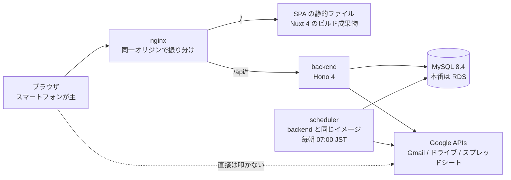

# expense-claim

**結婚式の動画を撮影するビデオグラファーのための、交通費精算アプリ。**

https://github.com/user-attachments/assets/e5a074f6-43a5-4695-8ff9-46fe70587c80

AWS 上の確認環境で、駅と区間の登録から提出までを通した操作（約7分・音声なし）。この環境は Google を叩かない実装で動かしており、入力した値はすべて架空である。

利用者は企業からの業務委託を受けて結婚式場へ出向き、その月に動いた分の交通費を委託元へまとめて申請する。
このアプリは婚礼案件の稼働に伴う交通費を記録し、**委託元が持つスプレッドシートへ月度ごとに提出する。**
使うのは本人1名だけで、スマートフォンのブラウザから使うことを主に想定している。案件は委託元からの
依頼メールを取り込んで作られ、提出漏れは毎朝の定期実行がメールで催促する。案件は月6〜10件、提出シートへ
書く行は月20〜30行。**小さいので、性能や拡張性のために構成を複雑にしていない。**

> **最終的な目的は、委託元が提供するスプレッドシートへ書き込むことである。** したがって
> **シートの仕様と Google アカウントの認可状態が、そのままアプリの正常動作を左右する。** 行数や保護範囲が
> 変われば書けず、認可が切れれば取り込みも提出もできない。だから**決め打ちにせず構造を毎回読み**、
> 認可状態は設定画面から見えるようにしてある。
>
> **Google の認証（ログイン）と認可（Gmail・ドライブ・スプレッドシート）は実装しているが、AWS 上に立てる
> 確認環境では通らない。** ウェブアプリ型の OAuth クライアントはリダイレクト URI に https とドメイン名を
> 要求し、この環境は HTTP とパブリック IP しか持たないためである。AWS 上では Google を叩かない実装に
> 差し替えて動かす。**実物に繋いだ認証・認可は、Cloudflare で動かすアプリ側で対応している。**
>
> なお**このリポジトリは public である。** スプレッドシートID・シート名・フォルダID・会場コードの実値・
> 氏名・メールアドレスは書かない。ここに出る例はすべて架空の値である。

## 何をなぜ作ったか

**目的が2つある。技術選定はその重なりで決まっていて、片方だけを見ると理由が読めない。**

| | 目的① | 目的② |
| --- | --- | --- |
| 何か | **エンジニアスクールの課題** | **交通費精算アプリとして使い続ける** |
| いつ | 今回のプロジェクト | 別プロジェクトで作り直す |
| 制約 | **前回のアプリから技術スタックを変える。インフラは据え置き** | **全て無料の構成にする**（Cloudflare を想定） |

| 層 | 前回 | 今回（目的①で置き換えた） |
| --- | --- | --- |
| フロントエンド | React SPA | **Nuxt 4（Vue 3）の SPA** |
| バックエンド | Java / Spring Boot | **Hono 4（TypeScript）** |
| データベース | PostgreSQL | **MySQL 8.4** |
| インフラ / IaC | AWS EC2 ×1 / RDS ×1 / Terraform | **据え置き**（課題の制約） |

目的②は、**Cloudflare Workers で動かないものを選ばない**という形で効いている。Workers は Node.js
ランタイムそのものではなく、Node.js 依存の強いものはそのままでは動かないことがある。この制約は
今回の成果物には課されないが、**ここで Workers で動かないものを選ぶと目的②で作り直しになる。**

## できること

業務の流れは **取り込み → 記録 → 提出 → 催促**。画面は11枚、API は40本。

1. **取り込み** — ホームを開くと走る。**提出シートの A1 から対象月度を読み**、依頼メールを Gmail から
   差出人アドレスで探して案件にする。**解析できなかったメールは捨てずに「要確認事項」へ積む。**
   対象月度が切り替わっていれば、**前の月度の案件を提出の有無を問わず消す。**
2. **記録** — **「帰り道の2手」で終わることを要件にしている。** 会場コードから会場、会場からルートを辿って
   既定値が出るので、往復か片道かとルートを選べば保存できる。**金額は登録済みの区間運賃から機械的に
   決まり、手で打たない。** タクシーは金額と領収書画像を登録し、**領収書はドライブへ保存できて初めて
   データベースへ書く**（失敗は要確認事項へ。中途半端な行を残さない）。
3. **提出** — **確認 → 実行の2段構え。** 確認は1文字も書かずに内容を見せ、実行で初めて書く。書く直前に
   対象月度を読み直し、**確認したときと変わっていれば書かずに止める。** 本文行が足りなければ挿入し、
   挿入したことを要確認事項で知らせる。
4. **催促** — `scheduler` が毎朝 07:00（JST）に起き、**1日か3日で対象月度が未提出なら本人へ1通送る。**
   目的は**アプリを開かない人に届くこと**なので、ここだけはリクエストの外で走らせている。同じ日に
   2通送らないことはデータベースが守る。

| 画面 | URL |
| --- | --- |
| ログイン | `/login` |
| ホーム（月度ごとの案件一覧） | `/` |
| 案件の追加 / 詳細 / 交通費の記録 | `/projects/new` / `/projects/:id` / `/projects/:id/record` |
| 会場とルート / ルートの編集 | `/venues` / `/routes/new`・`/routes/:id` |
| 区間と運賃（駅の登録も） | `/segments` |
| 提出 / 要確認事項 | `/submit` / `/attentions` |
| 設定（連携状態・控えの取得・ログアウト） | `/settings` |

**認証は Google OAuth 2.0 と許可アドレス1件の照合だけ**で、本人1名しか使わないので権限モデルを持たない。
**認可情報をバックエンドの外へ出さない**ため、フロントエンドから Google API は叩かない。

## アーキテクチャ



| コンテナ | 役割 | 実行時 |
| --- | --- | --- |
| `nginx` | パスで振り分け、SPA の静的ファイルも配る | **立つ** |
| `backend` | 業務ロジックと外部連携 | **立つ** |
| `scheduler` | 提出アラート。**`backend` と同じイメージを別コマンドで起動**し、ロジックを二重に持たない | **立つ** |
| `frontend` | Nuxt の開発サーバ。**本番はビルド時だけ**で、成果物は nginx イメージへ焼き込む | 開発だけ |
| `mysql` / `cloudbeaver` | ローカルのデータベースと、その閲覧 UI | 開発だけ |

- **実行時に立つのは3つ。** EC2 でも同じ3つで、開発では `frontend` / `mysql` / `cloudbeaver` が足されて6つ
- **オリジンを分けない。** `/` は SPA、`/api/*` は Hono。**利用者1人のアプリで CORS と Cookie の面倒を抱えない**
- **層は `routes`（検証と応答）→ `services`（業務ロジック）→ `repositories`（DB）。** `domain` は何にも
  依存せず、`integrations` は外部 API をインターフェースで包む
- **依存の注入は `backend/src/app.ts` の `createApp` 1か所だけ。** だから Google を叩かない実装に丸ごと
  差し替えられる
- **定期実行は1本しか置かない。** ジョブキューもワーカーも無く、crond でもない。**時刻まで眠る Node.js プロセス**

| | 選定 |
| --- | --- |
| 言語 / 実行時 | **TypeScript 6** / **Node.js 24**（Active LTS） |
| フロントエンド | **Nuxt 4（Vue 3）** を SPA としてビルド。UI 基盤は **Nuxt UI 4** |
| バックエンド | **Hono 4**。外部連携は **googleapis 180**（Gmail・ドライブ・スプレッドシート） |
| データ | **MySQL 8.4**（LTS・`utf8mb4_ja_0900_as_cs`）＋ **Drizzle ORM 0.45** / `mysql2`（16テーブル・SQL 14本） |
| 認証 | **Google OAuth 2.0 ＋ 許可アドレスの照合** |
| テスト | **Vitest 5 ＋ Playwright 1.63** |
| 実行 / インフラ | **Docker Compose ＋ nginx stable** / **AWS EC2 ×1 ＋ RDS ×1** / **Terraform** |

テストはバックエンドのユニット27ファイル・API 統合31ファイル（実 MySQL に当てる）・フロントエンドの
コンポーネント18ファイル・E2E 4ファイル（Playwright で nginx 越しにスタック全体を叩く）。

## インフラ（AWS）

**EC2 1台 ＋ RDS 1台を Terraform で立てる。** 課題の制約で前回と同じ構成なので、ここは選定していない。
VPC・サブネット・セキュリティグループまで [`infra/`](infra/) が作る。

- **意図的に作らないもの** — HTTPS・ドメイン・ALB・NAT Gateway・Elastic IP・ECR
- **冒頭のとおり Google の認証・認可が通らない**ので、Google を叩かない実装で動かし、確認が済んだら
  `destroy` する**使い捨ての環境**である
- 配置は `scripts/deploy.sh`。**t3.micro では SPA のビルドが載らない**ので、ローカルでイメージを作って
  EC2 へ送る（ECR を使わない理由がこれ）
- CI（[`build.yml`](.github/workflows/build.yml)）は**本番 compose のビルドだけ**を見る。Lint とテストは
  ローカルのフックが担保する

```bash
terraform -chdir=infra plan && terraform -chdir=infra apply   # plan を読んでから apply する
bash scripts/deploy.sh --all                                  # ローカルでビルドして EC2 へ配置する
terraform -chdir=infra destroy                                # 確認が済んだら消す
```

**構築・配置・確認・片付けの手順は [`infra/README.md`](infra/README.md) が正本。**

## 動かし方

```bash
docker compose up
```

アプリは <http://localhost:8080/> で開く。frontend と backend はホットリロードの開発モードで立ち、
**既定では Google を叩かない実装で動く**ので、OAuth クライアントもスプレッドシートも用意せずに触れる。
**テスト・マイグレーション・環境変数・品質チェック・実物の Google への接続の手順は、
[開発環境のドキュメント](docs/design/07-development.md)にまとめてある。**

## ドキュメント

- **要求分析**（なぜ作るのか・何が欲しいのか）: [`docs/requirements-analysis.md`](docs/requirements-analysis.md) — ヒアリングと、提出シート・依頼メールの実測から整理した
- **要件定義**（いま守る約束）: [`docs/requirements.md`](docs/requirements.md) — 機能要件と非機能要件、そして要求とのトレーサビリティ
- **決定ログ**（なぜ決めたか・なぜ覆したか）: [`docs/decisions.md`](docs/decisions.md) — 日付つきで26件
- **設計**（どう作るか）: [`docs/design/`](docs/design/) — 技術選定・画面・データベース・API・外部連携・異常系・開発環境。**[`01-architecture.md`](docs/design/01-architecture.md) から読んでください。**
- **実装計画**（どの順で作ったか）: [`docs/implementation-plan.md`](docs/implementation-plan.md) — Phase 0〜12、全74タスクの一覧と進捗
- **Google Cloud 入門**: [`docs/google-cloud-basics.md`](docs/google-cloud-basics.md) — このアプリで使う範囲を、**提案の是非を判断できるようになること**を目的にまとめた。第2部にセットアップ手順がある
- **AWS 環境の構築**: [`infra/README.md`](infra/README.md) — 前提・手順・費用・片付けまで

実機で確かめるための使い捨てスクリプトが [`tools/`](tools/) にある。様式や書式が変わったら再実行する。

| ツール | 何を確かめるか |
| --- | --- |
| [`tools/sheet-probe/`](tools/sheet-probe/) | 提出先スプレッドシートへ API から読み書きできるか |
| [`tools/gmail-probe/`](tools/gmail-probe/) | 依頼メールを Gmail API から読み、案件として取り込めるか |
| [`tools/drive-probe/`](tools/drive-probe/) | `drive.file` スコープで、アプリが作っていないフォルダへ保存できるか |
