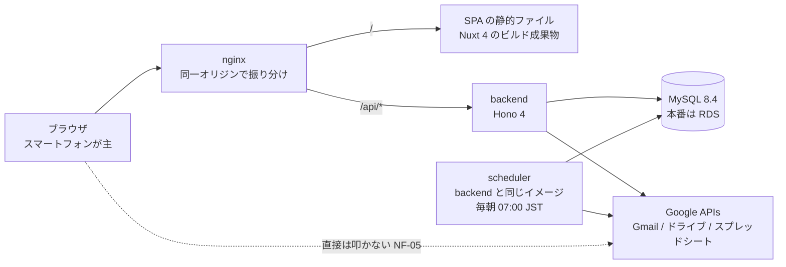

# expense-claim

**婚礼案件の稼働に伴う交通費を記録し、委託元が持つスプレッドシートへ月度ごとに提出する業務アプリ。**
利用者は本人1名で、スマートフォンのブラウザから使うことを主に想定する（`NF-01`）。
案件は委託元からの依頼メールを取り込んで作られ、提出漏れは毎朝の定期実行がメールで催促する。

規模は**案件が月6〜10件、提出シートへ書く行が月20〜30行**。小さい。
**性能や拡張性のために構成を複雑にしていない**のは、この規模が根拠である。

> **このリポジトリは public である。** スプレッドシートID・シート名・フォルダID・会場コードの実値・
> 氏名・メールアドレスは書かない（`N-08` / `N-18`）。この README に出る例はすべて架空の値である。

## 何をなぜ作ったか

**このプロジェクトは目的を2つ持つ。技術選定はその重なりで決まっている。片方だけを見ると理由が読めない。**

| | 目的① | 目的② |
| --- | --- | --- |
| 何か | **エンジニアスクールの課題** | **交通費精算アプリとして使い続ける** |
| いつ | 今回のプロジェクト | 別プロジェクトで作り直す |
| 制約 | **前回のアプリから技術スタックを変える。インフラは据え置き** | **全て無料の構成にする**（Cloudflare を想定） |

目的①のため、前回のアプリから層ごとに置き換えた。

| 層 | 前回 | 今回 |
| --- | --- | --- |
| フロントエンド | React SPA | **Nuxt 4（Vue 3）の SPA** |
| バックエンド | Java / Spring Boot | **Hono 4（TypeScript）** |
| データベース | PostgreSQL | **MySQL 8.4** |
| インフラ / IaC | AWS EC2 ×1 / RDS ×1 / Terraform | **据え置き**（課題の制約） |

目的②が効いているのは、**重いものを選んでいない**点である。移行先に想定する Cloudflare Workers は
無料プランのバンドル上限が 3 MiB で、Node.js ランタイムそのものでもない。この制約は今回の成果物には
課されないが、**ここで重いものを選ぶと目的②で作り直しになる**ので、選定の判断材料に使っている。

選定の根拠は [`01-architecture.md`](docs/design/01-architecture.md) 2〜3章、覆した判断は
[`decisions.md`](docs/decisions.md) にある。

## できること

業務の流れは **取り込み → 記録 → 提出 → 催促**。画面は11枚、API は40本。

### 1. 案件の取り込み

ホームを開くと取り込みが走り、**提出シートの A1 から対象月度を読み**、依頼メールを Gmail から
差出人アドレスで探して案件にする。**解析できなかったメールは捨てずに「要確認事項」へ積む。**

対象月度が切り替わっていれば、提出済みの案件を消す。
**未提出のまま残っていたものは消さずに要確認事項へ回す。**

### 2. 交通費の記録

**「帰り道の2手」で終わることを要件にしている。** 会場コードから会場、会場からルートを辿って既定値が
出るので、往復か片道かとルートを選べば保存できる。
**金額は登録済みの区間運賃から機械的に決まり、手で打たない。**

タクシーは金額と領収書画像を登録する。**領収書はドライブへ保存できて初めてデータベースへ書く。**
保存に失敗したものは要確認事項に積み、**中途半端な行を残さない。**

### 3. 提出

**確認 → 実行の2段構え。** 確認は1文字も書かずに提出内容を見せ、実行で初めて書く。
書く直前に対象月度を読み直し、**確認したときと変わっていれば書かずに止める。**
本文行が足りなければ行を挿入し、挿入したことを要確認事項で知らせる。

### 4. 催促（提出アラート）

`scheduler` が毎朝 07:00（JST）に起き、**その日が1日か3日で、対象月度が未提出なら本人へ1通送る。**
アラートの目的は**アプリを開かない人に届くこと**なので、ここだけはリクエストの外で走らせている
（[決定17](docs/decisions.md#決定17--提出アラート)）。同じ日に2通送らないことはデータベースが守る。

### 画面

| 画面 | URL |
| --- | --- |
| ログイン | `/login` |
| ホーム（月度ごとの案件一覧） | `/` |
| 案件の追加 / 詳細 | `/projects/new` / `/projects/:id` |
| 交通費の記録 | `/projects/:id/record` |
| 会場とルート | `/venues` |
| ルートの編集 | `/routes/new` / `/routes/:id` |
| 区間と運賃（駅の登録も） | `/segments` |
| 提出 | `/submit` |
| 要確認事項 | `/attentions` |
| 設定（連携状態・控えの取得・ログアウト） | `/settings` |

**認証は Google OAuth 2.0 と許可アドレス1件の照合だけ。** 利用者が本人1名なので権限モデルを持たない
（`NF-06`）。**認可情報をバックエンドの外へ出さない**ため、フロントエンドから Google API は叩かない
（`NF-05`）。

画面の詳細は [`02-screens.md`](docs/design/02-screens.md)、エンドポイントは
[`04-api.md`](docs/design/04-api.md)。[画面モック](docs/design/mockup/index.html) も置いてある。

## アーキテクチャ



| コンテナ | 役割 | 実行時 |
| --- | --- | --- |
| `nginx` | パスで振り分ける。SPA の静的ファイルも配る | **立つ** |
| `backend` | 業務ロジックと外部連携 | **立つ** |
| `scheduler` | 提出アラート。**`backend` と同じイメージを別コマンドで起動する**（業務ロジックを二重に持たない） | **立つ** |
| `frontend` | Nuxt の開発サーバ。**本番ではビルド時にしか動かず**、成果物は nginx イメージへ焼き込む | 開発だけ |
| `mysql` / `cloudbeaver` | ローカルのデータベースと、その閲覧 UI | 開発だけ |

**実行時に立つのは3つ**（`nginx` / `backend` / `scheduler`）。EC2 でも同じ3つである。
開発では `frontend` / `mysql` / `cloudbeaver` が足されて6つになる。

- **オリジンを分けない。** `/` は SPA、`/api/*` は Hono へ nginx が振り分ける。
  **CORS と Cookie の面倒を利用者1人のアプリで抱えない**（[`01-architecture.md`](docs/design/01-architecture.md) 4.3）
- **層は `routes`（検証と応答）→ `services`（業務ロジック）→ `repositories`（DB）。**
  `domain` は何にも依存せず、`integrations` は外部 API をインターフェースで包む
- **依存の注入は `backend/src/app.ts` の `createApp` 1か所だけ。** だから `GOOGLE_STUB=1` で
  Google を叩かない実装に丸ごと差し替えられる
- **定期実行は1本しか置かない**（`NF-04` / [決定17](docs/decisions.md#決定17--提出アラート)）。
  ジョブキューもワーカーも無い。crond でもなく、**時刻まで眠る Node.js プロセス**である

| 層 | 選定 |
| --- | --- |
| 言語 / 実行時 | **TypeScript 6** / **Node.js 24**（Active LTS） |
| フロントエンド | **Nuxt 4（Vue 3）** — SPA としてビルドする。UI 基盤は **Nuxt UI 4** |
| バックエンド | **Hono 4** |
| データベース | **MySQL 8.4**（LTS）。照合順序は `utf8mb4_ja_0900_as_cs` |
| DB アクセス | **Drizzle ORM 0.45** ＋ `mysql2`。マイグレーションは `drizzle-kit`（16テーブル / SQL 14本） |
| 外部連携 | **googleapis 180** — Gmail・ドライブ・スプレッドシート |
| 認証 | **Google OAuth 2.0 ＋ 許可アドレスの照合** |
| テスト | **Vitest 5 ＋ Playwright 1.63** |
| 実行形態 | **Docker Compose** ＋ **nginx stable** |
| インフラ / IaC | **AWS EC2 ×1 / RDS ×1** / **Terraform** |

テストは**バックエンドのユニット27ファイル・API 統合31ファイル（実 MySQL に当てる）・
フロントエンドのコンポーネント18ファイル・E2E 4ファイル**（Playwright。nginx 越しにスタック全体を叩く）。
方針は [`07-development.md`](docs/design/07-development.md) 4章。

## インフラ（AWS）

**EC2 1台 ＋ RDS 1台を Terraform で立てる。** 課題の制約で前回と同じ構成なので、ここは選定していない。
VPC・サブネット・セキュリティグループまで [`infra/`](infra/) が作る。

- **意図的に作らないもの** — HTTPS・ドメイン・ALB・NAT Gateway・Elastic IP・ECR。理由は
  [`infra/README.md`](infra/README.md) にある
- **HTTPS もドメインも無いため、Google のウェブアプリ型 OAuth が通らない。** そのため AWS 上では
  `GOOGLE_STUB=1` で動かし、確認が済んだら `destroy` する**使い捨ての環境**である
  （[決定26](docs/decisions.md#決定26--aws-の確認環境)）
- 配置は `scripts/deploy.sh`。**t3.micro では SPA のビルドが載らない**ので、
  ローカルでイメージを作って EC2 へ送る（ECR を使わない理由がこれ）
- CI（[`build.yml`](.github/workflows/build.yml)）は**本番 compose のビルドだけ**を見る。
  Lint とテストはローカルのフックが担保する

```bash
terraform -chdir=infra plan && terraform -chdir=infra apply   # plan を読んでから apply する
bash scripts/deploy.sh --all                                  # ローカルでビルドして EC2 へ配置する
terraform -chdir=infra destroy                                # 確認が済んだら消す
```

**構築・配置・確認・片付けの手順は [`infra/README.md`](infra/README.md) が正本。**

## 動かし方

```bash
docker compose up
```

アプリは <http://localhost:8080/> で開く。`compose.override.yaml` が自動で読まれ、frontend と backend が
ホットリロードの開発モードになる。**既定は `GOOGLE_STUB=1` で、Google を叩かない実装で動く**ので、
OAuth クライアントもスプレッドシートも用意せずに触れる。

**テスト・マイグレーション・環境変数・品質チェック・実物の Google への接続は
[`07-development.md`](docs/design/07-development.md) 2章と4〜5章が正本。**

## ドキュメント

- **要求分析**（なぜ作るのか・何が欲しいのか）: [`docs/requirements-analysis.md`](docs/requirements-analysis.md) —
  ヒアリングと、提出シート・依頼メールの実測から整理した。要求 `R-xx` / 制約 `N-xx`
- **要件定義**（いま守る約束）: [`docs/requirements.md`](docs/requirements.md) —
  機能要件 `F-xx` / 非機能要件 `NF-xx` と、要求とのトレーサビリティ
- **決定ログ**（なぜ決めたか・なぜ覆したか）: [`docs/decisions.md`](docs/decisions.md) — 日付つきで26件
- **設計**（どう作るか）: [`docs/design/`](docs/design/) — 技術選定・画面・データベース・API・
  外部連携・異常系・開発環境。**[`01-architecture.md`](docs/design/01-architecture.md) から読んでください。**
- **実装計画**（どの順で作ったか）: [`docs/implementation-plan.md`](docs/implementation-plan.md) —
  Phase 0〜12、全74タスクの一覧と進捗
- **Google Cloud 入門**: [`docs/google-cloud-basics.md`](docs/google-cloud-basics.md) —
  このアプリで使う範囲を、**提案の是非を判断できるようになること**を目的にまとめた。
  第2部にセットアップ手順がある
- **AWS 環境の構築**: [`infra/README.md`](infra/README.md) — 前提・手順・費用・片付けまで

実機で確かめるための使い捨てスクリプトが [`tools/`](tools/) にある。様式や書式が変わったら再実行する。

| ツール | 何を確かめるか |
| --- | --- |
| [`tools/sheet-probe/`](tools/sheet-probe/) | 提出先スプレッドシートへ API から読み書きできるか |
| [`tools/gmail-probe/`](tools/gmail-probe/) | 依頼メールを Gmail API から読み、案件として取り込めるか |
| [`tools/drive-probe/`](tools/drive-probe/) | `drive.file` スコープで、アプリが作っていないフォルダへ保存できるか |
