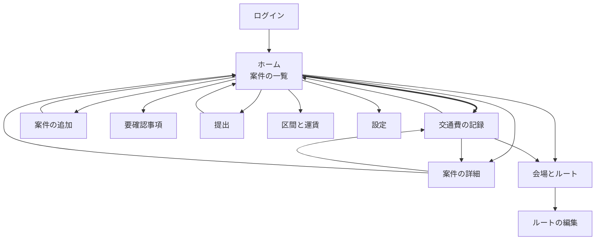

# 画面設計

## 1. この文書について

この文書は、要件定義 8章の画面11枚を **実装できる粒度まで落としたもの** である。

- **扱うこと** — 画面遷移、画面ごとの項目定義、状態と分岐、モック
- **扱わないこと** — 見た目の作り込み（配色・タイポグラフィ）、
  エンドポイント（[`04-api.md`](04-api.md)）、テーブル定義（[`03-database.md`](03-database.md)）
- **出どころ** — 要件定義 4章（機能要件）・8章（画面と操作）・9.2（月度の並走）

> **このリポジトリは public である。**
> 例示はすべて架空の値を使う（N-08 / N-18）。要件定義 5.6 の例をそのまま使っている。

**この文書の中心は 2.2 である。** 「帰り道の記録が2手で終わる」（要件定義 8.1 / 決定19）が
成立するかどうかが、このアプリの成否を決める。他の画面は多少手数を要してよい。

## 2. 画面一覧と遷移

### 2.1 遷移図



**太い線が「帰り道の経路」である**（2.2）。**決定19 で、1本になった。**
以前はホーム → 案件の詳細 → 交通費の記録の2本だった（2.3）。

**画面を替えるのは、その画面の仕事が終わったときだけである。**
作業の途中で寄り道する登録 — 会場・駅・区間 — は**画面を替えず、シートを重ねて出す。**
閉じれば元の作業へ戻り、**打ちかけの内容は残る。**

**この図に線が引かれるのは前者だけで、シートは線にならない。**
ルートの編集から区間を登録しても、線は増えない。

理由は、**画面を替えると入力中の内容が捨てられる**ためである。ルートの編集の途中で
「区間と運賃」へ飛ばしていたときは、**ルート名も紐づく会場も区間の並びも、その場で消えていた。**
戻る導線も無く、画面の説明文だけが「作ってから戻る」と書いていた。
**寄り道のために本題を失わせない。**

| 画面 | 役割 | 機能 |
| --- | --- | --- |
| ログイン | Google アカウントでログインする | F-01 |
| **ホーム** | 案件の一覧。記録が済んだか・要確認事項の有無・最後に取り込んだ日時 | F-03 / F-09 / F-21 |
| 案件の詳細 | 項目の確認と修正、削除。**記録済みの記録を直す入口**（2.3） | F-11 / F-12 |
| 案件の追加 | 自動で拾えなかった案件を手で足す | F-10 |
| **交通費の記録** | ルートを選び、タクシーと領収書を入れる | F-18〜F-26 |
| 会場とルート | 会場の一覧と、紐づくルートの管理 | F-13 / F-14 / F-17 |
| ルートの編集 | 使う区間を並べる。**足りない区間はここで登録できる**（2.1） | F-16 / F-37 |
| 区間と運賃 | **`区間` / `駅` の2タブ。**区間の一覧と片道運賃の編集、駅の登録 | F-15 / F-37 |
| 提出 | 書き込む内容の確認 → 実行 → 結果 | F-27〜F-30 |
| 要確認事項 | 一覧と、確認済みにする操作 | F-33 / F-34 |
| 設定 | 接続の状態、再認可、提出先の確認 | F-02 |

### 2.2 いちばん短い経路 — 2手

```
① ホーム                      ② 交通費の記録
   案件カードの「記録する」を     「保存」を
   タップ                         タップ
```

**2手目までにキーボード入力が現れない。** これが成立の条件である（要件定義 8.1
「屋外・移動中に文字を打たせる作りにすると、その場で終えるが成立しない」）。

**そのために、②を開いた時点で次が埋まっている必要がある。**

| 項目 | 開いた時点の値 | 根拠 |
| --- | --- | --- |
| 往復か片道か | **`往復`** | 実測では全行が `往復`（要件定義 5.3）。`片道` はまだ一度も起きていない |
| 往路ルート | **会場に紐づくルートが1本ならそれ。複数なら未選択** | 要件定義 8.1 |
| 復路ルート | **往路と同じ**（`往復` のとき） | 決定9。復路は往路を反転して使う |
| 区間ごとの金額 | **ルートに登録された片道運賃。`往復` なら ×2** | 要件定義 5.3 / F-20 |

**ルートが複数ある会場では +1手になる**（ルートを選ぶ）。
要件定義 8.1 は「ルートが1つしか紐づいていない会場なら選択済みの状態で開く」としており、
**複数ある場合に手数が増えることは織り込まれている。**

**数えた結果**（`mockup/index.html` のデータと規則で、未記録の案件を全件数えた）

| 会場 | ルート | 通常 | タクシーがある日 |
| --- | --- | --- | --- |
| `AAA` 甲ホール | 1本 | **2手** | **4手** |
| `BBB` 乙迎賓館 | 2本 | **3手** | 5手 |
| `EEE` 戊スタジオ | **0本** | **記録できない**（4.3） | — |

**目標に収まるのは、ルートが1本の会場だけである。**
`BBB` が3手になるのは仕様どおりで、**ルート選択を省けば「どちらで行ったか」が記録されない。**
ここは減らせない（2.3）。

**減らせるとしたら、手数ではなく「ルートが1本になる状態」のほうである。**
会場ごとに実際に使うルートが1本へ収束していけば、多くの案件が2手で終わる。
**複数ルートを登録するかどうかは本人が決められる**（F-16 / F-17）。

> **数えたのは経路の手数であって、実機の触り心地ではない。**
> 押しやすさ・誤タップ・スクロール量は、2.5 の Artifact をスマートフォンで開いて確かめる。
> **2.3 の判断は、そうやって触ってから下した**（7章）。

**タクシーに乗った日は +2手**（要件定義 8.1）。

```
② 交通費の記録
   ├ 「タクシー」をタップ  ← +1手
   ├ 金額を入力            ← キーボードが要る
   ├ 領収書をアップロード  ← +1手（カメラロールを開く）
   └ 「保存」をタップ
```

**この経路にだけキーボード入力が現れる。** 金額は領収書に書いてある数字を写すだけで、
思い出す必要が無いので許容する。

### 2.3 2手への短縮 — 却下していたものを採った

**この節は、以前は「検討したが採らなかった短縮」だった。**
モックを実機で触ったうえで覆した（決定19）。**却下していた理由をここに残す。**

> **ホームの案件カードに「記録する」を直接置けば2手になる。**
> 採らなかった。**同じ日に案件が2件以上あることがある**（決定4 / 要件定義 5.6 の例では
> 9/5 に案件が2件）。**案件の詳細を挟むことで、会場名とご両家名を見て
> 「この案件で合っているか」を確かめられる。**
> **間違った案件に記録すると、提出まで気づけない。** 詳細を挟んで確かめさせるほうが安全である。

**覆せたのは、確認に要る3項目がカードにそのまま出ているからである。**

| どこで確かめるか | 出ているもの |
| --- | --- |
| **ホームの案件カード**（3.2） | 施行日・会場名・ご両家名 |
| **交通費の記録の先頭**（3.5 の「案件の要約」） | 施行日・会場名・ご両家名 |

**却下理由が求めていた確認は、詳細でなくても済んでいた。**
押す前にカードで見え、押した後にも記録画面の先頭で見える。
**失うのは「詳細を必ず通る」という強制だけで、確認の機会は2か所に残る。**

**案件の詳細は無くならない。** 項目の修正と削除（F-11 / F-12）はここにしか無く、
**カード本体をタップすれば入る**（3.2）。記録済みの記録を直す入口もここである（3.3）。

**「長押しで直接記録へ」の折衷案は要らなくなった。** ボタンを置いたほうが、
**押せる場所が目に見える。** 長押しは、知っている人にしか使えない。

#### 採らなかった短縮 — 前回使ったルートを既定にする

**ルートが複数ある会場で、前回使ったルートを選択済みにすれば `BBB` も2手になる。**
採らない（決定21）。

**「選んだ」と「既定のまま通した」が区別できなくなる。**
`BBB` は往路「丁駅乗換」・復路「戊駅直通」と、**往復で違うルートを使う会場である**（2.4 のデータ）。
**既定が当たる保証は無く、外れたときは違う金額がそのまま提出される。**
**間違いは記録の中に残り、金額として辻褄が合ってしまうので、提出前の確認でも見つからない。**

**1手を減らすために、記録が実態と違う確率を上げる取引になっている。**
減らすべきは手数ではなく「ルートが1本になる状態」のほうである（2.2）。

### 2.4 モック

| どこに | 何のために |
| --- | --- |
| [`mockup/index.html`](mockup/index.html) | **正本。** PR で差分を追える。ブラウザで直接開ける |
| Artifact（URL は 2.5） | **実機のスマートフォンで確かめるため。** 押しやすさ・誤タップ・スクロール量を見る |

**モックは 2.1 の11画面すべてと、4章の状態と分岐を持つ。** 左のパネルからどの画面へも直接入れる。

**モック上の操作は、モックの中のデータへ反映される。**
記録すれば提出画面の行が増え、区間の運賃を直せば、その区間を使っている全ルートの片道合計が変わる。
**「直すとどこに効くか」を、読まずに確かめられる。**

#### 場面 — 時期

**切り替えると、4.2 の並走がそのまま現れる。**

| 場面 | 今日 | シートの `A1` | 何が見えるか |
| --- | --- | --- | --- |
| 当月中 | 8/20（木） | `2026-08` | 当月分だけ |
| 月末の最終月曜 | 8/31（月） | `2026-08` | 当月分（記録中）＋ 翌月第1週分（施行前） |
| 翌月1〜3日 | 9/2（水） | `2026-08` | 前月分（提出待ち）＋ 当月分 |
| **稼働日の帰り道**（既定） | 9/5（土） | `2026-08` | **2.2 の2手の経路。**9/5 の2件が施行済み・未記録 |
| 切り替わった後 | 9/6（日） | **`2026-09`** | **提出せずに切り替わり、8月度が残る**（F-32 / 4.4） |
| 提出の直前 | 9/14（月） | `2026-09` | **提出済みの8月度は消えている**（F-32）。9月度の行が要件定義 5.6 と一致する |

**案件はどれも「アプリの中に現れた日」を持つ。** 依頼は月曜に届くので（要件定義 9.2）、
場面の「今日」より後に届く案件は並ばない。**月度の並走は、この1つの日付から導出している。**

#### 場面 — わざと壊す

**異常系はトグルで見る。**

| トグル | 何が起きるか |
| --- | --- |
| Google API の認可が切れている | 提出の確認が成り立たず、**設定の「再認可する」へ導かれる**（F-02 / N-13） |
| 提出シートの様式が変わっている | **確認は通り、実行が書く前に中止する**（NF-10 / 5.5 / [`04-api.md`](04-api.md) 6.1） |
| 提出シートの本文行が足りない | 足りないぶんを挿入し、**要確認事項に残す**（要件定義 5.2 手順5） |
| ドライブへの保存に失敗する | **領収書を選んだ時点で失敗し、乗車を記録しない**（F-26） |

#### データ

**要件定義 5.6 の架空の例に、月度の並走を見るぶんを足したものである。**

| 集合 | 中身 |
| --- | --- |
| 会場 | 5件。`AAA`/`BBB`/`CCC` は**マスタ由来**、`DDD`/`EEE` は**自分で追加**（F-13 / F-14） |
| ルート | 5本。`BBB` だけ2本、**`EEE` は0本**（4.3） |
| 区間 | 7区間。**`X鉄甲駅→X鉄乙駅` を2本のルートが共有する**（決定18） |
| 駅 | 8駅。**`X鉄乙駅` と `Y鉄乙駅` を別の駅として持つ**（F-15） |
| 案件 | 6件。**8月度2件と9月度4件**（下記）。うち1件は**手で足した案件**（F-10。**案件番号は持つ**） |
| 要確認事項 | **7種別すべて**（3.10） |

| 案件 | 施行日 | 会場 | ご両家名 | ルート | タクシー |
| --- | --- | --- | --- | --- | --- |
| — | 8/22 | `CCC` | ▲▲様▼▼様 | 往復とも「丙駅直通」（1区間） | 無し |
| — | 8/23 | `DDD` | ◎◎様☆☆様 | 往復とも「乙駅乗換」（2区間） | 1回・2,400円 |
| A | 9/5 | `AAA` | 〇〇様△△様 | 往復とも「乙駅乗換」（2区間） | 2回・計3,200円 |
| B | 9/5 | `BBB` | □□様◇◇様 | 往路「丁駅乗換」／復路「戊駅直通」 | 無し |
| — | 9/6 | `EEE` | ◆◆様◇◇様 | **ルートが無い**（4.3） | 無し |
| C | 9/12 | `AAA` | ××様＋＋様 | 往復とも「乙駅乗換」（2区間） | 無し |

**`A` `B` `C` が要件定義 5.6 の例にあたる。** 場面「提出の直前」で提出を開くと、
**書き込む行が 5.6 の表と一致する。**

**8月度の2件を足したのは、4.2 の並走を見るためである。**
5.6 の3件だけでは、ホームに月が1つしか並ばない。

### 2.5 モックの URL

**https://claude.ai/code/artifact/899e925d-e270-43ec-94af-81f6a78987c5**

**既定では非公開で、リンクを知っていても開けない。** 共有するときはページの共有メニューから開ける。

**Artifact は `mockup/index.html` から導出する。正本は常にリポジトリ側**（2.4）。
Artifact の骨組みが `<!DOCTYPE>` `<html>` `<head>` `<body>` を持つため、
publish するときはそこを外し、`<title>`・フォントの `<link>`・`<style>` と body の中身だけを渡す。

**モックを直したら、リポジトリ側を直してから publish し直す。**
Artifact 側だけを直すと、正本と食い違ったまま気づけなくなる。

## 3. 画面ごとの項目定義

**「出どころ」は要件定義 6章のエンティティ名と属性名をそのまま使う。**

### 3.1 ログイン

| 項目 | 種類 | 出どころ | 備考 |
| --- | --- | --- | --- |
| 「Google でログイン」 | 操作 | — | F-01 |
| 拒否メッセージ | 表示 | — | **許可されたアカウント以外**のとき（N-03 / 決定5） |

**ログインに Gmail・ドライブ・スプレッドシートのスコープを求めない**
（[`01-architecture.md`](01-architecture.md) 3.7）。ここで確かめるのは本人かどうかだけである。

### 3.2 ホーム

**「提出までに何が足りていないか」が分かる場所である**（要件定義 8.2）。

| 項目 | 種類 | 出どころ | 備考 |
| --- | --- | --- | --- |
| **月度の見出し** | 表示 | **案件.施行日から導出**（決定12） | **月度ごとに区切る**（4.2） |
| 月度の状態 | 表示 | 提出記録 / 対象月度 | `提出待ち` / `提出済み（日時）` / `これから稼働` |
| 案件カード | 表示 | 案件 | 下記 |
| ├ 施行日 | 表示 | 案件.施行日 | |
| ├ 会場名 | 表示 | 案件.会場名 | |
| ├ ご両家名 | 表示 | 案件.ご両家名 | |
| ├ **記録の済み／未** | 表示 | 交通費記録の有無 | F-21 / 4.1 |
| ├ タクシーの有無 | 表示 | タクシー乗車 | 記録済みのときだけ |
| └ **「記録する」** | 操作 | — | **2.2 の1手目。「未記録」のカードにだけ出す**（下記） |
| **要確認事項の件数** | 表示 | 要確認事項（未確認のもの） | **0件なら出さない**（4.4） |
| **最後に取り込んだ日時** | 表示 | 同期状態.最後に取り込んだ日時 | **10章の備え。**下記 |
| **提出アラートが最後に動いた日時** | 表示 | 同期状態.cron が最後に起動した日時 | **同じく10章の備え。**下記 |
| 「案件を追加」 | 操作 | — | F-10 |
| 「提出」 | 操作 | — | F-27。**対象月度に記録済みの案件が1件も無ければ非活性**（下記） |
| メニュー（会場とルート・要確認事項・設定） | 操作 | — | |

**カードに「記録する」を置くのは、2.2 の経路を2手にするためである**（決定19 / 2.3）。
**カード本体をタップすると案件の詳細へ行く。** 項目の修正と削除は詳細にしか無い（3.3）。

**「記録する」を出すのは「未記録」のカードだけである。**
記録済みの案件は埋まっており、施行前の案件はまだ記録できない（4.1 / 3.3）。
**押せないボタンを並べるより、出さないほうがよい。**
カードには `施行前` / `記録済み` のバッジが出ており、**ボタンが無い理由はそこに書いてある。**

**記録済みの記録を直す入口は、案件の詳細のままである**（3.3）。
帰り道に急いでやる操作ではなく、**記録の要約を見てから入るほうが安全である。**

**ルートが0本の会場でも、ボタンは出す。** 押すと記録画面が
「ルートが登録されていません」と出して会場とルートへ導く（4.3）。
**カードの側で黙って消すと、なぜ記録できないのかが分からないまま終わる。**

**「最後に取り込んだ日時」を出すのは、静かな故障に気づくためである**（要件定義 10章）。
差出人アドレスが変わると **エラーは何も出ず、ただ案件が入ってこなくなる。**
月6〜10件・土日祝の稼働という頻度では、しばらく気づけない。

**「提出アラートが最後に動いた日時」も、同じ理由で出す**
（[`06-error-handling.md`](06-error-handling.md) 7章）。
提出アラートは `docker compose` 内の cron コンテナが毎日起動して送るが（`01-architecture.md` 3.8）、
**そのコンテナが起動しなくなっても、エラーは何も出ない。**
**アラートを送る仕組みが落ちたことを、アラートで知らせることはできない。**

**2日以上前なら目立たせる。** cron は毎日走るので、1日空くのは時計のずれで起こりうるが、
**2日空けば落ちている。**

**要確認事項には出さない。** 要確認事項は「起きたこと」の記録であり、
**cron が動いていないのは「起きていないこと」で、それを積める主体がいない**（同 7.3）。
**「無いこと」は記録できない。読む側が気づくしかない。**

**対象月度に記録済みの案件が1件も無ければ、「提出」を非活性にする。**
**書き込む行が0行になり、押しても何も起きない。** 3.9 の「提出する」も同じ条件で押せない。
**押せない理由を添える。** 理由の見えない非活性は、故障と区別がつかない。

**案件の並び順** — 月度の降順（提出待ちが上）、月度の中では施行日の昇順。

**画面を開いたときに取り込みが走る**（F-03 / 決定1）。取り込み中はその旨を出す。
**取り込みの完了を待たずに一覧を出す。** 待たせると 2.2 の1手目が遅れる。

### 3.3 案件の詳細

| 項目 | 種類 | 出どころ | 必須 | 備考 |
| --- | --- | --- | --- | --- |
| 施行日 | 表示・編集 | 案件.施行日 | ○ | **月度がここから決まる**（決定12）。直すと所属月度が変わる |
| 会場コード | 表示・編集 | 案件.会場コード | ○ | 会場一覧から選ぶ |
| 会場名 | 表示 | 案件.会場名 | — | 会場コードに連動 |
| ご両家名 | 表示・編集 | 案件.ご両家名 | ○ | `〇〇様△△様` の形 |
| 案件番号 | 表示・編集 | 案件.案件番号 | ○ | **どの案件も必ず持つ**（F-10）。**重複は弾く**（F-08） |
| 出どころ | 表示 | 案件.出どころ | — | `自動取込` / `手動追加` |
| 記録の要約 | 表示 | 交通費記録 / タクシー乗車 | — | ルート名・合計額・タクシーの件数 |
| **「記録する」** | 操作 | — | — | **2.2 の経路からは外れた**（2.3）。**記録済みを直す入口はここである。施行前は押せない**（4.1） |
| 「削除」 | 操作 | — | — | F-12。**確認を挟む** |

**この画面は 2.2 の経路から外れた**（決定19 / 2.3）。**入口としては残る。**
ホームのカードにボタンが出ないのは、記録済みの案件と施行前の案件である。
**どちらもここから記録画面へ入る。**

**施行前の案件では「記録する」を押せない。** まだ稼働しておらず、入力できる状態にない（4.1）。
**ただし記録が既にあるなら押せる。** 施行日を後から未来へ直した案件が、直せないまま残ってしまう。

**削除すると交通費記録・タクシー乗車・領収書のレコードも消える**（要件定義 4.3）。
**ドライブ上のファイル実体は消さない**（要件定義 6.4）。**確認ダイアログにこの2つを書く。**

### 3.4 案件の追加

| 項目 | 種類 | 出どころ | 必須 |
| --- | --- | --- | --- |
| 施行日 | 入力 | 案件.施行日 | ○ |
| 会場 | 入力 | 案件.会場コード | ○ |
| ご両家名 | 入力 | 案件.ご両家名 | ○ |
| 案件番号 | 入力 | 案件.案件番号 | ○ |

**出どころは `手動追加` で固定。** **案件番号は必須である**（F-10）。

**手で足すのは、依頼メールが正常に取り込まれなかったときだけである。**
メール自体は届いていて、案件番号はそこに書かれている。**見て入力できる。**
**その旨を画面に出す。** 空でよいように見えると、面倒なときに空で登録されてしまう。

**既存と重複する案件番号は弾く**（F-08 / [`04-api.md`](04-api.md) 4.4 の `PROJECT_NO_DUPLICATED`）。
**必須にしたことで、二重取り込みの防止が手で足した案件にも効くようになった**（要件定義 6.2）。
先に手で足しておいた案件が、後からメールで取り込まれても増えない。

### 3.5 交通費の記録

**この画面が 2.2 の2手目である。開いた時点で保存できる状態になっていること。**

| 項目 | 種類 | 出どころ | 開いた時点の値 |
| --- | --- | --- | --- |
| 案件の要約（施行日・会場名・ご両家名） | 表示 | 案件 | — |
| **往復 / 片道** | 選択 | 交通費記録.往復か片道か | **`往復`** |
| **往路ルート** | 選択 | 交通費記録.往路ルート | **ルートが1本ならそれ。複数なら未選択** |
| 復路ルート | 選択 | 交通費記録.復路ルート | **`片道` を選んだときだけ出す** |
| 区間の一覧 | 表示 | ルートが使う区間 | 出発駅・到着駅・金額 |
| **区間ごとの金額** | **表示** | 交通費記録.区間ごとの金額 | **登録運賃（`往復` なら ×2）**（F-20） |
| 合計 | 表示 | 導出 | |
| 「タクシーに乗った」 | 操作 | — | **既定では畳んでおく** |
| ├ 乗車ごとの金額 | 入力 | タクシー乗車.金額 | F-22。**1回ずつ** |
| └ 領収書 | 入力 | 領収書 | F-23。**画像と PDF** |
| **「保存」** | 操作 | — | **2手目** |

**復路ルートを `往復` のときに出さないのは、手数を増やさないためである。**
ルートは「自宅→会場」の1方向で持ち、復路は反転して使う（決定9）。
**`往復` なら復路は自動的に決まる。**

**この画面に金額の入力欄を置かない**（F-20）。3.7 と同じ理屈である。
**上書きにはキーボードが要り、置けば2手の経路（2.2）に入力欄が現れる。**
**直す場所は 3.8 だけである。** 区間の片道運賃を直せば、その区間を使う全ルートに効く（決定18）。
**済んだ記録は動かない**（要件定義 6.2）。

**戻り先は、この画面を開いた画面である。** ホームのカードから開いたらホームへ、
案件の詳細から開いたら詳細へ戻る。**保存したあとも同じところへ帰る。**

**記録した結果をどこで確かめたいかは、どこから来たかで決まる。**
ホームから来たなら、**一覧に戻ってカードが「記録済み」に変わったのを見たい。**
詳細から来たなら、**記録の要約が入ったのを見たい。**
**片方に固定すると、もう片方は来ていない画面に着く。**

**領収書は保存が済んで初めて乗車を確定する**（F-26）。
**保存に失敗したら乗車の記録を残さない。** 中途半端な状態を作らない。

### 3.6 会場とルート

| 項目 | 種類 | 出どころ | 備考 |
| --- | --- | --- | --- |
| **会場の絞り込み** | 入力 | — | **会場コード・会場名の部分一致**（F-38）。下記 |
| 会場一覧 | 表示 | 会場 | 会場コード・会場名・出どころ |
| ├ 出どころ | 表示 | 会場.出どころ | `マスタ由来` / `自分で追加` |
| └ 紐づくルート数 | 表示 | ルート | **0本の会場を目立たせる。**記録できないため |
| 「会場を追加」 | 操作 | — | F-14 |
| 「会場マスタを取り込む」 | 操作 | — | F-13 |
| ルート一覧（会場ごと） | 表示 | ルート | 名前・区間数・片道合計 |
| 「ルートを追加」 | 操作 | — | F-16 / F-17 |

**絞り込みが要るのは、会場マスタを取り込むと43件まで増えるからである**（F-13 / 要件定義 9.1）。
**会場ごとにルートまで並べるので、1画面に43ブロックが縦に積まれる。**
ルートを足したい会場・運賃を直したい会場へ、スクロールで辿り着かせない。

**会場コードと会場名の両方で引く。** 依頼メールに載るのは会場コードだが、
**画面で目に入っているのは会場名のほうである。** どちらで思い出しても同じ場所に着く。

**絞り込みは画面が行う。** `GET /api/venues` は43件を全件返しており（[`04-api.md`](04-api.md) 4.7）、
**サーバーへ検索を足す理由が無い。**

**マスタに無い会場を追加できることが要る**（F-14 / 要求分析 6.5）。
**マスタだけを使う作りにすると、その会場にルートを紐付けられず、記録そのものができない。**

### 3.7 ルートの編集

| 項目 | 種類 | 出どころ | 必須 |
| --- | --- | --- | --- |
| ルート名 | 入力 | ルート.名前 | ○ |
| 紐づく会場 | 選択 | ルート.紐づく会場 | ○ |
| 区間の並び | 選択 | ルートが使う区間 | ○ |
| ├ 区間 | 選択 | 区間（**登録済みのものから**） | ○ |
| └ 片道運賃 | **表示** | 区間.片道運賃 | — |
| 区間の追加・削除・並べ替え | 操作 | — | **並べ替えは上下ボタン**（下記）。**上限を設けない**（要件定義 6.1） |
| 「区間を足す」 | 操作 | — | 登録済みの区間から選ぶ。**シート**（2.1） |
| 「区間を登録する」 | 操作 | — | 一覧に無い区間をその場で作る。**シート**（F-37。項目は 3.8 と同じ） |

**「自宅→会場」の向きで登録する**（決定9）。画面にその旨を明記する。

**並べ替えは上下ボタンで行う。ドラッグ＆ドロップは採らない**（決定20）。
区間は1本のルートに1〜3本で、**並べ替えるのはルートを作るときだけである。**
**帰り道の経路（2.2）には、この画面が出てこない。**

**ドラッグは縦スクロールと取り合いになる。** 掴む場所を別に置き、
スクロールを止める作り込みが要る。**それだけの手当てをして効くのが、経路の外にある画面である。**
**押せば1つ動くボタンのほうが、外で片手で触っても外さない。**

**この画面では、並べた区間の運賃を直せない。** 片道運賃は区間が持ち（決定18）、
**直すと、その区間を使っている全ルートに効く。**
**波及するものを、1本のルートを編集している最中に触らせない。** 直す場所は 3.8 だけである。

**「区間を登録する」で新しい区間に運賃を入れるのは、これに当たらない**（3.8）。
**まだどのルートも使っていない区間に、波及する先が無い。**

**どちらの操作もこの画面を離れない。** 一覧に無い区間は「区間を登録する」でその場で作り、
**登録したものはそのままこのルートの並びに入る。**
編集の途中で押すボタンなので、**登録の目的はこのルートで使うことである。**
登録だけして並びに入れないと、閉じたあとに「区間を足す」で選び直す手が要る。

駅が無ければ、**そのシートの中からさらに駅を登録できる**（3.8）。閉じれば区間の入力へ戻り、
**打ちかけの運賃は残る。** **足す順は「駅 → 区間 → ルート」で固定である**（`04-api.md` 8章）。
**固定なのは順序であって、画面ではない。**

### 3.8 区間と運賃

| 項目 | 種類 | 出どころ | 備考 |
| --- | --- | --- | --- |
| **タブ** | 操作 | — | **`区間` / `駅` の2枚。件数を添える**（下記） |
| **［区間］**区間一覧 | 表示 | 区間 | 出発駅・到着駅・片道運賃 |
| └ 使っているルート数 | 表示 | ルートが使う区間 | **直す前に、何本に効くかが見える** |
| 「区間を追加」 | 操作 | — | F-37。**シート**（2.1）。見出しの右端に置く |
| ├ 出発駅 | 選択・新規登録 | 区間.出発駅 | ○ |
| ├ 到着駅 | 選択・新規登録 | 区間.到着駅 | ○ |
| └ 片道運賃 | 入力 | 区間.片道運賃 | ○ |
| **区間をタップ** | 操作 | — | **シート。** 中身は使用中かどうかで変わる（下記） |
| ├ 片道運賃 | 入力 | 区間.片道運賃 | **常に直せる。直すと使っている全ルートに効く** |
| ├ 出発駅・到着駅 | 選択 | 区間.出発駅／到着駅 | **どのルートも使っていないときだけ** |
| └ 削除 | 操作 | — | **どのルートも使っていないときだけ** |
| **［駅］**駅一覧 | 表示 | 駅 | 名前と、その駅を使う区間の数 |
| 「駅を登録」 | 操作 | 駅.名前 | F-15（3.7 から移した）。**シート**。見出しの右端に置く |
| **駅をタップ** | 操作 | — | **シート** |
| ├ 駅名 | 入力 | 駅.名前 | **常に直せる。使われていても直せる** |
| └ 削除 | 操作 | — | **どの区間も使っていないときだけ** |

**タブで分ける。** 区間と駅を1ページに縦へ積むと、**区間が増えるほど駅の一覧が遠のく。**
区間側に居るあいだ、駅の存在そのものが視界から消える。
**タブは見出しに固定し、どこまでスクロールしても1手で行き来できるようにする。**

**追加の操作は、それぞれの一覧の見出しの右端に置く。**
2つのボタンを一覧と一覧の間に並べると、**どちらの一覧に効くボタンなのかが位置で決まらない。**

**「区間を追加」の出発駅・到着駅は、選ぶだけでなくその場で登録できる。**
シートの中から駅のシートを重ねて出し、閉じれば区間の入力へ戻る。**打ちかけの運賃は残る。**
**駅が無いというだけで、区間の入力を捨てさせない。**

**登録済みの区間の運賃を直せる場所は、この画面だけである**（F-20 / 3.5）。
記録画面にも 3.7 の区間の並びにも入力欄は無く、**既にある片道運賃はここでしか変えられない。**

**新しい区間を登録するときの運賃はこれに当たらない。** 3.7 のシートからも入れられる。
**直すのと登録するのは、波及の有無が違う。** 直せばその区間を使う全ルートに効くが（決定18）、
**登録したばかりの区間を使っているルートは、まだどこにも無い。**
「1本のルートを編集している最中に、波及するものを触らせない」（3.7）は保たれている。

**運賃改定は、この画面だけで終わる**（R-23 / 決定18）。
最寄り駅が同じ会場が複数あると、「自宅最寄り駅→乗換駅」は多くのルートに現れる。
**ルートごとに運賃を持っていたときは、直す先を人が探すことになっていた。**
**探させないために、区間から入れる場所を1つ作る。**

#### 直せる範囲は、使われているかどうかで変わる

**登録し間違えたものを、やり直せる必要がある。** 打ち間違えた駅名も、
組み合わせを取り違えた区間も、**登録したきり直せないままでは残り続ける。**
3.7 のシートから駅を登録できるようにしたぶん、**間違えて足す機会はむしろ増えている。**

| | 常にできる | **使われていないときだけ** |
| --- | --- | --- |
| **駅** | 名前を直す | 削除 |
| **区間** | 片道運賃を直す | 出発駅・到着駅を直す／削除 |

**区間の駅を差し替えられると、その区間を使っている全ルートの経路が黙って変わる**
（`04-api.md` 4.7）。区間は複数のルートで共有されるからである（決定18）。
**この理屈は、使っているルートが0本なら成り立たない。** 黙って変わるものが無い。
**だから使用中かどうかで開け閉めする。** 削除も同じ線で引く。

**駅名だけは、使われていても直せる。** これは非対称に見えるが、そうしないと直す手段が無い。
**使われている駅は消せない**（`03-database.md` 6.2 の RESTRICT）ので、
区間やルートを組んだあとに打ち間違いに気づくと、**リネーム以外に道が残らない。**
名前を直しても**どの駅を使うかは変わらない。** 差し替えとは性質が違う。

**済んだ記録は動かない。** 実績は駅名を**記録した時点の文字列**で持っており、
駅への参照ではない（`03-database.md` 7章）。**駅名を直しても、駅や区間を消しても、
提出済みの行は変わらない。**

**消せない・変えられないときは、その理由を画面に出す。** ボタンを黙って消さない。
「N本のルートが使っています」まで見せて、**先に何をすれば消せるのかを書く。**

**駅名は鉄道会社の略称込みで持つ**（F-15）。
**乗換駅は鉄道会社ごとに別の駅として書かれる**ため（要求分析 5.2）、
`X鉄乙駅` と `Y鉄乙駅` は**別の駅として登録する。** 画面にこの説明を出す。

**前の区間の到着駅と、次の区間の出発駅は一致しなくてよい。**
入力補助でそこを揃えようとしない（要件定義 6.1）。

### 3.9 提出

| 段 | 項目 | 種類 | 出どころ |
| --- | --- | --- | --- |
| **確認** | 対象月度 | 表示 | 提出シートの `A1`（F-31 / 決定13） |
| | **書き込む行の一覧** | 表示 | **書き込む形のまま**（F-27） |
| | **領収書欄（`M8`）** | 表示 | **書き込む形のまま**（要件定義 5.4） |
| | 会場コードの照合結果 | 表示 | **マスタに無いものを警告**（F-27 / N-14） |
| | **記録の無い案件** | 表示 | **飛ばす旨を警告**（要件定義 5.5） |
| | **挿入する行数** | 表示 | **書ける行数と組み立てた行数の差**（[`04-api.md`](04-api.md) 5.4） |
| | 要確認事項の件数 | 表示 | 要確認事項 |
| | 前回の提出日時 | 表示 | 提出記録 |
| | 「提出する」 | 操作 | — |
| **実行** | 進行状況 | 表示 | 要件定義 5.2 の手順1〜8 |
| **結果** | 書き込んだ行数 | 表示 | 提出記録.書き込んだ行数 |
| | 行を挿入したか | 表示 | **挿入したら要確認事項に残る**（要件定義 5.2 手順5） |
| | 中止した理由 | 表示 | **様式が変わっていたら書く前に止まる**（NF-10 / 要件定義 5.5） |

**行の一覧は、提出シートの列（A〜I）そのままの形で出す**（F-27 / R-17）。
**画面が組み立て直さない。** 2行目以降の A〜D 列が空であることまで確認の対象である（要件定義 5.3）。
**J（高速代/駐車場）・K（車両）・L（備考）は出さない。** 常に空であり、
**書かない欄を出すと、書くように見える**（`04-api.md` 5.4）。

**`片道` はまだ一度も起きていない書き方なので**（要件定義 5.3）、
初めて現れるときは目視で確かめられるようにする。

**領収書欄は、行ではなく1つのセルとして出す。**
`M8:M32` は丸ごと1つの結合セルで、**月に1枠しかない**（要件定義 5.4）。
行と同じ表に混ぜると、**乗車の数と行の数が一致しないこと**が読み取れなくなる。

**挿入する行数を確認の段に出すのは、挿入がシートの構造を変える操作だからである**（`04-api.md` 5.4）。
**実行してから知らせるのでは遅い。**

**中止する条件は6つある**（`04-api.md` 5.4）。どれも **1行も書かずに止まる。**

| 中止の理由 | 画面がすること |
| --- | --- |
| `TARGET_MONTH_UNREADABLE` / `SHEET_NOT_FOUND` / `SHEET_FORMAT_CHANGED` / `SHEET_UNREACHABLE` / `WRITABLE_RANGE_UNKNOWN` | 理由を出す。**アプリ側では直せないものが混じる**（N-13） |
| `GOOGLE_UNAUTHORIZED` | **設定の「再認可する」へ導く**（`04-api.md` 2.5） |

**確認と実行のあいだに、シートは変わりうる。**
だから実行はプレビューの結果を持ち回さず、**手順1〜7 をやり直してから書く**（`04-api.md` 6.1）。
**確認を通っても、実行が中止することがある。**

**何度でも実行できる**（F-29）。全消ししてから書き直すため、差し戻しにも同じ操作で応じられる。

### 3.10 要確認事項

| 項目 | 種類 | 出どころ |
| --- | --- | --- |
| 種別 | 表示 | 要確認事項.種別 |
| 内容 | 表示 | 要確認事項.内容 |
| 発生日時 | 表示 | 要確認事項.発生日時 |
| 「確認済みにする」 | 操作 | F-34 |

**種別は7つ**（要件定義 4.9）。

| 種別 | いつ出るか |
| --- | --- |
| メールの解析に失敗 | 裏取りが通らなかった（F-07） |
| 会場コードがマスタに無い | 提出前の照合で見つからなかった（F-27） |
| 提出シートへアクセスできない | 共有が締められた・認可が切れた（F-02） |
| ドライブへの保存に失敗 | アップロードが通らなかった（F-26） |
| 行を挿入した | 提出時に行が足りなかった（要件定義 5.2） |
| 提出せずに月度が切り替わった | **切り替わった先より前の月度に限る**（F-32 / 4.4） |
| 提出アラートを送れなかった | 送信が通らなかった（要件定義 7.5） |

### 3.11 設定

| 項目 | 種類 | 備考 |
| --- | --- | --- |
| Google API の認可状態 | 表示 | F-02。**失効していたら目立たせる** |
| 「再認可する」 | 操作 | F-02 |
| 提出先の確認 | 表示 | **スプレッドシート名とシート名。IDは出さない**（N-08） |
| 対象月度 | 表示 | 提出シートの `A1`（F-31） |
| **設定データの書き出し** | 操作 | NF-11 / [`01-architecture.md`](01-architecture.md) 8章 |
| **設定データの読み込み** | 操作 | 同上。**追加ではなく置き換え** |
| ログアウト | 操作 | — |

**控えに含めるのは駅・会場・ルート・区間だけである**（[`04-api.md`](04-api.md) 4.10）。
**実績データを含めない。** 消えてよいものである（N-05）。

**読み込みは追加ではなく置き換えとする。**
控えは丸ごと1つで、**部分的に混ぜると元の形に戻らない。**

**認可の状態では、保持しているスコープも出す**（`04-api.md` 4.2）。
`gmail.send` は決定17 で後から足したもので、**古いトークンのままだとアラートの送信だけが失敗する。**
**失敗してから気づくより、足りないスコープを見て再認可へ導けるほうがよい。**

## 4. 状態と分岐

### 4.1 記録の済み／未

| 状態 | 判定 | ホームでの見え方 |
| --- | --- | --- |
| **未記録** | 交通費記録が無い | **目立たせる。**提出までに埋める必要がある |
| 記録済み | 交通費記録がある | 合計額を出す |
| **施行前** | 施行日が未来 | **未記録でも目立たせない。**まだ稼働していない。**記録もできない**（3.3） |

**施行前の案件を「未記録」として警告しない。**
月末には翌月第1週の案件が既に入っている（要件定義 9.2）。
**これを毎回警告すると、本当に埋めるべきものが埋もれる。**

### 4.2 月度の並走

**ホームは月度ごとに区切る**（要件定義 8.2）。**2つの月が同時に存在するのは月初だけではない。**

| 時期 | ホームに並ぶもの |
| --- | --- |
| 当月中（最終月曜より前） | 当月分だけ |
| **月末の最終月曜〜月末** | **当月分（記録中）＋ 翌月第1週分（施行前）** |
| **翌月1〜3日** | **前月分（提出待ち）＋ 当月分（記録中）** |
| 翌月4〜7日 | 月度が切り替わり、**提出済みの前月分が消える**（F-32） |

**月度の見出しには状態を添える。**

```
2026年8月度  提出待ち          ← 対象月度（提出シートの A1）
  ...

2026年9月度  これから稼働
  ...
```

**「対象月度」は提出シートの `A1` が決める**（決定13）。カレンダーの前月ではない。

**3か月分が同時に並ぶことはない**（要件定義 9.2 / N-21）。
配信は月曜で、覆う最も遠い日は**翌月7日まで**にしかならない。

### 4.3 ルートが1本しかない会場

**選択済みの状態で開く**（要件定義 8.1）。これが 2.2 の2手を成立させている。
**2本以上あるときに前回のルートを既定にすることはしない**（決定21 / 2.3）。

| 会場に紐づくルート | 交通費の記録を開いたとき | 手数 |
| --- | --- | --- |
| **1本** | **選択済み** | **2手** |
| 2本以上 | 未選択。選ばせる | 3手 |
| **0本** | **記録できない。**ルートの登録へ導く | — |

**0本のときに黙って空の画面を出さない。** 会場とルートの画面へ導く（3.6）。

### 4.4 要確認事項の出し分け

**「提出せずに月度が切り替わった」は、切り替わった先より前の月度だけ出す**（F-32）。

**この区別を落とすと、毎月の切替でかならず誤検知が上がる。**
9/4〜9/7 の切替時、9月度に提出記録が無いのは当たり前である。
それを報せても、**本人にできることは何も無い。**

**要確認事項が0件のとき、ホームに件数を出さない。** 常時「0件」を出すと、
**件数があること自体に慣れてしまい、増えたことに気づけなくなる。**

## 5. 画面に出さないと決めたもの

| 出さないもの | なぜ |
| --- | --- |
| 提出済みデータの閲覧・集計 | 対象外（要件定義 11章）。正本は提出シートにある |
| 提出期限のリマインド | **画面では持たない。** 月初の提出アラートは**メールで送る**（要件定義 F-35 / 7.5）。**目的はアプリを開かない人に届くこと**なので、画面に出しても届かない |
| スプレッドシートID・フォルダID | **public リポジトリの方針とは別に、画面にも出さない**（N-08）。名前で足りる |
| 依頼メールの本文 | 取り出した5項目で足りる。**リンクは叩かない**（要件定義 7.2） |
| 月度の手動切り替え | `A1` が正（決定13）。**手で変えられると判断が2つになる** |

## 6. 要件とのトレーサビリティ

| 機能要件 | この文書のどこ |
| --- | --- |
| F-01 | 3.1 |
| F-02 | 3.11 |
| F-03 | 3.2 |
| F-04〜F-08 | **画面を持たない**（取り込みは自動。結果は 3.2 と 3.10 に出る） |
| F-09 | 3.2 / 4.1 / 4.2 |
| F-10 | 3.4 |
| F-11 / F-12 | 3.3 |
| F-13 / F-14 / F-17 | 3.6 |
| **F-38** | **3.6** |
| F-15 | 3.8（シートは 3.7 からも開く） |
| F-16 | 3.7 |
| **F-37** | **3.8**（シートは 3.7 からも開く） |
| F-18〜F-21 | 3.5 / 4.3 |
| F-22〜F-26 | 3.5 |
| F-27〜F-30 | 3.9 |
| F-31 | 3.9 / 3.11 / 4.2 |
| F-32 | 4.4（**画面を持たない。**自動で消える） |
| F-33 / F-34 | 3.10 |
| F-35 / F-36 | 5章（**画面を持たない。**メールで送る。要件定義 7.5） |
| NF-01 | 全体（スマートフォン幅で設計する） |
| NF-11 | 3.11 |
| NF-12 | 2.2（2手。取り込みの完了を待たずに一覧を出す） |

## 7. 未確定事項

| 何が | いつ決めるか |
| --- | --- |
| 領収書のアップロードでカメラを直接起動するか | 実装時。**その場で撮る運用が無い**ので後回しでよい |
| 画面の見た目（配色・タイポグラフィ） | **導線が固まってから** |

### 閉じたもの

**「モックを実機で触ってから決める」としていた3件は、触って決まった**（決定19〜21）。

| 何が | どう決まったか | どこに書いたか |
| --- | --- | --- |
| **2手への短縮を採るか** | **採る。**ホームの案件カードから記録画面へ直行する | 2.2 / 2.3 / 3.2 |
| ルートが複数ある会場で、前回使ったルートを既定にするか | **既定にしない。**毎回選ぶ | 2.3 / 4.3 |
| 区間の並べ替えの操作方法 | **上下ボタンのまま。**ドラッグ＆ドロップは採らない | 3.7 |

**3件とも、モックを触るまで決められなかったものである。**
**2手への短縮は、触る前は却下していた**（2.3）。読んで決めていたら、そのままになっていた。
