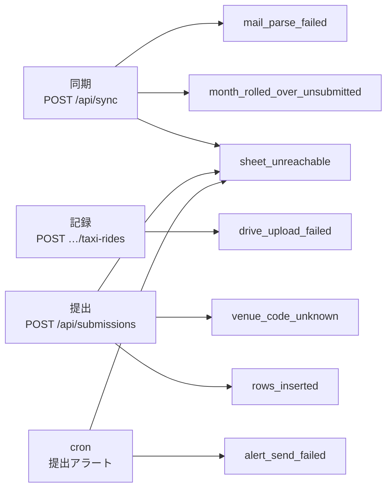
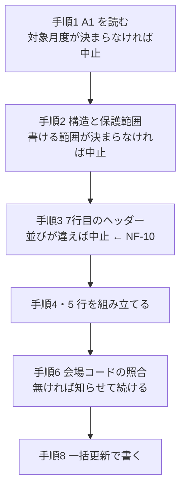
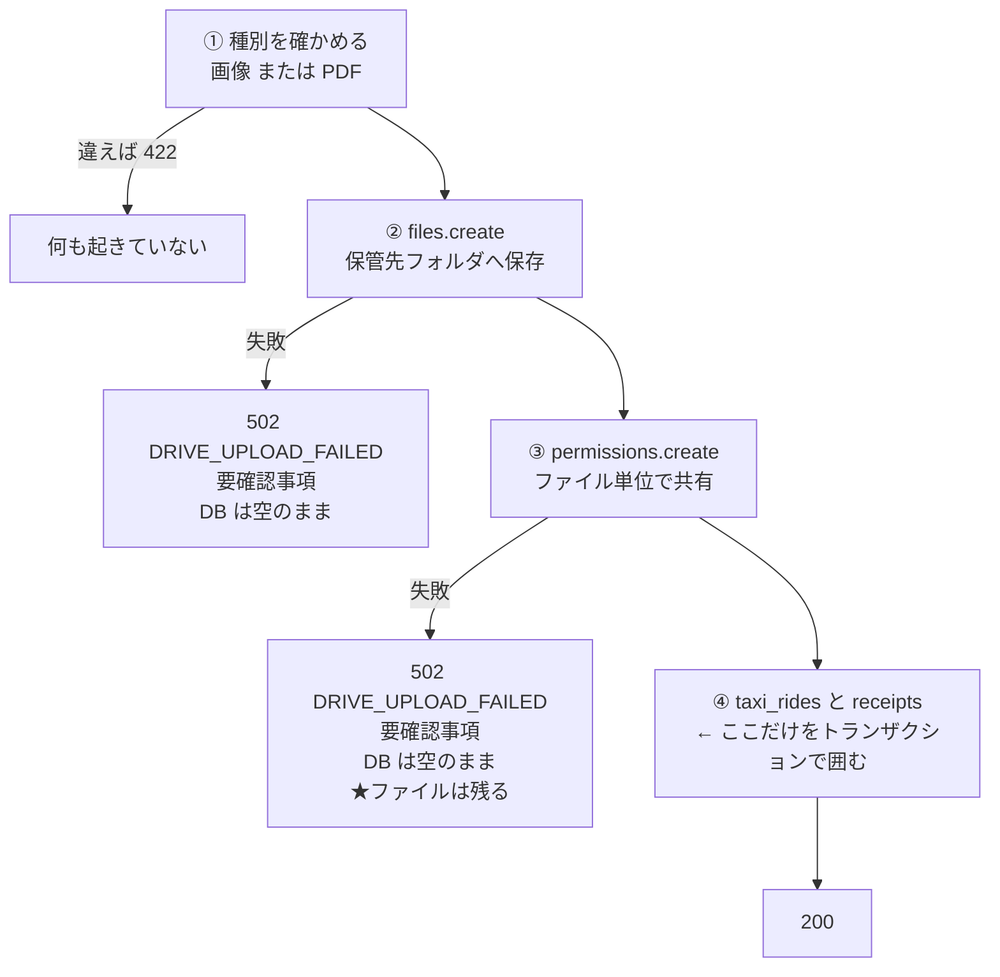

# 異常系

## 1. この文書について

- **扱うこと** — 失敗したときに何が残るか。要確認事項がどこから生まれるか。
  トランザクションをどこで区切るか。定期実行が落ちたことにどう気づくか
- **扱わないこと** — 個々の外部呼び出しの叩き方（[`05-integration.md`](05-integration.md)）、
  エンドポイントの一覧（[`04-api.md`](04-api.md)）、画面の見た目（[`02-screens.md`](02-screens.md)）
- **前提** — 設計の5本（`architecture` / `screens` / `database` / `api` / `integration`）が
  決めたことを引き取る。**この文書は最後に読む**

**この章の関心は、要件定義10章と同じ「静かに壊れないこと」である。**
例外が出て止まるより、**間違った値が黙って提出されるほうが害が大きい。**

### この文書が閉じる5つの宿題

| 宿題 | どこから来たか | どこで閉じるか |
| --- | --- | --- |
| **要確認事項の発生経路** | [`README.md`](README.md) がこの文書の担当と決めた | **3章** |
| **`attentions.detail` の書式** | `03-database.md` 12章 / `04-api.md` 10章 / `05-integration.md` 11章 | **4章** |
| **`NF-10` 様式が変わったら止まる** | `01-architecture.md` 9章（**未確定事項ではなくトレーサビリティ表から**） | **5章** |
| **トランザクションの境界** | `03-database.md` 12章 / `04-api.md` 10章 / `05-integration.md` 11章 | **6章** |
| **定期実行が落ちたことに気づく手立て** | 要件定義13章 / `01-architecture.md` 11章 / `05-integration.md` 11章 | **7章** |

**3本から同じ宿題が2件来ている。** どちらも「失敗したときにどう振る舞うか」であり、
**先行文書がそれぞれの持ち場では決めきれなかったものである。**

### 更新の仕方

要件が変わったら、まず要件定義10章を直す。**この文書は実現方法だけを持つ。**
新しい種別の失敗が見つかったら、3章の表と `attentions.kind` の両方を足す。
**片方だけ足さない。** 画面に出ない要確認事項は、残していないのと同じである。

---

## 2. 引き取る足場 — ここで決め直さない

**異常系の材料は、すでにかなりの部分が先行文書にある。**
この文書の仕事は**新しい体系を立てることではなく、散っているものを1か所に集めて、
残った穴を埋めることである。**

| 既に決まっていること | どこ |
| --- | --- |
| 失敗の分類（401 / 403・404 / ヘッダー相違 / 429 の振り分け） | `05-integration.md` 2.4 |
| **自動再試行を持たない**（指数バックオフの却下理由も） | `05-integration.md` 2.5 |
| エラー応答の形（**401 と 503 を分ける・502 と 503 を分ける**） | `04-api.md` 2.5 |
| **「止める」と「知らせて続ける」を応答の形で分ける** | `04-api.md` 2.6 |
| 中止する条件5つ・中止しない条件2つ | 要件定義 5.5 |
| 起きること × どう気づくか × どう直すか の12行 | 要件定義 10章 |
| `attentions` テーブルと `kind` の7種 | `03-database.md` 5.3 |
| 領収書保存の順番（保存 → 共有 → DB 書き込み） | `05-integration.md` 6.1 |
| 要確認事項の画面（**種別・内容・発生日時の平坦な表示**） | `02-screens.md` 3.10 |
| cron の置き場（compose 内の専用コンテナ・`Asia/Tokyo`） | `01-architecture.md` 3.8 |

**この表を引き取るということは、次の3つを前提に置くということである。**

| 前提 | 効き方 |
| --- | --- |
| **自動で再試行しない** | 失敗はその場で見せるか、要確認事項に残すかのどちらかになる。**「静かに再試行して静かに失敗する」経路を作らない**（`05-integration.md` 2.5） |
| **200 かどうかが「書いたか書いていないか」を表す** | 中止はエラー応答、続行は `200` に `warnings[]`（`04-api.md` 2.6）。**この約束を6章のトランザクション境界でも守る** |
| **要確認事項は「起きたことの記録」である** | 外から積むエンドポイントを持たない（`04-api.md` 4.9）。**アプリが自分で起こしたことだけが載る** |

---

## 3. 要確認事項の発生経路

### 3.1 7種 × 発生箇所

**`attentions.kind` の7種**（`03-database.md` 5.3）が、**どの経路から生まれるか**を1か所にまとめる。
先行文書は「いつ出るか」までは書いているが、**どのエンドポイントの何手目か**は書いていない。

| `kind` | 発生箇所 | どこで | 要件 |
| --- | --- | --- | --- |
| `mail_parse_failed` | **同期** | `POST /api/sync` 手順4（取り込み）。裏取りが通らなかったメール1通につき1行 | `F-07` |
| `month_rolled_over_unsubmitted` | **同期** | `POST /api/sync` 手順3。**切替先より前で未提出**の月度1つにつき1行 | `F-32` |
| `sheet_unreachable` | **同期 / 提出 / cron** | `POST /api/sync` 手順1／提出の手順1〜3／アラートの手順3 | `F-02` / `N-13` |
| `drive_upload_failed` | **記録** | `POST /api/projects/:id/taxi-rides`。`files.create` か `permissions.create` が失敗 | `F-26` |
| `venue_code_unknown` | **提出** | `POST /api/submissions` 手順6。**プレビューでは積まない**（3.2） | `F-27` / `N-14` |
| `rows_inserted` | **提出** | `POST /api/submissions` 手順5。**挿入した時点で積む**（6.3） | 要件定義 5.2 手順5 |
| `alert_send_failed` | **cron** | 提出アラートの手順5。送信が通らなかった | 要件定義 7.5 |

**発生箇所は4つしかない。** 同期・記録・提出・cron である。
**これは偶然ではなく、外部 API を叩く場所がその4つしか無いから**である
（`05-integration.md` 2.2「叩く呼び出しは9本だけ」）。

**`sheet_unreachable` だけが3つの経路から来る。** 提出シートは
同期（`A1` を読む）・提出（手順1〜3）・アラート（対象月度を読む）の
**すべてが触るからである。** 種別を経路ごとに割らないのは、
**本人がすることが同じ**だから — 共有か認可のどちらかを確かめにいく（`N-13` / `F-02`）。

### 3.2 プレビューは積まない。実行は積む

**`POST /api/submissions/preview` は `venue_code_unknown` を積まない。**
`warnings[]` で返すだけである（`04-api.md` 2.6）。

| なぜ | |
| --- | --- |
| **プレビューは書かない**（`04-api.md` 4.8） | **シートに未知のコードは載っていない。** まだ何も起きていない |
| **何度でも押せる** | 押すたびに要確認事項が増えるのでは、**確認という操作の意味が変わる** |
| **要確認事項は「起きたことの記録」である**（2章） | 「これから書く内容についての警告」は `warnings[]` の役目 |

**ただし `sheet_unreachable` は、プレビューでも積む。**
`04-api.md` 6.3 が「読めなければ要確認事項が残る」と決めているとおりである。

**矛盾ではない。線は「実際に起きたか」で引かれている。**

| | プレビュー | 実行 |
| --- | --- | --- |
| **`sheet_unreachable`** — **読めなかったことは、もう起きている** | **積む** | 積む |
| **`venue_code_unknown`** — **書いて初めて起きる** | 積まない（`warnings[]`） | **積む** |

### 3.3 重複を除かない

**同じ会場コードで2回提出したら、`venue_code_unknown` は2行になる。**
まとめない。

| なぜ | |
| --- | --- |
| **2回書いているから** | 提出は何度でも実行でき（`F-29`）、**そのたびに未知のコードがシートへ載る** |
| **`occurred_at` を持っている**（`03-database.md` 5.3） | まとめると**いつ書いたかが消える** |
| **「同じとは何か」を決めずに済む** | 種別が同じなら同じか。会場コードまで見るか。**判定を持てば、その判定が壊れる** |

**確認済みにすれば消える**（`F-34`）。ホームが数えるのは未確認のものだけである
（`02-screens.md` 4.4）。**溜まって困るのは、確認していないときだけである。**

---

## 4. `detail` の書式 — 素のテキスト1本にする

### 4.1 決定

**`attentions.detail` は、本人がそのまま読める日本語の文面を1つ持つ。**
種別ごとの構造（JSON など）を持たせない。`03-database.md` 5.3 の `TEXT NOT NULL` は動かさない。

| なぜ | |
| --- | --- |
| **出す先が平坦である** | `02-screens.md` 3.10 は「種別・内容・発生日時」を並べるだけ。**構造を持たせても、展開する場所が無い** |
| **読むのは本人だけである** | 要確認事項を作るエンドポイントを持たず（`04-api.md` 4.9）、**機械が読み返す相手がいない** |
| **`04-api.md` 2.5 と同じ形になる** | エラー応答の `message` も「本人が読む日本語」で、**画面はそのまま出してよい**と決めてある。**画面から見て、要確認事項とエラーが同じ扱いになる** |
| **種別が増えたときに動く場所が1つで済む** | 構造を持たせると、**種別を足すたびに画面とスキーマの両方が動く** |

### 4.2 何を書くか

**本人が「次に何をするか」を決められるだけの手がかりを入れる。それ以外を入れない。**

| `kind` | 文面に入れるもの | 入れないもの |
| --- | --- | --- |
| `mail_parse_failed` | 件名・受信日時・**取り出せなかった項目名** | **本文の全文。** 長すぎて読めず、案件の中身がそのまま残る |
| `month_rolled_over_unsubmitted` | 残った月度・その月度の案件件数 | |
| `sheet_unreachable` | 何をしようとしたか（読み／書き）・**認可切れか共有停止か**（`05-integration.md` 2.4） | **スプレッドシートID・シート名** |
| `drive_upload_failed` | 案件・乗車日・ファイル名・**保存で落ちたか共有で落ちたか** | **保管先フォルダID** |
| `venue_code_unknown` | **会場コード**・その案件の施行日とご両家名 | |
| `rows_inserted` | 挿入した行数・挿入した位置 | |
| `alert_send_failed` | 対象月度・**1日ぶんか3日ぶんか** | **宛先アドレス** |

**識別子を入れないのは、本人が読んでも動けないからである。**
シートIDを知っても、することは「共有を確かめる」で変わらない。
**要確認事項の画面は人に見せることがあり、載っていなければ写らない**（`N-08` / `N-18`）。

**「どちらで落ちたか」は入れる。** `sheet_unreachable` は
**認可切れなら再認可で直り、共有停止ならアプリ側では直せない**（`05-integration.md` 2.4）。
**導く先が違うので、文面で分かれていなければ意味が無い。**

> 文面の例はこの文書に書かない。**架空の会場コードや氏名を並べることになり、
> 実物と見分けがつかなくなる**（[`README.md`](README.md) の書き方の約束）。

### 4.3 採らなかった案

- **`detail` に JSON を入れ、画面が組み立てる** — 種別ごとに文面の形を変えられるが、
  **画面が7種類の分岐を持つことになる。** 文面をバックエンドで作るのと情報量は同じで、
  **置き場所が画面から遠くなるだけである**
- **`detail` を構造化し、列を種別ごとに足す** — 型で守れるが、
  **7種のうち共通する列がほとんど無い。** `NULL` だらけの表になる
- **関連する行への外部キーを持つ**（`project_id` など）— 画面から案件へ飛べるが、
  **実績データは月度切替で消える**（`F-32`）。**参照先が消えた要確認事項が残る。**
  `attentions` が関連を張らないのは `03-database.md` 4章の決定であり、**そこを崩さない**

---

## 5. 止める / 知らせて続ける

### 5.1 `NF-10` — 様式が変わったら、書く前に止まる

**`01-architecture.md` 9章が、この要件を丸ごとこの文書へ送っている。**
材料は揃っており、**組み立て直すだけである。**

| 何を | どこが決めている |
| --- | --- |
| 7行目のヘッダーを `values.get` で読む | `05-integration.md` 7.3 |
| 想定と違えば `502 SHEET_FORMAT_CHANGED` | `05-integration.md` 2.4 / `04-api.md` 2.5 |
| **中止する**（何も書かない） | 要件定義 5.5 |
| 中止はエラー応答で表す | `04-api.md` 2.6 |

**`NF-10` が守られるのは、読む順番のおかげである。**

**中止条件は、すべて書き込みより前に置かれている。**
要件定義 5.2 が「途中で条件を満たさなければ、何も書かずに中止する」と書いたのは、
**手順の並びそのものが `NF-10` の実装だから**である。

**手順3を通ったあとに様式が変わることは、防げない。**
確認と実行の間にシートは変わりうる（`04-api.md` 6.1）。
**だから実行は手順1〜3を読み直す。** それでも読み直しと書き込みの間には隙間が残るが、
**そこを埋める手立てを持たない** — 提出シートは委託元の所有物であり、
ロックをかける経路が無い（`N-04`）。**隙間があることを承知で、隙間を最小にする。**

### 5.2 中止したときに、要確認事項を残すか

**残すものと残さないものがある。線は「本人がその画面を見ているか」で引く。**

| 中止条件（要件定義 5.5） | 応答 | 要確認事項 |
| --- | --- | --- |
| `A1` を読めない・日付として解釈できない | 502 `SHEET_UNREACHABLE` | **残す** `sheet_unreachable` |
| 自分のシートが見つからない | 502 `SHEET_UNREACHABLE` | **残す** `sheet_unreachable` |
| 提出シートを読めない・書けない | 502 / 503 | **残す** `sheet_unreachable` |
| 書き込める行の範囲を特定できない | 502 `SHEET_UNREACHABLE` | **残す** `sheet_unreachable` |
| **7行目のヘッダーが想定と違う** | 502 `SHEET_FORMAT_CHANGED` | **残さない** |

**様式の変更だけが要確認事項に残らない。** `03-database.md` 5.3 の `kind` に
**該当する種別がそもそも無い**のは、この判断の結果である。

| なぜ残さないか | |
| --- | --- |
| **本人はいま画面を見ている** | 提出は「確認して実行する」操作である（`F-27`〜`F-29`）。**エラーはその場に出る** |
| **確認済みにしても直らない** | 実装を直すまで、**押すたびに同じ中止が起きる。** 積めば同じ行が増え続ける |
| **要確認事項は「後で気づく」ためのものである** | 同期・cron のように**本人が見ていない場所**で起きたことを残す器である |

**共有停止と認可切れは残す。** こちらは同期や cron でも起きるためで、
**提出の画面を見ていないときに気づく手立てが要る。**

### 5.3 知らせて続けるもの

**要件定義 5.5 の「中止しない」2件は、`200` に `warnings[]` を載せる**（`04-api.md` 2.6）。

| 条件 | 扱い | 要確認事項 |
| --- | --- | --- |
| **会場コードが会場マスタに無い** | 警告を出し、**そのまま書く**（`N-14`） | **実行でだけ積む**（3.2） |
| 交通費の記録が無い案件がある | その案件を飛ばし、警告を出す | **積まない** |

**記録の無い案件を要確認事項に積まないのは、それが異常ではないからである。**
月の途中で提出すれば、これから稼働する案件は当然まだ記録が無い。
**ホームが「未記録」を出しており**（`02-screens.md` 3.2 / `F-21`）、
**同じことを2か所で知らせる意味が無い。**

---

## 6. トランザクションの境界

### 6.1 原則 — 外部呼び出しをまたいでトランザクションを開かない

**この1行で、3つの場面のうち2つが決まる。**

| なぜ | |
| --- | --- |
| **巻き戻せないものが混ざる** | ドライブへの保存もシートへの書き込みも、**DB のロールバックでは戻らない。** またいで開いても、原子性は手に入らない |
| **待ち時間が読めない** | 領収書は数百KB〜数MB（要件定義 9.1）。**アップロードの間ずっと接続とロックを握る理由が無い** |
| **cron も同じ DB に繋ぐ**（`01-architecture.md` 3.8） | 利用者1人でも接続は2系統ある。**長いトランザクションを常態にしない** |

**トランザクションで守るのは、DB の中だけで完結する不変条件である。**
外部との整合は、**順番で守る**（`05-integration.md` 6.1）。

### 6.2 記録の保存（`F-26`）

**`05-integration.md` 6.1 が順番を決めた。ここで決めるのは、どこを囲むかである。**

**トランザクションは④だけを囲む。** `taxi_rides` の `INSERT` と
`receipts` の `INSERT` の2本である。

| 守りたいこと | |
| --- | --- |
| **領収書の無い乗車を作らない** | `F-26`。①〜③ が通ってから④に入るので、**④が丸ごと通るか、丸ごと通らないか**になる |
| 乗車の無い領収書を作らない | `receipts.taxi_ride_id` の外部キーと `UNIQUE`（`03-database.md` 5.2）が**そもそも作らせない** |

**③で失敗すると、ドライブに孤児のファイルが残る。** これを許す。

| なぜ | |
| --- | --- |
| **消す経路を持たないと決めてある** | `files.delete` を呼ばない（`05-integration.md` 6.3 / `04-api.md` 7章）。**消す実装を足せば「消してよいものを消す」判断がアプリに増える** |
| **害が小さい** | **提出シートには載らない。** 載るのは `receipts.drive_url` であり、**④を通ったものだけである**（`R-15`） |
| **気づける** | 要確認事項に `drive_upload_failed` が残り、**共有で落ちたことが文面に出る**（4.2） |

**やり直すと、同じ連番のファイルが2つできる。**
ファイル名の連番は `receipts` を見て採番するので（`03-database.md` 5.2）、
**孤児は数に入らない。** これも許す — **委託元はファイル名を見ない。
見るのは提出シートに並んだ URL である**（要求分析 5.2）。

**採らなかった案** — ③が失敗したら②で作ったファイルを消す。
**「消さない」（`05-integration.md` 6.3）を崩すことになる。**
しかも**消す呼び出し自体が失敗しうる**ので、孤児が出る経路は結局消えない。
**1つの失敗を消すために、失敗する呼び出しをもう1本増やすことになる。**

### 6.3 提出（`F-29`）

**順序は `04-api.md` 6章の図のとおり、シートが先・`submissions` が後である。**
ここで決めるのは、**その間で落ちたときにどうするか**である。

**`submissions` の `INSERT` は1文なので、明示的なトランザクションを開かない。**
守るべき不変条件が DB の中に無い。

**順序が非対称であることが、この判断の核心である。**

| 落ち方 | 残る状態 | 害 |
| --- | --- | --- |
| **`submissions` が先 → シートが失敗** | **「提出済み」なのに書かれていない** | **重い。** `F-36`「提出が済んでいれば送らない」がアラートを黙らせる。**締切前に気づく手立てが1つ消える** |
| **シートが先 → `submissions` が失敗** | 書かれているのに「未提出」 | **軽い。** アラートが余分に届き、もう一度実行すれば揃う |

**害の小さいほうへ倒す。だからシートが先である。**

**シートは書けたが `submissions` が書けなかったときは、`200` を返さない。**
502 で返す。`04-api.md` 2.6 の約束（`200` かどうかが「書いたか書いていないか」を表す）とは
**逆向きに見えるが、そうではない。**

**その約束が守っているのは「本人の申請が壊れていないか」である。**
このとき**シートは正しく書けている。** 壊れているのは提出記録のほうで、
**もう一度実行すれば直る**（`F-29`「何度でも実行できて、結果が同じ」）。
**`200` を返して「提出できた」と見せるほうが危ない** — 本人はホームで
「提出待ち」のままなのを見て、何が起きたのか分からなくなる。

**要確認事項には積まない。** 本人はいまその画面を見ている（5.2 と同じ線）。

**手順5の行挿入と手順8の書き込みは、別の呼び出しである**（`05-integration.md` 8.3）。
**挿入が通って書き込みが失敗すると、挿入だけが残る。** これも許す。

| なぜ | |
| --- | --- |
| **値が壊れない** | 増えるのは空行だけ。**書き込める範囲の内側に入る**（`N-11`） |
| **次の提出で埋まる** | 本文行はすべてアプリが持つ（決定11）。**やり直せば同じ範囲を書き直す** |
| **`rows_inserted` は挿入した時点で積む** | **挿入は本当に起きている。** 委託元の資産に手を入れたことは、書き込みの成否と関係なく残す |

### 6.4 同期（`F-32`）

**同期はまとめない。手順ごとに効かせる。**

`04-api.md` 4.3 が「片方が失敗しても、もう片方は走る」と決めており、
**全体を1つのトランザクションにすると、その決定が崩れる。**

| 手順 | 囲むか |
| --- | --- |
| 1〜2 月度の検知と削除 | **`DELETE FROM projects` の1文だけ。** 子は `CASCADE` で落ちる（`03-database.md` 6.3） |
| 3 未提出の月度を要確認事項に残す | 囲まない |
| 4 依頼メールの取り込み | **1通ずつ囲む。** `imported_mails` と `projects` を1組で書く |
| 5 `last_imported_at` の更新 | 囲まない |

**メールを1通ずつ囲むのは、途中で落ちても取り込めたぶんを残すためである。**
`imported_mails` の主キーは Gmail の message id で（`03-database.md` 5.3 / `F-08`）、
**取り込めた通は次回スキップされる。** まとめて囲むと、
**10通目で落ちたときに9通ぶんが消える。**

**`last_imported_at` は、1件も取り込まなかった実行でも更新する**（`04-api.md` 4.3）。
**Gmail の取り込みが失敗した実行では更新しない。**
この値はホームに出て、**静かな故障に気づくための手立てである**（要件定義10章 / `02-screens.md` 3.2）。
**失敗した実行で更新すると、動いていないのに動いているように見える。**

---

## 7. 定期実行が落ちたことに気づく手立て

### 7.1 なぜ難しいか

**アラートを送る仕組みが落ちたことを、アラートで知らせることはできない。**

`alert_send_failed` は**送信が失敗したときに残る**ものである（3.1）。
**コンテナが起きてすらいなければ、その行も生まれない。**

**そして要件定義10章は、すでにこう決めている。**

> **アラートが届かなかったこと自体は、検知しない。**
> 送信に失敗すれば要確認事項に残るが、**それを見るにはアプリを開かなければならない。**
> 受信側で迷惑メールに入るような届かなさは、**アプリからは分からない。**

**つまり「アラートが確実に届く」ことは、はじめから保証の対象外である。**
`F-35` は提出を保証する仕組みではなく、**気づく手立てを1つ増やすもの**である（`R-22`）。

**したがって cron の死活も、同じ強さで保証すればよい。**
**アプリを開いたときに気づければ足りる。**

### 7.2 決定 — 走った時刻を残し、ホームに出す

**cron は、何もしない日でも「走った」ことを DB に書く。**
その時刻をホームに出し、**古ければ本人が気づく。**

| # | すること |
| --- | --- |
| 1 | **cron は起動するたびに `sync_state.last_cron_run_at` を更新する。** 1日でも3日でもない日（要件定義 7.5 手順2 で何もせずに終わる日）も更新する |
| 2 | `GET /api/home` が `last_cron_run_at` を返す |
| 3 | **ホームに「提出アラートが最後に動いた日時」を出す。** 2日以上前なら目立たせる |

**「送った」ではなく「走った」を書く。** 送るのは月2回だが、**起動は毎日である。**
記録したい事実は「仕組みが生きているか」であって、「メールを送ったか」ではない。

**`sync_state` には既に `last_alert_sent_on` がある**（`03-database.md` 5.3）。
**それでは足りない。** この列は「最後に送った日」であり、月2回しか動かない。
**送っていない日が続いているとき、走っていて送るものが無いのか、走っていないのかが
区別できない。** 死活を見るには、**送信と無関係に毎日動く値**が要る。

**しきい値を2日にするのは、毎日走るからである。**
1日空くのは時計やタイムゾーンのずれで起こりうるが（`Asia/Tokyo` 固定・`01-architecture.md` 3.8）、
**2日空けば落ちている。**

**あわせて、コンテナに再起動の設定を入れる**（`restart: unless-stopped`）。
**これは検知ではなく回復である。** 落ちても起き上がるが、
**起き上がらなくなったことは、それだけでは分からない。** 両方が要る。

### 7.3 なぜ要確認事項に積まないのか

**積む主体がいないからである。**

`attentions` の7種は**すべて「何かが起きた」記録**である（3.1）。
**cron が動いていないのは「起きていないこと」であり、
それを記録できるのは動いている cron だけ**という循環になる。

**「無いこと」は記録できない。読む側が気づくしかない。**

**だからホームに出す。** これは要件定義10章の2行目
（差出人が変わると**エラーは何も出ず、ただ案件が入ってこなくなる**）に対して
**「最後に取り込んだ日時」を置いたのと、まったく同じ形である**（`F-21` / `02-screens.md` 3.2）。

**このアプリには既に、静かな故障に気づくための場所がある。そこへ1行足す。**

### 7.4 採らなかった案

- **外部の死活監視サービスへ ping を送る**（`healthchecks.io` など）—
  届かなければ先方がメールをくれるので、**アプリを開かなくても気づける。**
  却下する理由は2つ。**外部依存が1つ増え、目的②（無料構成への移行・`01-architecture.md` 1章）でも
  持ち回ることになる。** そして**「監視サービスが落ちたことを誰が知るのか」という
  同じ問題が1段ずれるだけ**である。利用者1人・提出は月1回に対して重い
- **cron 自身が「生きています」メールを毎日送る** — 届かないことで気づけるが、
  **毎日届くメールは読まれなくなる。** `F-36` が「提出済みでも毎回届く作りにすると、
  **読まずに消す習慣がつく**」として却下したのと同じ理由である。
  **しかもアラート本体が、その習慣の巻き添えになる**
- **`NF-04` を緩め、死活確認の定期実行をもう1本置く** —
  **`NF-04` は定期実行を1本に限っている。** 2本目を置く理由が
  「1本目が生きているか見るため」では、**同じ問いが2本目に移るだけである**
- **要確認事項に積む** — 7.3 のとおり、**積む主体がいない**

### 7.5 この決定が動かすもの

**要確認事項を1種類も増やさずに済んだ。テーブルも増えない。足すのは列1つと表示1つである。**

| 文書 | 何が増えるか |
| --- | --- |
| [`03-database.md`](03-database.md) 5.3 | `sync_state` に **`last_cron_run_at`** を1列 |
| [`04-api.md`](04-api.md) 4.3 | `GET /api/home` の応答に `lastCronRunAt` |
| [`02-screens.md`](02-screens.md) 3.2 | ホームに「提出アラートが最後に動いた日時」 |

**新しいテーブルを作らず、`sync_state` に相乗りさせる。**

| なぜ | |
| --- | --- |
| **cron が書く列が、すでにそこにある** | `last_alert_sent_on` は cron が更新している（`03-database.md` 5.3）。**別のテーブルを立てると、cron の状態が2か所に割れる** |
| **読む先が同じである** | `last_imported_at` も `last_cron_run_at` も、**ホームが「静かな故障」を見せるために読む値**である（`02-screens.md` 3.2） |
| **単一行のまま増えない** | 掃除が要らない（`auth_state` と同じ形） |

> **`sync_state` を「リクエストの中で走るものの状態」と読むと、この判断は逆に見える。**
> だが `last_alert_sent_on` が既に入っている以上、**その読み方は実態と合っていない。**
> このテーブルが持っているのは**「アプリが最後に何かをした時刻」**であり、
> **それを誰が書いたかではない。**

---

## 8. 要件とのトレーサビリティ

| 要件 | どこで満たすか |
| --- | --- |
| `F-02` 再認可へ導く | 3.1 / 4.2（**認可切れか共有停止かを文面で分ける**） |
| `F-07` メールの解析に失敗 | 3.1（同期 手順4） |
| `F-08` 二重取り込みを防ぐ | 6.4（**1通ずつ囲むので、取り込めた通は次回スキップされる**） |
| `F-24` / `F-25` / `F-26` 領収書 | **6.2**（④だけを囲む。孤児のファイルは残す） |
| `F-27` 提出前の確認 | 5.1 / 5.3 |
| `F-29` 何度でも実行できて、結果が同じ | **6.3**（シートが先・`submissions` が後） |
| `F-32` 月度切替 | 3.1 / 6.4 |
| `F-33` 要確認事項の一覧 | **3章**（発生経路）／ **4章**（文面） |
| `F-34` 確認済みにできる | 3.3（**溜まって困るのは、確認していないときだけ**） |
| `F-35` / `F-36` 提出アラート | **7章** |
| `NF-04` 定期実行は1本だけ | 7.4（**2本目を置かない**） |
| `NF-10` 様式が変わったら止まる | **5.1**（中止条件が書き込みより前に並んでいる） |
| `NF-12` 記録画面が待たされない | 6.1（**外部呼び出しをまたいでトランザクションを開かない**） |
| `N-04` 提出シートを壊さない | 5.1 / 6.3（**挿入だけが残っても値は壊れない**） |
| `N-08` / `N-18` 環境依存値を出さない | **4.2**（識別子を文面に入れない） |
| `N-11` 行数・保護範囲を決め打ちにしない | 5.2 / 6.3 |
| `N-13` 共有が締められたら直せない | 3.1 / 5.2 |
| `N-14` 会場コードが無くても書く | 3.2 / 5.3 |

---

## 9. 未確定事項

| 何が | 何が決まっていないか | いつ決めるか |
| --- | --- | --- |
| **孤児のファイルをどう見つけるか** | 6.2 で「残す」と決めたが、**溜まったときに掃除する手立ては持たない。** ドライブを直接見れば分かる | **要らなくなるまで決めない。** 月6〜10件の頻度で、共有の付与が落ちる回数から考える |
| **`detail` の文面の長さ** | 素のテキストと決めたが（4.1）、**上限を置いていない。** `TEXT` に収まらない長さにはならないが、画面での折り返しは見て決める | 実装時 |
| **`last_run_at` のしきい値** | 2日とした（7.2）。**実際に何日空くと落ちているのかは、動かしてみないと分からない** | 実装後に見直す |

**要件としては固まっている。** ここに挙げたのは、いずれも**動かしてから決めたほうがよいもの**である。

**この文書で、設計の6本が揃った。**
`01-architecture.md` 11章・`03-database.md` 12章・`04-api.md` 10章・`05-integration.md` 11章が
ここへ送っていた宿題は、**すべて閉じた。**
