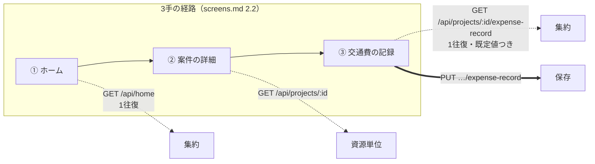
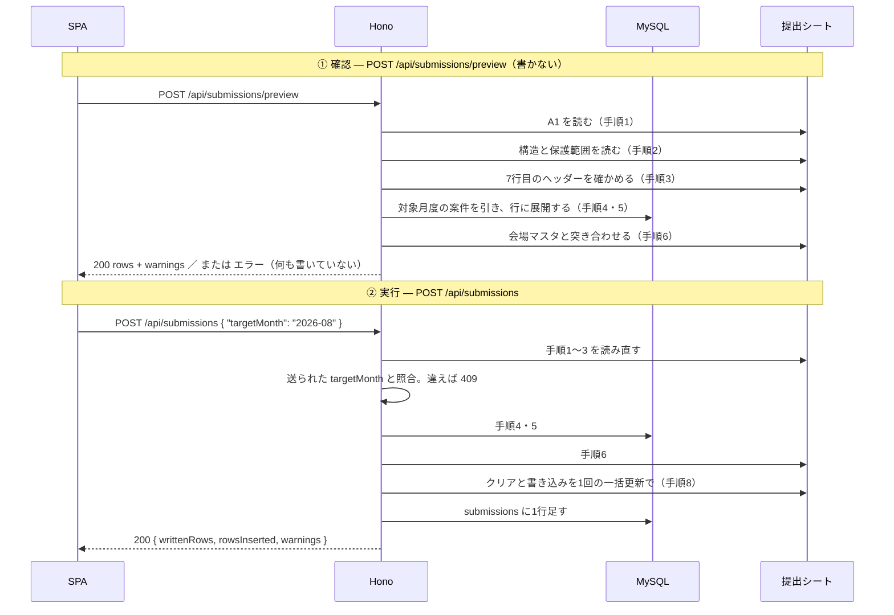

# API 設計

## 1. この文書について

この文書は、**フロントエンドとバックエンドの間に何を置くか** を決めたものである。
設計フェーズの4本目で、[`architecture.md`](architecture.md)・[`screens.md`](screens.md)・
[`database.md`](database.md) の次に置く。

- **扱うこと** — エンドポイントの粒度と一覧、要求と応答の形、エラーの返し方、
  **持たないエンドポイント**、画面との対応
- **扱わないこと** — 外部 API の呼び出し設計（[`integration.md`](integration.md)）、
  異常系の実現方法（[`error-handling.md`](error-handling.md)）、画面の見た目（[`screens.md`](screens.md)）
- **出どころ** — 要件定義 4章（機能要件）・5章（書き出し仕様）・9章（非機能要件）、
  `architecture.md` 3.7 / 4.3 / 5.2、`screens.md` 2.x / 3.x / 4.x、`database.md` 5.x / 7.x

> **このリポジトリは public である。**
> スプレッドシートID・シート名・フォルダID・会場コードの実値・氏名・メールアドレスは
> **この文書に書かない**（N-08 / N-18）。例示はすべて架空の値で、要件定義 5.6 と揃えてある。

### この文書が閉じる2つの宿題

**前の文書が、決めきれずにここへ持ち越したものが2件ある。**

| 宿題 | どこから来たか | どこで閉じるか |
| --- | --- | --- |
| **エンドポイントの粒度** | `architecture.md` 11章 | **3章** |
| **全端末のセッション失効** | `architecture.md` 11章 / `database.md` 12章。**署名付き Cookie でサーバー側に状態が無い** | **4.1 / 7章** |

### この文書がいちばん言いたいこと

**7章である。** このアプリの非機能要件の多くは、**エンドポイントが存在しないことによって守られる。**

書き込み先を受け取らなければ他人のシートへは書けない（`NF-08`）。
宛先を受け取らなければ他人へメールは送れない（`NF-13`）。
トークンを返さなければバックエンドの外へは出ない（`NF-05`）。

**`architecture.md` 5.4 が「取り違えられないよう型で分ける」としたのと同じ発想を、API の面でやる。**
検証で弾くのではなく、**そもそも書けないようにする。**

### 更新の仕方

実装の途中で判断がひっくり返ったら、**なぜひっくり返ったかを添えて**ここへ書き戻す。
前の文書の結論が変わる場合は、そちらも直す。

## 2. 全体の約束

### 2.1 前の文書から来るもの

| 前提 | 出典 | API への効き方 |
| --- | --- | --- |
| **同一オリジンでパスを振り分ける** | `architecture.md` 4.3 | **CORS を作らない。** ベースパスは `/api` |
| セッションは署名付き Cookie。90日・使うたび延びる | `architecture.md` 3.7 | トークンをヘッダーで運ばない（2.3） |
| **Google API を叩くのは `integrations` だけ。認可情報を外へ出さない** | `architecture.md` 5.2 / `NF-05` | **トークンを返すエンドポイントを持たない**（7章） |
| `routes` は `services` だけを呼ぶ | `architecture.md` 5.2 | エンドポイントは業務ロジックを持たない。**この文書は入口の形だけを決める** |
| **「月」の3基準を型で分ける** | `architecture.md` 5.4 | **JSON の書式で分ける**（2.4） |
| **取り込みの完了を待たずに一覧を出す** | `screens.md` 3.2 | **一覧と同期を別のリクエストにする**（3.1） |
| **記録画面は開いた時点で保存できる状態** | `screens.md` 3.5 / 4.3 | **既定値をサーバーが返す**（3.2 / 5.2） |
| **加工は記録時に済ませる。提出時には何もしない** | `database.md` 5.2 | **提出行の正本を作るのはサーバー**（3.2 / 5.3） |
| 案件は月6〜10件、会場43件前後 | 要件定義 9.1 | **ページングを持たない**（2.7） |

### 2.2 ベースパスと、同一オリジンで済むもの

```
https://<ホスト>/api/*
```

**オリジンが分かれないので、CORS の設定が要らない**（`architecture.md` 4.3）。
Cookie は `HttpOnly` / `Secure` / `SameSite=Lax` で、**クロスサイトからの `POST` には付かない。**

**CSRF 対策はこれに `Origin` ヘッダーの照合を足すだけでよい。**
状態を変えるメソッド（`POST` / `PUT` / `PATCH` / `DELETE`）で、`Origin` が自分のホストでなければ 403 を返す。
**トークンを配って回す仕組みを持たない。** 利用者1人・オリジン1つで、隠された経路が無い。

**OAuth のリダイレクトには `state` を必須にする**（4.1 / 4.2）。
`SameSite=Lax` はトップレベルの `GET` には Cookie を付けるので、**コールバックだけは素の照合が要る。**

### 2.3 表現

| | |
| --- | --- |
| 本文 | `application/json`。**`multipart/form-data` は領収書のアップロードだけ**（4.6） |
| キーの書き方 | **`camelCase`** |
| 文字コード | UTF-8 |

**`camelCase` にするのは、`repositories` の外へ `snake_case` を出さないためである**（`database.md` 5章 / 10.2）。
DB の列名がそのまま API に出ていると、**DB を替えたときに API の互換性まで巻き込む。**

**セッションは Cookie だけで運ぶ。** `Authorization` ヘッダーを使わない。
**SPA は同一オリジンにいるので、ブラウザが勝手に付ける**（2.2）。
JavaScript から読める場所にトークンを置かない。

### 2.4 「月」の3基準を、JSON の書式で分ける

**`architecture.md` 5.4 が型でやったことを、API の面でやる。**

| 基準 | JSON での書式 | 例 | 誰が決めるか |
| --- | --- | --- | --- |
| **カレンダー上の日** | `YYYY-MM-DD` | `"2026-09-05"` | 案件の施行日。人が入れるか、依頼メールから来る |
| **対象月度** | **`YYYY-MM`** | `"2026-08"` | **サーバーが提出シートの `A1` から読む**（決定13） |
| **案件の月度** | **`YYYY-MM`** | `"2026-09"` | **サーバーが施行日から導出する**（決定12） |

**日付と月度は書式が違うので、JSON の上でも取り違えられない。**
`"2026-09-05"` を月度の欄に入れれば、その場で弾ける。

**対象月度と案件の月度は同じ書式だが、どちらもサーバーが返す値であり、
クライアントから送る経路が無い**（7章）。**送れないものは取り違えられない。**

**日時は ISO 8601 の UTC で返す**（`"2026-09-05T09:42:00Z"`）。
`database.md` 4.2 が `DATETIME` を UTC で入れると決めており、**そのまま出す。**
**表示のための JST への変換はクライアントが行う。**

**`YYYY-MM-DD` に時刻もタイムゾーンも付けない。**
施行日は暦日であって時刻ではない（`database.md` 4.2）。
**`Date` を経由して UTC へ寄せると1日ずれ、別の月度になる。**

### 2.5 エラーの形

```json
{ "error": { "code": "SHEET_UNREACHABLE", "message": "提出シートを読めませんでした" } }
```

**`message` は本人が読む日本語**である。画面はそのまま出してよい。

| 状態 | いつ | `code` の例 |
| --- | --- | --- |
| 400 | 本文が JSON として壊れている | `BAD_REQUEST` |
| **401** | **未ログイン。セッションが切れた・失効させられた** | `UNAUTHENTICATED` |
| **403** | **許可アドレス以外**（F-01 / N-03）。`Origin` が合わない | `NOT_ALLOWED` |
| 404 | 資源が無い | `NOT_FOUND` |
| **409** | **競合。** 対象月度が変わった・案件番号が重複した | `TARGET_MONTH_CHANGED` / `PROJECT_NO_DUPLICATED` |
| **422** | **値が規則に合わない**（負の金額など） | `INVALID_VALUE` |
| **502** | **Google API が失敗した** | `SHEET_UNREACHABLE` / `DRIVE_UPLOAD_FAILED` / `SHEET_FORMAT_CHANGED` |
| **503** | **Google API の認可が無い・切れている** | `GOOGLE_UNAUTHORIZED` |

**401 と 503 を分けるのは、導く先が違うからである。**
401 はログイン画面へ。**503 は設定画面の「再認可する」へ**（F-02 / `screens.md` 3.10）。
**`architecture.md` 3.7 がログインの認可と Google API の認可を分けたので、失われ方も2つある。**

**502 と 503 も分ける。** 502 は相手が失敗した（共有が締められた・様式が変わった）。
**アプリ側では直せない**（N-13）。503 は自分の認可が切れた。**再認可で直る。**

### 2.6 「止める」と「知らせて続ける」を、応答の形で分ける

**要件定義 5.5 が2つの表で書き分けたものを、そのまま応答へ写す。**

| 要件定義 5.5 | API での姿 |
| --- | --- |
| **中止する**（何も書かない） | **エラー応答。200 を返さない** |
| **中止しない**（知らせたうえで続ける） | **200 に `warnings[]` を載せる** |

```json
"warnings": [
  { "code": "VENUE_CODE_UNKNOWN", "message": "会場コード AAA が会場マスタにありません", "projectId": 1 }
]
```

**この分け方が要るのは、「書いたのか書いていないのか」が本人にとって決定的だからである。**
会場コードがマスタに無くても書く（N-14）。記録の無い案件は飛ばして書く（5.5）。
**どちらも提出は成立している。** 一方、`A1` を読めなければ**1行も書いていない。**
**200 かどうかで、その区別が付く。**

**提出だけの約束ではない。** 同期（4.3）も同じ形にする。
**Gmail が読めなくても、月度の検知は済んでいる。** 片方の失敗で全体を落とさない。

### 2.7 持たないもの

| 持たないもの | なぜ |
| --- | --- |
| **ページング** | 案件は月6〜10件、会場は43件前後、提出行は月20〜30行（要件定義 9.1）。**全部返して足りる** |
| **購読**（WebSocket / SSE） | 更新するのは本人1人だけ。**他の誰かの変更が飛んでくることが無い** |
| **非同期ジョブと、その状態を問い合わせるエンドポイント** | ジョブキューもワーカーも置かない（`NF-04` / `architecture.md` 2.1）。**同期は同期で返す**（3.1） |
| **一括更新（バッチ）のエンドポイント** | まとめて送りたい場面が無い。**ルートの区間だけは配列で置き換える**が、それは1つの資源の更新である（3.3） |
| **バージョニング**（`/api/v1`）| クライアントは同じリポジトリの SPA 1つだけ。**古い版を動かし続ける相手がいない** |

## 3. 粒度 — リソース中心に、集約を2本だけ混ぜる

**`architecture.md` 11章がここへ持ち越した宿題を閉じる。**

### 3.1 何を集約し、何を集約しないか

```
GET  /api/home                          ← 集約。案件一覧＋月度状態＋要確認件数＋最後に取り込んだ日時
GET  /api/projects/:id/expense-record   ← 集約。案件＋会場のルート＋既定値を一式

GET  /api/venues / POST /api/routes / GET /api/stations ...   ← 以降は素直な資源単位
```

**集約するのは2本だけである。** どちらも `screens.md` 2.2 の**3手の経路上にある画面**で、
**「開いた時点で必要なものが揃っている」ことが要件そのもの**だからである。

| 画面 | 資源単位だと | 集約すると | 根拠 |
| --- | --- | --- | --- |
| **ホーム** | 案件・対象月度と提出状態・要確認件数・最後に取り込んだ日時で**4往復** | **1往復** | `NF-12` / `screens.md` 3.2 |
| **交通費の記録** | 案件・会場のルート・既存の記録で**2〜3往復**。**そのあと既定値を組み立てる** | **1往復。既定値まで入って返る** | 要件定義 8.1 / `screens.md` 3.5 |

**逆に、会場とルートの画面は3手の経路に無い**（`screens.md` 2.1）。
**往復回数を減らす理由が無いので、資源単位に置く。**



**②の案件の詳細を集約しないのは、ここが確認のための画面だからである**（`screens.md` 2.3）。
出すのは案件の項目と記録の要約だけで、**1資源で足りる。**

### 3.2 サーバーが決めることと、クライアントが決めてよいこと

**粒度と同じくらい、これを決めておく必要がある。**
**要件で定まっている規則がクライアントにもあると、答えが2つできる。**

**サーバーが決める**

| 何を | なぜ |
| --- | --- |
| **案件の月度** | 決定12。`database.md` 9章が列すら持たないと決めた値である。**クライアントで導出させると、そこが2つ目の答えになる** |
| **対象月度** | 決定13。提出シートの `A1` が正。**手で変えられる経路を作らない**（7章） |
| **並び順** | 要件定義 5.3（施行日の昇順、同じ日なら案件番号の昇順、番号が無いものは後ろ）。**提出行と同じ規則をホームでも使う** |
| **記録画面の既定値** | 「ルートが1本ならそれ、複数なら未選択」（`screens.md` 4.3）。**3手が成立するかどうかがこの規則にかかっている** |
| **提出行に書く金額**（往復の ×2、復路の反転、上書きの反映） | `database.md` 5.2。**`expense_record_legs` は提出行の正本である。正本を作る規則を1か所に置く**（5.3） |
| **提出シートに書く行そのもの** | F-27 / R-17。**「書き込む形のまま」見せるのだから、組み立てるのは書く側である** |

**クライアントが決めてよい**

| 何を | なぜ |
| --- | --- |
| **「施行前」の強調** | 施行日と今日を比べるだけ（`screens.md` 4.1）。**間違えても表示が変わるだけで、データは壊れない** |
| **合計額の表示** | 区間の金額の足し算。**提出シートへ書くのは区間ごとの額であって、合計ではない**（要件定義 5.3） |
| **要確認事項が0件のとき出さないこと** | `screens.md` 4.4。表示の判断 |
| **ルートを選び直したときの金額の再計算（表示のため）** | 下記 |

**最後の1つだけは、規則が両側にできることを認めている。**
往復の ×2 を画面に出さないわけにいかず、選び直すたびにサーバーへ聞けば往復が増える（`NF-12`）。

**そこで、`PUT` の応答に保存された区間をそのまま返す**（5.3）。
**ずれていれば、保存した直後に画面で分かる。** 提出まで持ち越さない。

### 3.3 採らなかった案

- **純粋な資源単位で統一する** — 例外が無く読みやすい。**だがホームが4往復、記録画面が2〜3往復になる。**
  `NF-12` と「3手」が、**フロントエンドの組み立て方に依存してしまう。**
  **要件で決まっているものを、実装の裁量へ落とさない**
- **全画面を BFF にする**（`/api/screens/home` のように画面ごとに1本）— 往復は最小になるが、
  **画面が増えるたびに API が増える。** 設定系の画面は資源と1対1で、包む層が意味を持たない。
  しかも `screens.md` 7章は**モックを触ってから導線を見直す余地**を残しており、
  **画面に密着させると、見直しのたびに API が動く**
- **GraphQL** — 往復も過不足も一度に解ける。**だがクライアントは同じリポジトリの SPA 1つだけで、
  取りたいものが揃わない相手がいない。** スキーマと解決器のぶんだけ構成が増え、
  **`architecture.md` 6.1 の「重いものを選ばない」に反する**
- **区間を個別のエンドポイントにする**（`POST /api/routes/:id/legs` など）— 一見素直だが、
  **`sort_order` の付け替えがクライアントとサーバーの2か所に載る。**
  区間はルートの部品で、単独では意味を持たない（`database.md` 6.2 が CASCADE にしたのと同じ理屈）。
  **ルートの `PUT` で配列ごと置き換える**

## 4. エンドポイント一覧

**全34本。** 要件の番号を添える。

### 4.1 認証 — ログイン

| | パス | 何をするか | 要件 |
| --- | --- | --- | --- |
| GET | `/api/auth/session` | ログイン状態を返す。未ログインは 401 | F-01 |
| GET | `/api/auth/login` | Google の同意画面へ 302。**スコープは `openid email` だけ** | F-01 |
| GET | `/api/auth/callback` | 許可アドレスと照合 → Cookie 発行 → `/` へ 302。**不一致は 403** | F-01 / N-03 |
| POST | `/api/auth/logout` | この端末の Cookie を消す | — |
| POST | `/api/auth/logout-all` | **全端末を失効させる** | 下記 |

**ログインに Gmail・ドライブ・スプレッドシートのスコープを求めない**（`architecture.md` 3.7）。
**ここで確かめるのは本人かどうかだけである。** Google API の認可は 4.2 で別に取る。

#### セッション Cookie の中身と、確かめる順序

Cookie は署名付きで、**`sub`（識別子）と `iat`（発行時刻）だけ**を持つ。
メールアドレスを入れない（N-18）。

| # | すること |
| --- | --- |
| 1 | 署名を確かめる |
| 2 | **`iat` が `auth_state.sessions_valid_after` より後であることを確かめる** |
| 3 | 期限（`iat` から90日）を確かめる |
| 4 | 通ったら、**`iat` を今にして Cookie を発行し直す**（使うたび延びる・`architecture.md` 3.7） |

**手順4より前に手順2を置く。** 逆にすると、失効させた直後のリクエストが
**新しい `iat` を得て生き延びてしまう。**

#### 全端末のセッション失効 — `architecture.md` 11章 / `database.md` 12章の宿題

**署名付き Cookie はサーバー側に状態を持たない。** ログアウトはその端末の Cookie を消すだけで、
**盗まれた端末の Cookie は90日間そのまま有効である。**

**`architecture.md` 3.7 は有効期限を90日と長く取った。** 帰り道に再ログインを求めないためであり、
この判断は動かさない。**代わりに、切る手立てをここで用意する。**

**単一行のテーブルに、失効の基準時刻を1つだけ持つ。**

```
auth_state（単一行・CHECK (id = 1)）
  sessions_valid_after  DATETIME NULL   ← ここより前に発行された Cookie を弾く
```

`POST /api/auth/logout-all` は、ここに現在時刻を書く。
**次のリクエストで、すべての端末の Cookie が 401 になる。**

| なぜこの形か | |
| --- | --- |
| **端末ごとの行を持たない** | 期限切れの行を掃除する処理が要らない。**利用者1人・端末1台**（要件定義 9.1） |
| **判定が1回の読み取りで済む** | 単一行。認証のたびに1クエリ増えるが、**月に数十リクエストの規模**（要件定義 9.1） |
| **`database.md` 5.3 の「セッションのテーブルを持たない」を覆さない** | 持つのは**端末の一覧ではなく、失効の基準時刻1つ**である |

**採らなかった案**

- **端末ごとのセッションテーブル** — 個別の端末を選んで切れる。**だが期限切れ行の掃除が要り、
  `database.md` 5.3 が明示的に「持たない」と決めたものを覆すことになる。**
  端末1台に対して、得るものより増える手当てのほうが多い
- **Cookie の署名鍵を入れ替える** — テーブルが1つも増えない。**だが鍵は環境変数なので、
  入れ替えるには再起動が要る**（`architecture.md` 7.3）。
  `architecture.md` 7.2 がリフレッシュトークンを環境変数に置かなかったのと**同じ理由で成立しない**
- **何も足さない** — 90日の Cookie をそのまま受け入れる。**盗まれたときに手が無い。**
  有効期限を長く取った判断と釣り合わない

### 4.2 Google API の認可

| | パス | 何をするか | 要件 |
| --- | --- | --- | --- |
| GET | `/api/google/authorization` | **認可の有無・保持スコープ・認可日時。** トークンは返さない | F-02 |
| GET | `/api/google/authorization/start` | 同意画面へ 302。`access_type=offline` / `prompt=consent` | F-02 |
| GET | `/api/google/authorization/callback` | リフレッシュトークンを**暗号化して保存** → 設定画面へ 302 | F-02 |

**返すのは3つだけである。**

```json
{ "authorized": true, "scopes": ["gmail.readonly", "gmail.send", "drive.file", "spreadsheets"],
  "authorizedAt": "2026-09-01T02:00:00Z", "missingScopes": [] }
```

**`missingScopes` を返すのは、スコープが増えたときに気づくためである**（`database.md` 5.3）。
`gmail.send` は後から足したもので、**古いトークンのままだとアラートの送信だけが失敗する。**
**失敗してから気づくより、保持しているスコープを見て再認可へ導けるほうがよい。**

### 4.3 ホームと同期

| | パス | 何をするか | 要件 |
| --- | --- | --- | --- |
| GET | `/api/home` | **集約。** 月度ごとの案件・対象月度・提出状態・未確認の要確認件数・最後に取り込んだ日時 | F-09 / F-21 |
| POST | `/api/sync` | **依頼メールの取り込みと、月度切り替わりの検知** | F-03〜F-08 / F-32 |

**`GET /api/home` は DB しか読まない。** 外部 API を叩かない。
**`screens.md` 3.2 の「取り込みの完了を待たずに一覧を出す」が、この分け方そのものである。**
1本にすると、**Gmail を待ってから一覧が出る。3手の1手目が遅れる**（`NF-12`）。

#### `POST /api/sync` が2つを兼ねる理由

要件定義 2.1 (3) は「**依頼メールの取り込みも、月度切り替わりの検知も、アプリを開いたときに走る**」と、
2つを1組で書いている。`database.md` の `sync_state` も、
`last_imported_at` と `last_seen_target_month` を**1つのテーブルに持っている。**

**DB が1つで持っているものを、API で2つに割らない。**

| # | すること | 根拠 |
| --- | --- | --- |
| 1 | 提出シートの `A1` を読み、`last_seen_target_month` と比べる | F-31 / F-32 |
| 2 | 変わっていれば、**切替先より前で、かつ提出が済んだ月度の実績を消す** | F-32 / `database.md` 6.3 |
| 3 | 消さずに残ったもののうち、**切替先より前で未提出のもの**を要確認事項に残す | F-32 / `screens.md` 4.4 |
| 4 | 依頼メールを取り込む | F-03〜F-08 |
| 5 | `last_imported_at` を更新する。**1件も取り込まなかった実行でも更新する** | `database.md` 5.3 |

**片方が失敗しても、もう片方は走る**（2.6）。
シートが読めなくても Gmail の取り込みは試みるし、逆も同じ。
**失敗は `warnings[]` と要確認事項に載せ、200 で返す。**

**これは「静かに壊れないこと」（要件定義 10章）と噛み合っている。**
差出人アドレスが変わると**エラーは何も出ず、ただ案件が入ってこなくなる。**
その気づきの手立てはホームの「最後に取り込んだ日時」であり、**同期そのものが止まってしまっては働かない。**

**二重に走っても案件は増えない。** `imported_mails` の主キーが Gmail の message id で、
**同じメールを2度取り込めない**（F-08 / `database.md` 5.3）。

### 4.4 案件

| | パス | 何をするか | 要件 |
| --- | --- | --- | --- |
| POST | `/api/projects` | 手で追加する。**`source` は `manual` 固定** | F-10 |
| GET | `/api/projects/:id` | 詳細。記録の要約を含む | F-11 |
| PATCH | `/api/projects/:id` | 項目を直す。**施行日を直すと所属月度が変わる** | F-11 |
| DELETE | `/api/projects/:id` | 削除。**紐づく記録・乗車・領収書の行も消える。ドライブの実体は消さない** | F-12 |

**`source` をリクエストで受け取らない。** `POST` で作れば `manual`、取り込みで作れば `mail` である
（`database.md` 5.2）。**受け取ると、取り込んだ案件を手動と偽れる。**

**案件番号が既存と重複したら 409（`PROJECT_NO_DUPLICATED`）。**
`projects.UNIQUE (project_no)` が二重取り込みの一段目である（F-08）。
**空の案件番号は重複しない**（MySQL は NULL の重複を許す）。
**そのぶん手で足した案件には効かない**ので、後から同じ案件がメールで入ることがある（要件定義 6.2）。

### 4.5 交通費の記録

| | パス | 何をするか | 要件 |
| --- | --- | --- | --- |
| GET | `/api/projects/:id/expense-record` | **集約。** 案件・会場のルート・**既定値**・既存の記録・タクシー乗車 | F-18 / F-19 |
| PUT | `/api/projects/:id/expense-record` | 保存。**応答に保存された区間を返す** | F-18〜F-21 |

**`PUT` にするのは、1案件に交通費記録が0か1だからである**（`database.md` 5.2 の `UNIQUE (project_id)`）。
**作るのも直すのも同じ操作になる。** 記録済みの案件をもう一度開いて直しても、同じ入口で済む。

**記録を消すエンドポイントは持たない。** `screens.md` 3.5 に操作が無い。
消したいときは案件ごと消す（F-12）か、上書きする。

### 4.6 タクシー乗車と領収書

| | パス | 何をするか | 要件 |
| --- | --- | --- | --- |
| POST | `/api/projects/:id/taxi-rides` | **`multipart/form-data`。** 金額＋領収書1件 | F-22〜F-26 |
| DELETE | `/api/taxi-rides/:id` | 消す。**ドライブのファイル実体は消さない** | 要件定義 6.4 |

**乗車と領収書を別のエンドポイントにしない。**
F-26 は「**保存に失敗したら、乗車の記録を残さずに知らせる**」と決めている。
**分けると、金額だけ登録されて領収書が無い状態を作れてしまう。**

**1回のリクエストの中で、ドライブへの保存 → 共有の付与 → DB への書き込みを通す。**
**途中で失敗したら 502 を返し、DB には何も残さない**（F-24 / F-25 / F-26）。

#### なぜ「保存」ボタンにまとめないか

`screens.md` 3.5 は、記録画面の最後に「保存」を置いている。
**タクシーもそこでまとめて送りたくなるが、採らない。**

| なぜ | |
| --- | --- |
| **DB の形がそうなっている** | `taxi_rides` は `projects` にぶら下がり、`expense_records` の子ではない（`database.md` 5.2）。**乗車は交通費記録と独立している** |
| **待たせる場所が変わる** | 領収書は数百KB〜数MB（要件定義 9.1）。**選んだ時点で送れば、金額を確かめているあいだにアップロードが終わる**（`NF-12`） |
| **失敗の出る場所が正しくなる** | まとめて送ると、**アップロードの失敗が「保存」ボタンの後に出る。** そこから区間の記録まで巻き戻すことになり、F-26 の「中途半端な状態を作らない」が逆に難しくなる |

**「タクシーだけあって交通費の記録が無い」状態は起こりうる。**
これは提出時に「記録の無い案件は飛ばして警告する」（要件定義 5.5）で拾われる。**中途半端ではない。**

### 4.7 会場・ルート・駅

| | パス | 何をするか | 要件 |
| --- | --- | --- | --- |
| GET | `/api/venues` | 会場一覧。**紐づくルート（名前・区間数・片道合計）まで含める** | F-13 / F-14 / F-17 |
| POST | `/api/venues` | 会場を追加。**`source` は `manual` 固定** | F-14 |
| POST | `/api/venues/import` | **会場マスタを取り込む。** `code` を鍵にした upsert | F-13 |
| POST | `/api/routes` | ルートを追加。区間の配列を伴う | F-16 / F-17 |
| GET | `/api/routes/:id` | ルート1本。**区間の中身つき** | F-16 |
| PUT | `/api/routes/:id` | 更新。**区間の配列ごと置き換える** | F-16 |
| DELETE | `/api/routes/:id` | 削除。**区間も一緒に消える**（CASCADE） | F-16 |
| GET | `/api/stations` | 駅一覧 | F-15 |
| POST | `/api/stations` | 駅を登録。**名前は鉄道会社の略称込み** | F-15 |

**`GET /api/venues` がルートまで返すのは、会場43件・ルートは会場あたり1〜数本だからである**
（要件定義 9.1）。**分ける理由が無い。** 区間の中身だけは重いので、`GET /api/routes/:id` に置く。

**`POST /api/venues/import` が `source = 'manual'` の行を触らない**（`database.md` 5.1）。
毎回入れ直すと、**手で足した会場を巻き込んで消しかねない。**

**会場を削除するエンドポイントを持たない。** `screens.md` 3.6 に操作が無く、
`database.md` 6.2 も `venues → routes` を RESTRICT にしている。**設定データを巻き込みで消さない。**

**駅を削除するエンドポイントも持たない。** 同じく `stations → route_legs` は RESTRICT で、
**使われている駅を消せてしまうとルートが壊れる。**

**駅名が既存と重複したら 409。** `stations.UNIQUE (name)` に当たる。
**`X鉄乙駅` と `Y鉄乙駅` は別の駅である**（F-15 / 要求分析 5.2）。
濁点だけが違う駅名も別の行になる（`database.md` 4.1・**実機未確認**）。

### 4.8 提出

| | パス | 何をするか | 要件 |
| --- | --- | --- | --- |
| POST | `/api/submissions/preview` | **要件定義 5.2 の手順1〜7。書かない** | F-27 |
| POST | `/api/submissions` | **手順1〜7 をやり直したうえで、手順8 を実行する** | F-28 / F-29 / F-30 |

詳しくは6章。

### 4.9 要確認事項

| | パス | 何をするか | 要件 |
| --- | --- | --- | --- |
| GET | `/api/attentions` | 一覧。`?checked=false` で未確認だけ | F-33 |
| POST | `/api/attentions/:id/check` | 確認済みにする | F-34 |

**`PATCH` で `{ "checked": true }` を送る形にしない。** 操作が1つしかなく、
**「確認済みにする」という意味がパスにそのまま出るほうが読める。**
**未確認へ戻す操作は持たない**（`screens.md` 3.9 に無い）。

**要確認事項を作るエンドポイントを持たない**（7章）。
`attentions` は**アプリが起こしたことの記録**であって、外から積むものではない。

### 4.10 設定

| | パス | 何をするか | 要件 |
| --- | --- | --- | --- |
| GET | `/api/settings` | **提出先の名前・対象月度・認可状態。ID は返さない** | F-02 / F-31 |
| GET | `/api/settings/config-backup` | 設定データを JSON で書き出す | NF-11 |
| POST | `/api/settings/config-backup` | 読み込む | NF-11 |

**`GET /api/settings` が返すのは名前だけである**（N-08 / `screens.md` 3.10）。

```json
{ "spreadsheetName": "交通費精算", "sheetName": "（自分のシート）", "targetMonth": "2026-08",
  "google": { "authorized": true, "missingScopes": [] } }
```

**スプレッドシートIDもフォルダIDも差出人アドレスも返さない。**
**public リポジトリの方針とは別に、応答にも出さない**（`screens.md` 5章）。

**控えは駅・会場・ルート・区間だけを含む**（`architecture.md` 8章）。
**実績データを含めない。** 消えてよいものである（N-05）。
**読み込みは追加ではなく置き換えとする。** 控えは丸ごと1つで、**部分的に混ぜると元の形に戻らない。**

## 5. 主要な応答の形

**全部は載せない。** 判断が効いている4本だけを置く。値はすべて架空で、要件定義 5.6 と揃えてある。

### 5.1 `GET /api/home`

```json
{
  "targetMonth": "2026-08",
  "lastImportedAt": "2026-09-05T09:42:00Z",
  "attentionCount": 1,
  "months": [
    {
      "month": "2026-09",
      "state": "upcoming",
      "submittedAt": null,
      "projects": [
        { "id": 3, "serviceDate": "2026-09-05", "venueCode": "AAA", "venueName": "甲ホール",
          "coupleName": "〇〇様△△様", "recorded": false, "totalAmount": null, "taxiCount": 0 },
        { "id": 4, "serviceDate": "2026-09-05", "venueCode": "BBB", "venueName": "乙迎賓館",
          "coupleName": "□□様◇◇様", "recorded": false, "totalAmount": null, "taxiCount": 0 }
      ]
    },
    {
      "month": "2026-08",
      "state": "due",
      "submittedAt": null,
      "projects": [ "…" ]
    }
  ]
}
```

| 決めたこと | なぜ |
| --- | --- |
| **`months` で束ねて返す** | ホームは月度ごとに区切る（`screens.md` 4.2）。**束ねるのは月度の判定であり、サーバーの仕事**（3.2） |
| `state` は `due` / `submitted` / `upcoming` の3つ | `screens.md` 3.2 の「提出待ち／提出済み（日時）／これから稼働」 |
| **並び順は月度の降順、月度の中では施行日の昇順** | `screens.md` 3.2。**配列の順序がそのまま画面の順序である** |
| **`attentionCount` は未確認だけを数える** | `screens.md` 4.4。**0件のとき出さないのはクライアントの判断**（3.2） |
| **「施行前」を返さない** | 施行日と今日を比べれば分かる。**表示の強調だけで、データが壊れない**（3.2） |
| **3か月分は返らない** | 配信が覆う最も遠い日は翌月7日まで（要件定義 9.2 / N-21）。**`months` は最大2要素** |

### 5.2 `GET /api/projects/:id/expense-record`

```json
{
  "project": { "id": 3, "serviceDate": "2026-09-05", "venueCode": "AAA",
               "venueName": "甲ホール", "coupleName": "〇〇様△△様" },
  "routes": [
    { "id": 1, "name": "乙駅乗換",
      "legs": [ { "sortOrder": 1, "fromStationName": "X鉄甲駅", "toStationName": "X鉄乙駅", "oneWayFare": 320 },
                { "sortOrder": 2, "fromStationName": "Y鉄乙駅", "toStationName": "Y鉄丙駅", "oneWayFare": 210 } ] }
  ],
  "defaults": {
    "tripType": "round",
    "outboundRouteId": 1,
    "returnRouteId": 1,
    "legs": [ { "sortOrder": 1, "fromStationName": "X鉄甲駅", "toStationName": "X鉄乙駅", "amount": 640 },
              { "sortOrder": 2, "fromStationName": "Y鉄乙駅", "toStationName": "Y鉄丙駅", "amount": 420 } ]
  },
  "record": null,
  "taxiRides": []
}
```

**`defaults` が、3手を成立させている。**

| 項目 | 値 | 根拠 |
| --- | --- | --- |
| `tripType` | **`"round"`** | 実測では全行が `往復`（要件定義 5.3）。`片道` はまだ一度も起きていない |
| `outboundRouteId` | **ルートが1本ならその id。複数なら `null`** | 要件定義 8.1 / `screens.md` 4.3 |
| `returnRouteId` | **往路と同じ**（`round` のとき） | 決定9。復路は往路を反転して使う |
| `legs[].amount` | **登録運賃を `round` なら ×2 した額** | 要件定義 5.3 / F-20 |

**`routes` が空なら `defaults.outboundRouteId` は `null` になる。**
**クライアントは記録画面を出さず、会場とルートの画面へ導く**（`screens.md` 4.3）。

**`record` が `null` でないときは、そちらが `defaults` に優先する**（記録済みの案件を開き直した場合）。

### 5.3 `PUT /api/projects/:id/expense-record`

**要求**

```json
{
  "tripType": "round",
  "outboundRouteId": 1,
  "returnRouteId": 1,
  "overrides": [ { "sortOrder": 2, "amount": 500 } ]
}
```

**区間も駅名も送らない。送るのは、選んだルートと、人が上書きした金額だけである。**

| なぜ | |
| --- | --- |
| **`expense_record_legs` は提出行の正本である**（`database.md` 5.2 の見出し） | **正本を作る規則を1か所に置く。** クライアントが組み立てた区間をそのまま保存すると、**ブラウザの中に提出行の作り方ができる** |
| **往復の ×2 と復路の反転は、要件が定めた規則である**（要件定義 5.3 / 決定9） | **要件の規則をクライアントへ置かない**（3.2） |
| **上書きだけは人の判断である**（F-20） | **`overrides` が、機械が決めた値と人が決めた値の境目になる** |
| **既定の経路では `overrides` は空配列** | 「直す必要が無ければ触らない」（F-20 / `screens.md` 3.5）。**キーボードが要らない経路では、金額を1円も送らない** |

**応答（200）には、保存された区間をそのまま返す。**

```json
{ "id": 12, "tripType": "round", "recordedAt": "2026-09-05T10:03:00Z",
  "legs": [ { "sortOrder": 1, "fromStationName": "X鉄甲駅", "toStationName": "X鉄乙駅", "amount": 640 },
            { "sortOrder": 2, "fromStationName": "Y鉄乙駅", "toStationName": "Y鉄丙駅", "amount": 500 } ] }
```

**画面はこれを表示に反映する。**
表示のための計算はクライアントも持つ（3.2）が、**食い違えば保存した直後に画面で分かる。**
**提出まで持ち越さない。**

**負の金額は 422（`INVALID_VALUE`）で弾く。**
`amount` は `INT UNSIGNED` だが、**DB は二重の網であって一枚目ではない**（N-09 / `database.md` 4.4）。

### 5.4 `POST /api/submissions/preview`

```json
{
  "targetMonth": "2026-08",
  "lastSubmittedAt": null,
  "attentionCount": 1,
  "rows": [
    { "no": 1, "projectId": 1,
      "cells": { "A": "2026/8/22", "B": "CCC", "C": "婚礼案件", "D": "▲▲様▼▼様",
                 "E": "X鉄甲駅", "F": "X鉄丙駅", "G": "往復", "H": 620, "I": null } },
    { "no": 2, "projectId": 1,
      "cells": { "A": null, "B": null, "C": null, "D": null,
                 "E": "Y鉄丙駅", "F": "Y鉄丁駅", "G": "往復", "H": 420, "I": null } }
  ],
  "receiptCell": "(8/23)\nhttps://drive.google.com/file/d/<ファイルID>/view",
  "writableRows": 25,
  "rowsToInsert": 0,
  "warnings": [
    { "code": "VENUE_CODE_UNKNOWN", "message": "会場コード CCC が会場マスタにありません", "projectId": 1 },
    { "code": "NO_EXPENSE_RECORD", "message": "交通費の記録がありません。この案件は書き込みません", "projectId": 5 }
  ]
}
```

| 決めたこと | なぜ |
| --- | --- |
| **`cells` を提出シートの列記号（A〜I）そのままにする** | F-27 / R-17「**書き込む形のまま**」。**画面が組み立て直さない。** 列と1対1で読める |
| **2行目以降の A〜D は `null`** | 要件定義 5.3。**先頭行にだけ書く。** 空であることまで含めて確認の対象である |
| **J / K / L を含めない** | 常に空（要件定義 5.3）。**書かない欄を応答に出すと、書くように見える** |
| **M（領収書）は行ではなく `receiptCell`** | `M8:M32` は丸ごと1つの結合セルで、**月に1枠しかない**（要件定義 5.4） |
| **`rowsToInsert` を返す** | 挿入はシートの構造を変える操作である（要件定義 5.2 手順5）。**実行する前に知らせる** |
| **`片道` が現れる案件が分かる** | `cells.G` に出る。**まだ一度も起きていない書き方**なので、初めてのときは目視で確かめられる（要件定義 5.3 / `screens.md` 3.8） |

**中止するときは 200 を返さない**（2.6 / 要件定義 5.5）。

| 中止の条件 | 応答 |
| --- | --- |
| `A1` を読めない・日付として解釈できない | 502 `TARGET_MONTH_UNREADABLE` |
| 自分のシートが見つからない | 502 `SHEET_NOT_FOUND` |
| **7行目のヘッダーが想定と違う** | **502 `SHEET_FORMAT_CHANGED`**（`NF-10`） |
| 読めない・書けない（共有の停止） | 502 `SHEET_UNREACHABLE` |
| 書き込める行の範囲を特定できない | 502 `WRITABLE_RANGE_UNKNOWN` |
| Google API の認可が切れている | 503 `GOOGLE_UNAUTHORIZED` |

### 5.5 `POST /api/projects/:id/taxi-rides`

**要求は `multipart/form-data`。**

| フィールド | 中身 | 要件 |
| --- | --- | --- |
| `amount` | この1回の金額 | F-22 |
| `rodeOn` | 乗車日。**省略なら案件の施行日** | F-22 |
| `receipt` | 領収書のファイル。**画像または PDF** | F-23 / R-13 |

**応答（201）**

```json
{ "id": 7, "rodeOn": "2026-09-05", "amount": 1800,
  "receipt": { "fileName": "20260905_AAA_1.jpg",
               "driveUrl": "https://drive.google.com/file/d/<ファイルID>/view" } }
```

**`fileName` はアプリが付ける**（`database.md` 5.2 の `<YYYYMMDD>_<会場コード>_<連番>`）。
**クライアントから受け取らない。** 元の名前は `IMG_1234.jpg` のようになっていて、
**フォルダを見てもどの日のものか分からない。**

**`driveFileId` は返さない**（N-08）。画面が使うのは URL だけである。

**失敗したら 502（`DRIVE_UPLOAD_FAILED`）で、DB には何も残っていない**（F-26）。
同時に要確認事項へ残る（`drive_upload_failed`）。

## 6. 提出の2段構え



### 6.1 プレビューの結果を持ち回さない

**実行は手順1〜7 をやり直す。** プレビューが作った行をサーバーに預けておいて、
それを書きにいく形にはしない。

| なぜ | |
| --- | --- |
| **提出の途中状態をサーバーに置かない** | 置けば「いつ捨てるか」が要る。**利用者1人・月1回の操作に対して、状態が1つ増えるほうが重い** |
| **確認と実行の間にシートは変わりうる** | 委託元の所有物である（N-04）。**古い読み取りを信じて書くほうが危ない** |
| **F-29 と噛み合う** | 「何度でも実行できて、結果が同じ」。**毎回読み直すからそうなる** |

### 6.2 代わりに `targetMonth` だけを照合する

**リクエストの本文は `{ "targetMonth": "2026-08" }` だけである。**

読み直した `A1` がこれと違えば、**409 `TARGET_MONTH_CHANGED` で止める。**

**確認した画面と違う月度のシートへ書かないための、最小の歯止めである。**
月度切替（翌月4〜7日）は提出の時期と重なっており（要件定義 1章）、
**確認している最中に切り替わることが、起こらないとは言えない。**

**書き込み先そのものは受け取らない**（7章）。受け取るのは**「どの月度のつもりだったか」だけ**である。

### 6.3 プレビューを `GET` にしない

| なぜ | |
| --- | --- |
| **外部 API を叩き、行を作りうる** | 読めなければ要確認事項（`sheet_unreachable`）が残る。**`GET` が副作用を持つ形にしない** |
| **先読みされると、そのたびにシートを叩く** | ブラウザやプロキシは `GET` を安全なものとして扱う |

### 6.4 一括更新にまとめる

**手順8のクリアと書き込みは、1回の一括更新にする**（要件定義 5.2）。
別々に実行すると、**クリアが通って書き込みが失敗したときにシートが空のまま残る。**

> **一括更新が「全部適用されるか、1つも適用されないか」になるのは API の仕様から言えることで、
> 実機では確かめていない**（要件定義 13章）。**`integration.md` と実装時に確かめる。**

## 7. 持たないエンドポイントと、受け取らないパラメータ

**この章が、この文書でいちばん重要である。**
**非機能要件の多くは、エンドポイントが存在しないことで守られる。**

| 持たないもの | 何を守るか |
| --- | --- |
| **Google API のトークンを返すエンドポイント** | **`NF-05`。** `/api/google/authorization` が返すのは**有無・スコープ・認可日時だけ**（4.2） |
| **書き込み先を受け取るパラメータ**（スプレッドシートID・シート名・フォルダID） | **`NF-08` / N-12。** 環境変数から取る。**実行時に決めない**（`architecture.md` 2.1） |
| **メールを送るエンドポイント** | **`NF-13` / N-23。** 送るのは `scheduler` コンテナだけ（`architecture.md` 3.8）。**宛先を組み立てる経路が API に無い** |
| **対象月度を切り替えるパラメータ** | **決定13 / `screens.md` 5章。** `A1` が正。**手で変えられると判断が2つになる**（6.2 の `targetMonth` は照合のためだけで、書き込み先を選ばない） |
| **ID を返す応答**（スプレッドシートID・フォルダID・ドライブのファイルID・Gmail の message id） | **N-08。** 設定は名前だけ、領収書は URL だけ（4.10 / 5.5） |
| **`source` を受け取るパラメータ**（案件・会場） | 取り込みで作れば `mail` / `master`、手で作れば `manual`（`database.md` 5.1 / 5.2）。**偽れる経路を作らない** |
| **依頼メールの本文を返すエンドポイント** | `screens.md` 5章。取り出した5項目で足りる。**リンクは叩かない**（要件定義 7.2） |
| **要確認事項を作るエンドポイント** | `attentions` は**アプリが起こしたことの記録**である。外から積むものではない |
| **月度切替を起こすエンドポイント** | F-32 は**確認を挟まない**（決定10）。**操作の入口が要らない。** 検知は `POST /api/sync` の中（4.3） |
| **会場・駅を削除するエンドポイント** | `screens.md` 3.6 / 3.7 に操作が無い。`database.md` 6.2 が RESTRICT にしている。**設定データを巻き込みで消さない** |
| **提出済みデータを読むエンドポイント** | 要件定義 11章。**正本は提出シートにある**（N-05） |
| **ドライブのファイルを消すエンドポイント** | 要件定義 6.4 / 11章。**アプリが消してよいものではない** |
| **`scheduler` 専用のエンドポイント** | `scheduler` は `backend` と**同じイメージを別コマンドで起動する**（`architecture.md` 3.8）。**HTTP を経由しないので、外から叩ける入口が生まれない** |
| **管理者・他ユーザーのためのエンドポイント** | 利用者は本人1人（N-03）。**権限モデルを持たない**（`architecture.md` 3.7） |

**下の3行は、`architecture.md` 5.4 と同じことをしている。**

> 取り違えるとデータが消える。**テストで見つける類の誤りではなく、そもそも書けないようにする。**

**書き込み先を受け取らなければ、他人のシートへ書くコードは書けない。**
**宛先を受け取らなければ、他人へ送るコードは書けない。**
**検証で弾いているのではなく、値が入ってくる経路が無い。**

## 8. 画面とエンドポイントの対応

**`screens.md` 2.1 の10画面すべてを埋める。**

| 画面 | 開いたときに叩く | 操作で叩く |
| --- | --- | --- |
| **ログイン** | `GET /api/auth/session` | `GET /api/auth/login` |
| **ホーム** | **`GET /api/home`** | `POST /api/sync` |
| 案件の詳細 | `GET /api/projects/:id` | `PATCH` / `DELETE /api/projects/:id` |
| 案件の追加 | `GET /api/venues` | `POST /api/projects` |
| **交通費の記録** | **`GET /api/projects/:id/expense-record`** | `PUT …/expense-record`／`POST …/taxi-rides`／`DELETE /api/taxi-rides/:id` |
| 会場とルート | `GET /api/venues` | `POST /api/venues`／`POST /api/venues/import`／`DELETE /api/routes/:id` |
| ルートの編集 | `GET /api/routes/:id`／`GET /api/stations` | `POST` / `PUT /api/routes/:id`／`POST /api/stations` |
| 提出 | `POST /api/submissions/preview` | `POST /api/submissions` |
| 要確認事項 | `GET /api/attentions?checked=false` | `POST /api/attentions/:id/check` |
| 設定 | `GET /api/settings` | `GET /api/google/authorization/start`／`GET`・`POST /api/settings/config-backup`／`POST /api/auth/logout`／`POST /api/auth/logout-all` |

**ホームを開くと `GET /api/home` と `POST /api/sync` が両方走る**（F-03 / `screens.md` 3.2）。
**`GET` の結果を待たずに `POST` を投げ、`POST` が返ったら `GET` をやり直す。**
**一覧は先に出る。** 取り込み中はその旨を出す。

**ルートの編集で `GET /api/stations` を先に取るのは、駅を選ばせるためである**（`screens.md` 3.7）。
**新しい駅は `POST /api/stations` で足してから区間に使う。**

## 9. 要件とのトレーサビリティ

### 9.1 機能要件

| 要件 | どこで満たすか |
| --- | --- |
| F-01 | 4.1 |
| F-02 | 4.2 / 2.5（503 で再認可へ導く） |
| F-03 | 4.3 `POST /api/sync` |
| **F-04〜F-08** | **エンドポイントを持たない。** `POST /api/sync` の中で走る（4.3） |
| F-09 | 4.3 `GET /api/home` / 5.1 |
| F-10 | 4.4 `POST /api/projects` |
| F-11 | 4.4 `GET` / `PATCH /api/projects/:id` |
| F-12 | 4.4 `DELETE /api/projects/:id` |
| F-13 | 4.7 `POST /api/venues/import` |
| F-14 | 4.7 `POST /api/venues` |
| F-15 | 4.7 `GET` / `POST /api/stations` |
| F-16 | 4.7 `POST` / `GET` / `PUT` / `DELETE /api/routes/:id` |
| F-17 | 4.7（ルートは `venueId` を持つ） |
| F-18 / F-19 | 4.5 / 5.2（`defaults`） |
| F-20 | 5.3（`overrides`） |
| F-21 | 5.1（`recorded`） |
| F-22〜F-26 | 4.6 / 5.5 |
| F-27 | 4.8 / 5.4 |
| F-28 / F-29 | 4.8 / 6章 |
| F-30 | 5.4（`lastSubmittedAt`）／ 5.1（`submittedAt`） |
| F-31 | 4.3 / 4.10（`targetMonth`） |
| **F-32** | **エンドポイントを持たない**（7章）。`POST /api/sync` の中で検知する（4.3） |
| F-33 / F-34 | 4.9 |
| **F-35 / F-36** | **エンドポイントを持たない**（7章）。`scheduler` が送る（`architecture.md` 3.8） |

### 9.2 非機能要件

| 要件 | どこで満たすか |
| --- | --- |
| `NF-01` スマホ主 | 3.1（往復回数を減らす2本の集約） |
| `NF-02` オフライン非対応 | 2.7（購読を持たない。入力はその場で送る） |
| `NF-03` 3層 | 2.2（`/api` で境界が1本に決まる） |
| `NF-04` 定期実行を持たない | 2.7 / 4.3（同期は同期で返す）／ 7章（`scheduler` 専用の入口を持たない） |
| **`NF-05` 認可情報を外へ出さない** | **7章**（トークンを返すエンドポイントを持たない）／ 4.2 |
| `NF-06` 本人以外は使えない | 4.1（許可アドレスの照合）／ 2.5（403） |
| `NF-07` 環境依存値をリポジトリに含めない | 4.10 / 7章（**応答にも出さない**） |
| **`NF-08` 他人のシートへ書く経路を持たない** | **7章**（書き込み先を受け取らない）／ 6.2 |
| `NF-09` 行数・保護範囲を決め打ちにしない | 5.4（`writableRows` / `rowsToInsert` は実行時に読んだ値） |
| `NF-10` 様式が変わったら止まる | 5.4（502 `SHEET_FORMAT_CHANGED`）／ 2.6 |
| `NF-11` 設定データの控え | 4.10 |
| `NF-12` 記録画面が待たされない | 3.1（集約2本）／ 4.3（一覧と同期を分ける）／ 4.6（領収書は選んだ時点で送る） |
| **`NF-13` メールの宛先は本人固定** | **7章**（メールを送るエンドポイントを持たない） |

## 10. 未確定事項

| 何が | 何が決まっていないか | いつ決めるか |
| --- | --- | --- |
| **`POST /api/sync` の所要時間** | `messages.list` + `messages.get` を数通ぶん叩く。**待たせる時間を実測していない。** 長ければ取り込みと月度検知を2本に割る | **実装時に実測** |
| **領収書のサイズ上限** | 1件あたり数百KB〜数MB（要件定義 9.1）。上限をどこに置き、超えたときに何を返すか | 実装時 |
| **提出の二重送信** | F-29 が「何度でも同じ結果」なので害は小さいが、**押し直すとシートを2回書く**（一括更新も2回走る） | 実装時 |
| **機械可読な定義を持つか**（OpenAPI など） | **この文書が正本である。** 別に持つと二重管理になるが、型の生成には効く | 実装時 |
| **`multipart` の受け方** | Hono の実装と、`googleapis` のマルチパートアップロードへの繋ぎ方 | [`integration.md`](integration.md) |
| **`attentions` の `detail` の書式** | 素のテキストか、種別ごとの構造か（`database.md` 12章から引き継ぐ） | [`error-handling.md`](error-handling.md) |
| **トランザクションの境界** | 記録の保存と提出をどこで区切るか（同上） | [`error-handling.md`](error-handling.md) |

**`database.md` 12章から引き継いだ2件は、ここでも決めない。**
**どちらも「失敗したときにどう振る舞うか」であり、`error-handling.md` の主題そのものである。**
