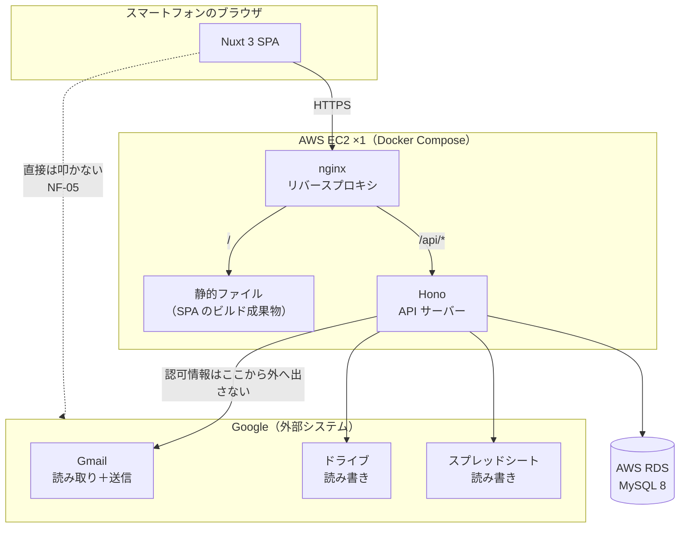

# アーキテクチャ設計

## 1. この文書について

この文書は、交通費精算アプリを **何で作り、どういう形に組むか** を決めたものである。
要件定義（[`docs/requirements.md`](../requirements.md)）の次に置く、設計フェーズの1本目である。

- **扱うこと** — 技術選定とその根拠、システム構成、層の分け方、認可情報の扱い、移行容易性
- **扱わないこと** — 画面の見た目（[`screens.md`](screens.md)）、テーブル定義（[`database.md`](database.md)）、
  エンドポイント（[`api.md`](api.md)）、外部 API の呼び出し設計（[`integration.md`](integration.md)）
- **出どころ** — 要件定義、スクール課題の制約、および依頼者本人への確認（2026-09-01）

> **このリポジトリは public である。**
> スプレッドシートID・シート名・フォルダID・会場コードの実値・氏名・メールアドレスは
> **この文書に書かない**（N-08 / N-18）。例示はすべて架空の値を使う。

### このプロジェクトが持つ2つの目的

**技術選定の判断は、この2つの重なりで決まっている。片方だけを見ると選定理由が読めない。**

| | 目的① | 目的② |
| --- | --- | --- |
| 何か | **エンジニアスクールの課題** | **交通費精算アプリとして使い続ける** |
| いつ | **今回のプロジェクト** | **別プロジェクトで作り直す** |
| 制約 | **前回のアプリから技術スタックを変える。インフラは据え置き** | **全て無料の構成にする**（Cloudflare を想定） |

**目的②の技術選定は、この文書では行わない。** そのプロジェクトで改めて決める。
ここでやるのは、**目的②へ移りやすい形にしておくこと**だけである（6章）。

### 前回のアプリ（目的①の出発点）

| 層 | 前回 | 今回 |
| --- | --- | --- |
| フロントエンド | React SPA | **変える** |
| バックエンド | Java / Spring Boot | **変える** |
| データベース | PostgreSQL | **変える** |
| インフラ | AWS EC2 ×1 / RDS ×1 | **据え置き** |
| IaC | Terraform | **据え置き** |

**TypeScript は今回も使ってよい。** 前回のバックエンドは Java なので、
バックエンドを TypeScript にすれば言語は変わっている。

### 更新の仕方

設計や実装の途中で判断がひっくり返ったら、**なぜひっくり返ったかを添えて**ここへ書き戻す。
要件そのものが変わった場合は、要件定義のほうも直す。

## 2. 前提となる制約

### 2.1 要件定義から来るもの

| 制約 | 出典 | 選定への効き方 |
| --- | --- | --- |
| フロントエンド・バックエンド・データベースの3層 | NF-03 / 2章 | 構成の骨格 |
| スマートフォンのブラウザが主、PC が従 | NF-01 | ネイティブアプリではない。レスポンシブな Web |
| **業務ロジックの定期実行を持たない。提出アラートの送信だけが例外** | NF-04 / 決定1 / 決定17 | ジョブキュー・ワーカーを置かない。**cron は提出アラート用の1本だけ**（3.8） |
| **送るメールの宛先は本人固定** | NF-13 / N-23 | **宛先を実行時に決めない。** 環境変数から取る |
| **Google API の認可情報をバックエンドの外へ出さない** | NF-05 / 2.1 | **フロントから Google API を叩く構成を採れない** |
| 本人以外は利用できない | NF-06 / N-03 / 決定5 | 権限モデルが要らない。許可アドレスの照合で足りる |
| 他人のシートへ書き込む経路を持たない | NF-08 / N-12 | 書き込み先を実行時に決めない |
| 提出シートの行数・保護範囲を決め打ちにしない | NF-09 / N-11 | 構造を毎回読む |
| **環境依存値と認証情報をリポジトリに含めない** | NF-07 / N-08 / N-18 | **設定はすべて環境変数** |
| 設定データの控えを取れる | NF-11 | 8章 |
| 記録画面の操作が待たされない | NF-12 | 4章 |
| 利用者1人・案件月6〜10件・提出行月20〜30行 | 9.1 | **「小さい。性能や拡張性のために構成を複雑にする理由は無い」**（原文） |

### 2.2 目的①（スクール課題）から来るもの

- **前回のアプリから、言語・フレームワーク・データベースを変える**
- **インフラは据え置き。** AWS の EC2 1台 + RDS 1台。IaC は Terraform

**EC2 は常時起動である。** したがって、サーバーレス構成で論点になる
コールドスタートは**今回は発生しない。** `NF-12` はこの点で楽になる。

### 2.3 目的②（無料運用への移行）から来るもの

移行先として **Cloudflare** を想定している。ここから逆算すると、次が効く。

| Cloudflare の性質 | 選定への効き方 |
| --- | --- |
| **Workers のバンドル上限は無料プランで 3 MiB**（有料 10 MiB） | **重いフレームワークを選べない** |
| Workers は Node.js ランタイムそのものではない | **Node.js 依存の強いものを選べない** |
| Hyperdrive が無料プランで使え、PostgreSQL と MySQL に対応する | **DB エンジンの選択は移行の妨げにならない** |
| Pages と Workers に無料枠がある（1日10万リクエスト） | 利用者1人には過剰なほど余る |

**この制約は今回の成果物には課されない。** EC2 で動かすからである。
だが、**ここで重いものを選ぶと目的②で作り直しになる**ので、選定の判断材料として使う。

## 3. 技術選定

### 3.1 一覧

| 層 | 選定 | 前回 |
| --- | --- | --- |
| 言語 | **TypeScript** | Java（バックエンド） |
| フロントエンド | **Nuxt 3（Vue 3）** — SPA としてビルドする | React SPA |
| バックエンド | **Hono** | Spring Boot |
| データベース | **MySQL 8** | PostgreSQL |
| データベースアクセス | **Drizzle ORM** | （不明・対象外） |
| 認証 | **Google OAuth 2.0 + 許可アドレスの照合** | （不明・対象外） |
| 実行形態 | **Docker Compose** | — |
| インフラ | **AWS EC2 ×1 / RDS ×1** | 同左（据え置き） |
| IaC | **Terraform** | 同左（据え置き） |

### 3.2 言語 — TypeScript

**フロントエンドとバックエンドを同じ言語で書く。**

| なぜ | |
| --- | --- |
| 前回から変わっている | 前回のバックエンドは Java。言語の縛りを満たす |
| **検証済みの資産を移植できる** | [`tools/gmail-probe/extract.cjs`](../../tools/gmail-probe/extract.cjs) の解析ロジックは、**実測で何度も直して辿り着いたもの**（要求分析 6章）。書き直さずに済む |
| 型で事故を防げる | 「月」に3つの基準がある（要件定義 1章）。**型で区別すれば取り違えを防げる**（5.4） |
| 移行先の選択肢が最も多い | Cloudflare Workers・Cloud Run・Fly.io など、どこでも動く |

**採らなかった案**

- **Go** — 起動もバンドルも最良で、Cloudflare 以外の移行先とは最も相性がよい。
  だが **Cloudflare Workers では動かない**（WebAssembly 経由の道はあるが常用に耐えない）。
  加えて未経験で、フロントエンドと言語が分かれる。**目的②の移行先を Cloudflare に据えた時点で外れた**
- **Python** — 学習資料は最も多いが、同じく Workers では動かない。フロントと言語が分かれる

### 3.3 バックエンド — Hono

| なぜ | |
| --- | --- |
| **Cloudflare Workers で動く** | Hono は Workers のために作られている。**目的②で載せ替えずに済む** |
| **Node.js でも動く** | 今回は EC2 上で Node.js として動かす。同じコードが両方で動く |
| 軽い | 3 MiB のバンドル上限に対して余裕がある |
| 前回から変わっている | Spring Boot とは別物 |

**採らなかった案**

- **NestJS** — Spring Boot の設計思想（DI・レイヤー・モジュール）を TypeScript で再現でき、
  前回の学びが最も接続する。**だが Cloudflare Workers で動かない。**
  デコレータと `reflect-metadata` による実行時リフレクションが Workers ランタイムと構造的に合わない。
  Cloudflare Containers を使えば動くが、**Workers Paid が要るので「全て無料」が崩れる。**
  **不利なのではなく行き止まりなので、外した**
- **Express** — Workers 非対応。Node.js 前提
- **Fastify** — Node.js 前提で、Workers 対応は弱い

**Hono を選ぶことで失うもの。** NestJS と違い、**Hono は構造を何も強制しない。**
層の分け方も依存の向きも自分で決めることになる。これは5章で決めて書き残す。
**設計を自分で決めて説明することは、目的①では欠点ではなく主題である。**

### 3.4 フロントエンド — Nuxt 3（Vue 3）

| なぜ | |
| --- | --- |
| React ではない | 前回は React SPA。縛りを満たす |
| **Nitro の思想が目的②と合う** | Nuxt のサーバーエンジン Nitro は、**最初から「どこへでもデプロイする」ために作られている。** Cloudflare 向けプリセットが標準搭載されている |
| 日本語の資料が多い | 詰まったときに抜けやすい |
| バンドルが軽い | 3 MiB の上限に対して余裕がある |

**今回は SPA としてビルドする。** サーバーサイドレンダリングを使わない。
利用者1人・10画面・認証必須で、SEO も初回表示速度も要求されていないため、
**サーバー側で描画する理由が無い。** バックエンドとの境界も明確になる（4.3）。

**採らなかった案**

- **Next.js** — React なので今回は選べない。加えて **Cloudflare の無料プランとは相性が悪い。**
  Workers で動かすには OpenNext というアダプタを噛ませるが、
  **Next.js のランタイムは重く、無料プランの 3 MiB に収めるのが課題になる。**
  さらに OpenNext は KV ネームスペースと R2 バケットのバインディングを要求するため、構成部品が増える。
  **Next.js は Vercel のために作られており、Cloudflare 対応はアダプタ経由の後追いである**という
  構造的な差がある
- **SvelteKit** — **Cloudflare 適性は Nuxt と互角**（`adapter-cloudflare` が公式）。
  書く量はさらに少なく、バンドルも最小。**日本語の資料と求人の多さで Nuxt を採った**
- **Angular** — バックエンドと思想を揃えられるが、10画面・利用者1人の規模に対して重い

### 3.5 データベース — MySQL 8

| なぜ | |
| --- | --- |
| PostgreSQL ではない | 前回は PostgreSQL。縛りを満たす |
| RDS で使える | インフラ据え置きの制約を満たす |
| **移行の妨げにならない** | Cloudflare Hyperdrive が **無料プランで MySQL に対応**している |
| 論理データモデルと合う | 要件定義 6章の関連は素直にリレーショナル（3.6） |

**採らなかった案**

- **PostgreSQL** — 前回使用。縛りに反する
- **MariaDB** — RDS では使えるが、**無料枠のあるマネージドサービスの選択肢が MySQL より少ない。**
  目的②で不利になる
- **リレーショナルでないもの**（DynamoDB など）— インフラが RDS 据え置きなので選べない。
  仮に選べたとしても、要件定義 6章の関連（会場1対多ルート、ルート1対多区間、
  区間が出発駅と到着駅を独立して持つ）を表現しにくい

### 3.6 データベースアクセス — Drizzle ORM

| なぜ | |
| --- | --- |
| **バンドルが軽い** | 3 MiB の上限に効く |
| **Workers で動く** | 目的②でそのまま使える |
| **DB を替えても書き方が変わらない** | MySQL・PostgreSQL・SQLite を同じ書き方で扱える。目的②で DB を替えたときの書き直しが小さい |
| SQL に近い | 生成される SQL が読める。**提出処理のような込み入った操作で何が起きているか分かる** |
| マイグレーションが付く | `drizzle-kit` でスキーマの変更履歴を持てる |

**採らなかった案**

- **Prisma** — スキーマファイルが宣言的で、そのまま [`database.md`](database.md) の材料にできるのが魅力。
  **だがクエリエンジンが重く、Workers の 3 MiB に対して不利。** 目的②で外すことになる
- **TypeORM** — Spring Data JPA に近く前回の学びが接続するが、
  デコレータ依存で Workers での動作に不安が残る
- **生の SQL のみ** — 型が付かない。**要件定義 6章の関連を型で守れない**

### 3.7 認証 — Google OAuth 2.0 + 許可アドレスの照合

**利用者は本人1人**（N-03 / 決定5）。権限の分離もアカウント管理も要らない。

| 何を | どうする |
| --- | --- |
| ログイン | Google アカウントで認証する（F-01） |
| 本人確認 | ID トークンのメールアドレスを、**環境変数で持つ許可アドレスと照合する** |
| セッション | **署名付き Cookie**（`HttpOnly` / `Secure` / `SameSite=Lax`）。**有効期限は90日で、使うたび延びる** |
| Google API の認可 | **ログインとは別に扱う**（7章） |

**有効期限を90日と長く取るのは、切れる場所が悪いからである**（2026-09-04 確認）。
使うのは主に稼働日の帰り道で、月6〜10回（要件定義 9.1）。
**屋外・移動中に再ログインを求めるのは、「3手で終わる」（要件定義 8.1）が最も崩れる形である。**
端末は本人のスマートフォン1台で、**盗まれたときは設定からログアウトすれば足りる**
（`screens.md` 3.10）。

**ログインの認可と、Google API の認可を分ける。** ログインは「本人か」を確かめるだけで、
Gmail・ドライブ・スプレッドシートのスコープは要らない。**混ぜると、
ログインのたびに広いスコープへの同意を求めることになる。**

**採らなかった案**

- **Auth.js / NextAuth** — 多機能だが、利用者1人・プロバイダ1つに対して過剰。
  Workers での取り回しにも制約がある
- **パスワード認証** — Google アカウントで足りる。パスワードを持つと保管の責任が増える

### 3.8 インフラ — AWS EC2 + RDS + Terraform（据え置き）

**目的①の制約により、前回と同じ構成を使う。** ここは選定していない。

| | |
| --- | --- |
| EC2 | 1台。**常時起動。** Docker Compose でコンテナを動かす |
| RDS | 1台。MySQL 8 |
| Terraform | 前回のものを引き継ぐ |

**EC2 が常時起動であることは、`NF-04` と矛盾しない。**
`NF-04` が禁じているのは**業務ロジックの定期実行**であって、サーバーが起きていることではない。
取り込みも月度切替の検知も、**リクエストの中で走る**（決定1）。

**cron は1本だけ置く。提出アラート（`F-35`）の送信である**（決定17 / 要件定義 2.1 (3)）。

| | |
| --- | --- |
| 何をするか | **その日が1日か3日で、対象月度が未提出なら、本人あてに1通送る**（要件定義 7.5） |
| 何をしないか | **取り込み・書き込み・削除はしない。データを変えない** |
| なぜリクエストの中で走らせないか | **アラートの目的は、アプリを開かない人に届くこと**である。開いたときに走らせては、それが要る場面でだけ走らない |

**置き場は `docker compose` 内の専用コンテナとする**（2026-09-04 確認）。

| なぜ | |
| --- | --- |
| **EC2 のホスト側に手を入れない** | Terraform や user-data でホストを触ると、**アプリの外に設定が1つ残る** |
| 6.1 の縛り1（Docker で動かす）と揃う | コンテナホスティングへそのまま移せる |
| 6.1 の縛り2（AWS 固有に依存しない）と揃う | EventBridge も Lambda も使わない |
| **目的②でそのまま移せる** | Cloudflare の Cron Triggers が同じ役割を担う |

**このコンテナは `backend` と同じイメージを、別のコマンドで起動する。**
業務ロジックを二重に持たない。**タイムゾーンは `Asia/Tokyo` に固定する**
（[`database.md`](database.md) 4.2）。

**採らなかった案**

- **EC2 ホストの cron** — 最も単純でコンテナが増えないが、**ホスト側に設定が残る。**
  再構築のたびに手で入れ直すか、Terraform に持たせることになる
- **EC2 ホストの systemd タイマー** — cron よりログと失敗検知は取りやすいが、
  **同じくホスト側に残る**

## 4. システム構成

### 4.1 構成図



**点線は「やらないこと」である。** フロントエンドは Google API を直接叩かない（`NF-05` / 2.1）。

### 4.2 コンテナの分け方

| コンテナ | 中身 | なぜ分けるか |
| --- | --- | --- |
| `nginx` | リバースプロキシ。TLS 終端 | パスで振り分けるため（4.3） |
| `frontend` | SPA のビルド成果物（静的ファイル） | **ビルド時にしか動かない。** 実行時はただのファイル |
| `backend` | Hono の API サーバー | 業務ロジックと外部連携 |
| `scheduler` | **提出アラートの定期実行**（`F-35` / 3.8） | **`backend` と同じイメージを別コマンドで起動する。** 業務ロジックを二重に持たない |

**`frontend` は実行時にはコンテナである必要が無い。** nginx が配れば足りる。
ビルドの段だけコンテナに分け、成果物を nginx へ渡す形にする。

**データベースはコンテナにしない。** RDS を使う（目的①の制約）。
ただし**ローカル開発では MySQL のコンテナを立てる。** RDS へ繋がずに開発できる状態を保つ。

### 4.3 同一オリジンでパスを振り分ける（CORS を作らない）

**フロントエンドとバックエンドを分離するが、オリジンは分けない。**

```
https://<ホスト>/          → SPA（静的ファイル）
https://<ホスト>/api/*     → Hono
```

**なぜこうするか。** オリジンが分かれると CORS と Cookie の設定が要る。
`SameSite` の扱いを誤ると**セッションが飛ぶか、逆に緩くなる。**
利用者1人のアプリで、この面倒を抱える利点が無い。

**目的②でも同じ形が取れる。** Cloudflare では1つのドメインに対して、
`/api/*` を Workers へ、それ以外を Pages へ振り分けられる。**移行しても CORS は発生しない。**

## 5. 層の分け方

**Hono は構造を強制しない。** だから、ここで決めて守る。

### 5.1 バックエンドの層

```
backend/src/
├ routes/          HTTP の入口。入力の検証とレスポンスの組み立てだけ
├ services/        業務ロジック。月度の判定・提出行の生成はここ
├ repositories/    データベースアクセス。Drizzle を触るのはここだけ
├ integrations/    外部連携。インターフェースと実装
│   ├ gmail/
│   ├ drive/
│   └ sheets/
├ domain/          型と業務ルール
└ config/          環境変数の読み取り
```

### 5.2 層をまたぐときのルール

| ルール | なぜ |
| --- | --- |
| **`routes` は `services` だけを呼ぶ。** `repositories` と `integrations` を直接呼ばない | 業務ロジックが HTTP の入口へ漏れると、テストも移行もできなくなる |
| **`services` はインターフェースだけを見る。** 実装を知らない | 6.3 の差し替えを可能にする |
| **`repositories` の外へ Drizzle の型を出さない** | DB を替えたときの影響を `repositories` に閉じる |
| **Google API を叩くのは `integrations` だけ** | `NF-05` / 要件定義 2.1 |
| **認可情報は `integrations` の外へ出さない** | 同上。`services` はトークンの存在を知らない |
| `domain` はどの層にも依存しない | 型と業務ルールだけを置く |

### 5.3 外部連携をインターフェースで包む

**`integrations` は、インターフェースと実装を分ける。**

```
integrations/gmail/
├ client.ts          インターフェース（services が見るのはこれだけ）
└ googleapis.ts      実装（googleapis パッケージを使う）
```

**今回の実装は `googleapis` パッケージを使う。** `tools/` の検証スクリプトと同じもので、
実機で動くことが確かめられている。

**このインターフェースは、`NF-05` を守るためにどのみち要る。**
目的②のためだけに作る構造ではない。移行で効くのは副次的な利点である（6.3）。

### 5.4 「月」の3基準を型で分ける

**要件定義 1章が「混ぜると事故になる」と明記している。**

| 呼び方 | 何を指すか | どこから決まるか |
| --- | --- | --- |
| 当月・前月・翌月 | カレンダー上の月 | 時計 |
| **対象月度** | 提出シートが今どの月を受け付けているか | 自分のシートの `A1`（決定13） |
| **案件の月度** | その案件の施行日が属する月 | 案件の施行日（決定12） |

**この3つを別々の型として `domain` に置き、互いに代入できないようにする。**
どれも実体は「年と月」だが、**同じ型にすると取り違えても気づけない。**

**取り違えるとデータが消える**（要件定義 1章 決定12 の解説）。
テストで見つける類の誤りではなく、**そもそも書けないようにする。**

## 6. 移行容易性 — 目的②のために今やっておくこと

### 6.1 4つの縛り

**技術選定そのものより、この4つのほうが移行に効く。**

| # | 縛り | なぜ |
| --- | --- | --- |
| 1 | **Docker で動かす** | EC2 上でも `docker compose` で起動する。コンテナホスティングへそのまま移せる |
| 2 | **AWS 固有サービスに依存しない** | S3・Secrets Manager・SQS・Lambda を使わない。**依存を作った分だけ移行時に外す作業が増える** |
| 3 | **設定はすべて環境変数** | クラウド固有のシークレット機構を挟まない。`NF-07` とも一致する |
| 4 | **データベースアクセスは `repositories` に閉じる** | DB を替えたときの影響範囲を1層に留める |

**縛り2 は、このアプリでは無理をしていない。** **領収書の保存先は Google ドライブ**（要件定義 7.3）
なので、そもそも S3 が要らない。**要件のほうが先に AWS 非依存になっている。**

### 6.2 移行するとき何が変わるか

| | 今回（AWS） | 目的②の想定（Cloudflare） |
| --- | --- | --- |
| フロントエンド | EC2 の nginx が配る静的ファイル | **Cloudflare Pages**（無料枠 1日10万リクエスト） |
| バックエンド | EC2 の Node.js コンテナ | **Cloudflare Workers**（無料枠。**バンドル 3 MiB 以内**） |
| データベース | RDS MySQL | **Hyperdrive 経由の MySQL**（Hyperdrive は無料プランで使える） |
| 秘密の置き場 | 環境変数 | Workers Secrets |
| ルーティング | nginx がパスで振り分け | Cloudflare がパスで振り分け（4.3） |

**Hono・Nuxt・Drizzle は、いずれもそのまま動く。**

### 6.3 移行するとき書き直しが要るもの

**`googleapis` パッケージだけである。**

`googleapis` は Node.js への依存が重く、バンドルも大きいため、
**Workers の 3 MiB に収まらない可能性が高い**（未検証・10章）。

**だが、実際に使う呼び出しは9本しかない。**

| 相手 | 使う呼び出し |
| --- | --- |
| Gmail | `messages.list` / `messages.get` / `messages.send`（提出アラート・要件定義 7.5） |
| ドライブ | `files.create`（マルチパートアップロード）/ `permissions.create` |
| スプレッドシート | `spreadsheets.get` / `values.get` / `values.update` / `batchUpdate` |

> **当初は `values.clear` を入れて10本としていた。**
> [`integration.md`](integration.md) 8.2 が **クリアという操作そのものをやめた**ため、1本減った。
> 本文行を「書く行＋空行」の矩形として1回で書けば、**消してから書く必要が無い。**

**`fetch` で書き直しても大した量ではない。** しかも 5.3 のインターフェースがあるので、
**書き直すのは `integrations` の実装だけで、業務ロジックには一行も触らない。**

## 7. 認可情報の扱い

### 7.1 OAuth クライアントを作り直す

[`docs/google-cloud-basics.md`](../google-cloud-basics.md) 15章のとおり、
検証で使った「デスクトップ アプリ」型のクライアントは、**そのままでは使えない。**

| | 検証時 | 今回 |
| --- | --- | --- |
| クライアントの種類 | デスクトップ アプリ | **ウェブ アプリケーション**（新しく作る） |
| 受け口 | `127.0.0.1` の任意ポート。登録不要 | **事前に登録した固定 URL** |
| クライアントシークレット | 秘密として扱えない | **本当に秘密になる。** バックエンドに置き、ブラウザへ出さない |

**同意画面の「内部」は変えない**（`google-cloud-basics.md` 9章）。
利用者は本人だけなので、外部にする理由が無い。**外部にするとリフレッシュトークンが7日で失効する。**

**リダイレクト URL は EC2 のドメインになる。** 目的②へ移るときは、
移行先のドメインを**追加で**登録する（差し替えではなく追加すれば、移行中も両方が動く）。

### 7.2 リフレッシュトークンの保管

**データベースに、暗号化して保存する。** 暗号鍵は環境変数で持つ。

| なぜ | |
| --- | --- |
| **クラウド固有サービスに依存しない**（6.1 の縛り2） | AWS Secrets Manager に置くと、移行時に外す作業が要る |
| **平文で置かない** | `google-cloud-basics.md` 11章が、リフレッシュトークンを **🔴 最も危険**（期限が無く、失効させるまで悪用が止まらない）としている |
| バックエンドの外へ出ない | `NF-05` / 要件定義 2.1 |

**トークンは1つしかない**（利用者1人）。テーブルを持つのは大げさに見えるが、
**リフレッシュトークンは再発行されうる**（再認可したとき）ので、更新できる場所が要る。

**採らなかった案**

- **AWS Secrets Manager** — 有料（シークレットごとに月額）。加えてクラウド固有依存を作る
- **環境変数に直接置く** — 再認可のたびに環境変数を書き換えて再起動することになる。運用が成立しない
- **平文でデータベースに置く** — 実装は最も簡単だが、**最も危険な秘密を裸で置くことになる**

### 7.3 秘密の置き場所

| 何を | どこに | 危険度 |
| --- | --- | --- |
| リフレッシュトークン | **データベース（暗号化）** | 🔴 最も危険 |
| 暗号鍵 | 環境変数 | 🔴 これが漏れると上と同じ |
| OAuth クライアントシークレット | 環境変数 | 🟡 単体では何もできないが、アプリを名乗られる |
| セッション Cookie の署名鍵 | 環境変数 | 🟡 なりすましログインが可能になる |
| スプレッドシートID・シート名・フォルダID・差出人アドレス | 環境変数 | 🟡 実データの所在が分かる（N-08） |
| 許可するメールアドレス | 環境変数 | 🟡 個人情報（N-18） |

**いずれもリポジトリに入れない**（`NF-07`）。雛形は [`.env.example`](../../.env.example) へ足す。
**現在の `.env.example` は検証ツール用の変数しか持っていない**ので、実装時にアプリの分を追加する。

## 8. 設定データの控え（NF-11）

**アプリに書き出し機能を持たせる。** 設定画面から、駅・会場・ルート・区間を
**JSON でダウンロードできる**ようにする。読み込みもできるようにする。

| なぜ | |
| --- | --- |
| 要件は「控えを**取れる**」こと | 自動バックアップがあることではない（`NF-11`） |
| **DB を替えても機能が残る** | 目的②で移行するとき、**この機能そのものが移行手段になる** |
| 小さい | 会場43件前後、ルートは会場あたり1〜数本（要件定義 9.1）。1ファイルに収まる |

**`NF-11` を落とすと、このアプリの前提が崩れる**（要件定義 9章）。
設定データが消えると「登録済みルートを選ぶだけで済む」（R-05〜R-07）が成立しない。

**採らなかった案**

- **RDS の自動バックアップに任せる** — AWS 固有依存になり（6.1 の縛り2）、
  **目的②へ移った先で同じ手段が無い。** また、利用者が自分で控えを取れない

## 9. 要件とのトレーサビリティ

| 要件 | この文書のどこで満たすか |
| --- | --- |
| `NF-01` スマホ主・PC 従 | 3.4（レスポンシブな SPA） |
| `NF-02` オフライン非対応 | 3.4（SPA だが記録はその場で送る。要件定義 2.1） |
| `NF-03` 3層 | 4.1 / 4.2 |
| `NF-04` 業務ロジックの定期実行なし。アラートだけ例外 | 3.8（cron は提出アラートの1本だけ） |
| `NF-05` 認可情報をバックエンドの外へ出さない | 4.1 / 5.2 / 5.3 / 7.2 |
| `NF-06` 本人以外は使えない | 3.7 |
| `NF-07` 環境依存値と認証情報をリポジトリに含めない | 7.3 |
| `NF-08` 他人のシートへ書く経路を持たない | 5.2（書き込み先は環境変数。実行時に決めない） |
| `NF-09` 行数・保護範囲を決め打ちにしない | [`integration.md`](integration.md) 7.2（`protectedRanges` の `requestingUserCanEdit` から書ける範囲を決める） |
| `NF-13` 送るメールの宛先は本人固定 | 2.1 / 7.3（宛先は環境変数。実行時に決めない） |
| `NF-10` 様式が変わったら止まる | [`error-handling.md`](error-handling.md) で扱う |
| `NF-11` 設定データの控え | 8章 |
| `NF-12` 記録画面が待たされない | 2.2（EC2 は常時起動でコールドスタートが無い） |

## 10. 未検証の前提

**文献や仕様から言えることと、実機で確かめたことを区別する。**
ここに挙げたものは**すべて未検証**である。

| 前提 | 出どころ | いつ確かめるか |
| --- | --- | --- |
| **`googleapis` が Cloudflare Workers で動かない（あるいは 3 MiB に収まらない）** | バンドルサイズと Node.js 依存からの推測 | **目的②のプロジェクト。** 今回は 5.3 で備えるだけ |
| **Hyperdrive が無料プランで MySQL に使える** | Cloudflare の公式告知 | 目的②のプロジェクト |
| **このアプリが Workers の 3 MiB に収まる** | Hono・Drizzle が軽いことからの推測 | 目的②のプロジェクト |
| **提出処理が Workers の CPU 時間制限に収まる** | 提出行が月20〜30行と小さいことからの推測 | 目的②のプロジェクト |
| **`drive.file` で既存フォルダへ保存できるか** | 文献上は**できない**とされる（アプリが作っていない親フォルダを触れないため） | **実装時。** 要件定義 13章のとおり、`tools/` にプローブを足して確かめる |
| **一括更新の原子性** | Sheets API の仕様からの推測 | 実装時（要件定義 13章） |

**「動かないかもしれない」ものに今から対処しない。**
5.3 のインターフェースは `NF-05` のためにどのみち要るもので、
**それ以上の先回りはしない。**

## 11. 未確定事項

**設計の後続で決めればよいもの。**

| 何が | どこで決めるか |
| --- | --- |
| **定期実行が落ちたことに気づく手立て** | [`error-handling.md`](error-handling.md)。**置き場は 3.8 で決めた** |
| 画面の見た目 | [`screens.md`](screens.md) |
| ログの出し方・監視 | 実装時。**利用者1人なので、まずは標準出力で足りるはず**（未確定） |
| テストの方針 | 実装時 |

**「テーブル定義・型・索引」と「領収書のファイル名の命名規則」は、
[`database.md`](database.md) で閉じた。** 命名規則は `integration.md` で決めるとしていたが、
**保存する列（`receipts.file_name`）と同じ場所で決めるほうが、根拠と結果が離れない。**

**「エンドポイントの粒度」と「全端末のセッション失効」は、[`api.md`](api.md) で閉じた。**

| 何が | どう決まったか |
| --- | --- |
| エンドポイントの粒度 | **リソース中心に、集約を2本だけ混ぜる**（`api.md` 3章）。集約するのはホームと交通費の記録で、**どちらも「3手」の経路上にあり、開いた時点で揃っていることが要件そのもの**だから |
| 全端末のセッション失効 | **単一行のテーブルに、失効の基準時刻を1つだけ持つ**（`api.md` 4.1 / [`database.md`](database.md) 5.3 の `auth_state`）。**端末ごとの行を持たないので掃除が要らない。** 3.7 の「有効期限90日」は動かさず、切る手立てだけを足した |
