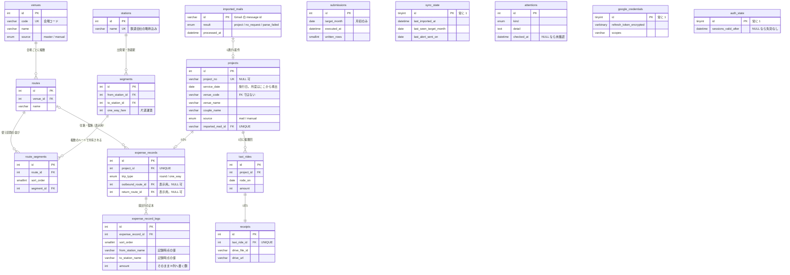

# データベース設計

## 1. この文書について

この文書は、要件定義 6章の論理データモデルを **MySQL 8 のテーブルへ落としたもの** である。
設計フェーズの3本目で、[`architecture.md`](architecture.md)・[`screens.md`](screens.md) の次に置く。

- **扱うこと** — 物理 ER 図、テーブル定義、型・NULL・既定値・索引・制約、削除の連鎖、
  マイグレーションの持ち方
- **扱わないこと** — エンドポイント（[`api.md`](api.md)）、外部 API の呼び出し設計
  （[`integration.md`](integration.md)）、異常系の実現方法（[`error-handling.md`](error-handling.md)）
- **出どころ** — 要件定義 5章（書き出し仕様）・6章（論理データモデル）、
  `architecture.md` 3.5 / 3.6 / 5.x / 7.2、`screens.md` 3.x（各画面が何を読むか）

> **このリポジトリは public である。**
> スプレッドシートID・シート名・フォルダID・会場コードの実値・氏名・メールアドレスは
> **この文書に書かない**（N-08 / N-18）。例示はすべて架空の値を使う。

### この文書が決める、いちばん重要なこと

**実績データを「記録した時点の形」で固定する**（7章）。

要件定義 6.2 は、交通費記録が金額を持つ理由を
「ルートは設定データで残り続け、運賃改定で書き換わりうる。記録した時点の金額を実績側に持つ」
と書いている。**書き換わるのは運賃だけではない。** 区間を足す・駅名を直す・ルートを消す、も起きる。

**金額だけを固定して区間をルートから引き直すと、過去の記録の行数そのものが後から変わる。**
提出は「対象月度の案件を行へ展開して、全消ししてから全部書き直す」（決定2 / F-28）なので、
**先月の提出内容が、今月ルートを直しただけで変わってしまう。**

## 2. 前提

### 2.1 要件定義から来るもの

| 前提 | 出典 | 設計への効き方 |
| --- | --- | --- |
| データは**設定・実績・システム**の3区分。**寿命が違う** | 6章 | **削除の連鎖を寿命の境界で切る**（6章） |
| **案件の月度は施行日から導出する。月度の属性を持たない** | 決定12 / 6.2 | `projects` に月度の列を作らない（9章） |
| **会場コードがマスタに無いことが実際にある** | 要求分析 6.5 / N-14 | `projects.venue_code` を外部キーにしない（8章） |
| **提出シートは 1行 = 1区間** | 5.3 | 区間ごとの行をテーブルとして持つ（7章） |
| **書き込む値の妥当性はアプリが担保する。入力規則は効かない** | N-09 / 5.1 原則4 | **DB でも担保できるものは DB で弾く**（4.4） |
| 領収書はタクシー乗車1回につき1件（1対1） | R-12 / 6.2 | `receipts.taxi_ride_id` を UNIQUE にする |
| 提出は何度でも実行できる | F-29 | `submissions` は月度ごとに複数行になる |
| 利用者は本人1人 | N-03 | 単一行のテーブルが3本ある（5.3） |
| 案件は月6〜10件、提出行は月20〜30行 | 9.1 | **小さい。索引も型も控えめでよい**（4.3） |

### 2.2 `architecture.md` から来るもの

| 前提 | 出典 | 設計への効き方 |
| --- | --- | --- |
| **MySQL 8** | 3.5 | `CHECK` 制約・`utf8mb4_ja_0900_as_cs` が使える |
| **Drizzle ORM + `drizzle-kit`** | 3.6 | スキーマを TypeScript で書き、マイグレーションを生成する（10章） |
| **Drizzle を触るのは `repositories` だけ。型を層の外へ出さない** | 5.2 | `domain` の型へ詰め替える（10章） |
| **リフレッシュトークンは DB に暗号化して保存する** | 7.2 | `google_credentials`（5.3） |
| **セッションは署名付き Cookie** | 3.7 | **セッションのテーブルを持たない**（5.3 の注） |
| **DB を替えたときの影響を `repositories` に閉じる** | 6.1 の縛り4 | MySQL 固有の機能に寄りかからない（4章の注） |

## 3. 物理 ER 図



**`submissions` / `sync_state` / `attentions` / `google_credentials` / `auth_state` は、
どこにも繋がない。**
関連を張る相手が無い。`submissions` は月度で、`attentions` は起きたことの記録である。

**実績と設定をまたぐ線は2本しかない**（`routes` → `expense_records` の往路・復路）。
**しかもどちらも NULL 可である。** これが7章の要点になる。

## 4. 共通の決めごと

### 4.1 文字コードと照合順序

| | |
| --- | --- |
| 文字コード | `utf8mb4` |
| **照合順序** | **`utf8mb4_ja_0900_as_cs`**（アクセント区別・大小区別） |

**MySQL 8 の既定 `utf8mb4_0900_ai_ci` を使わない。**
`ai` は accent-insensitive で、**日本語では濁点・半濁点がアクセントとして無視される。**
つまり **`か` と `が` が同じ値になる。**

**駅名は UNIQUE にする**（5.1）。既定のまま張ると、**濁点だけが違う別の駅を登録できなくなる。**
しかも失敗の仕方が「重複エラー」なので、**原因が照合順序だと気づきにくい。**

> **これは MySQL の仕様から言えることで、実機では確かめていない**（12章）。
> スキーマを最初に流すときに、濁点違いの2駅を入れて確かめる。

### 4.2 日付と日時

| 何を | 型 | なぜ |
| --- | --- | --- |
| **日付だけの項目**（施行日・乗車日・月度・アラート送信日） | `DATE` | 暦日として扱う。時刻もタイムゾーンも持たせない |
| **日時** | `DATETIME`（**UTC で入れる**） | `TIMESTAMP` は 2038年で頭打ちになり、接続ごとのタイムゾーン設定に振り回される |

**表示と判定は JST で行う。** とくに提出アラートの「その日が1日か3日か」（F-35 / 要件定義 7.5）は
**JST の暦日で判定する。** UTC で判定すると、**日本時間の1日の朝がまだ前月末になる。**

**アプリのコンテナのタイムゾーンは `Asia/Tokyo` に固定する。**
提出シートのタイムゾーンも `Asia/Tokyo` である（要求分析 5.1・API 実測）。

**`service_date` にタイムゾーン変換をかけない。** 施行日は依頼メールから `YYYY/MM/DD` として
取り出した暦日であり（要求分析 6.3）、**そのまま提出シートの A列へ書く**（要件定義 7.4）。
`Date` オブジェクトを経由して UTC へ寄せると、**1日ずれて別の月度になる。**
これは決定12（月度は施行日で決まる）を、**気づかないうちに壊す。**

### 4.3 キーと型の選び方

| 何を | どうする | なぜ |
| --- | --- | --- |
| 代理キー | `INT UNSIGNED AUTO_INCREMENT` | 案件は月6〜10件（9.1）。**実績は月度切替で消える**ので、10年動かしても1万行に届かない |
| **自然キーがあるもの** | **そのまま主キーにする** | `imported_mails` は Gmail の message id、単一行のテーブルは `1` 固定 |
| 順序を持つ子 | `SMALLINT UNSIGNED` の `sort_order` を持ち、`(親, sort_order)` を UNIQUE | 区間の数に上限を設けない（要件定義 6.1）が、**順序が重複してはいけない** |
| 識別子の文字列 | `VARCHAR` | 案件番号は数字9桁（要求分析 6.3）だが、**識別子であって数値ではない。** 書式が変わっても入るようにする |
| 作成・更新日時 | 全テーブルに `created_at` / `updated_at` | 障害を追うときの最低限。**業務ロジックはこれを見ない** |

### 4.4 金額と、DB で弾くもの

**金額はすべて `INT UNSIGNED`。** 円・整数で、小数を持たない。

**`UNSIGNED` にするのは、負の金額を DB で拒否するためである。**
要求分析 5.5 の実測では、提出シートに `-500` を **API 経由で書き込めてしまった**
（`strict=true` の入力規則があるのに素通りした）。**シートは何も守ってくれない**（要件定義 5.1 原則4）。
アプリが担保する（N-09）が、**担保の一段目は DB に置ける。**

**DB で弾けるものは弾く。**

| 制約 | どこに | 何を防ぐか |
| --- | --- | --- |
| `UNSIGNED` | すべての金額 | 負の金額 |
| `CHECK (DAYOFMONTH(x) = 1)` | `submissions.target_month` / `sync_state.last_seen_target_month` | **月初以外の月度。** 提出シートの `A1` は月初の日付シリアル値を返す（要求分析 5.6） |
| `CHECK (id = 1)` | 単一行の3テーブル | 2行目 |
| `UNIQUE (project_no)` | `projects` | **同じ案件の二重取り込み**（F-08） |
| `UNIQUE (taxi_ride_id)` | `receipts` | 1乗車に領収書が2件（R-12） |
| `UNIQUE (project_id)` | `expense_records` | 1案件に交通費記録が2件（要件定義 6.2 の `1 ─ 0..1`） |

> **`CHECK` は MySQL 8.0.16 以降で実際に強制される。** それ以前は構文だけ通って無視される。
> **`repositories` に閉じる**（`architecture.md` 6.1 の縛り4）ため、
> **アプリ側の検証を省く根拠にはしない。** DB は二重の網であって、一枚目ではない。

## 5. テーブル定義

**列名は英語の `snake_case`。** Drizzle が TypeScript 側の `camelCase` へ対応づける（10章）。
要件定義 6章のエンティティ名・属性名との対応は 11章に置く。

### 5.1 設定データ — 消えない

**寿命は「消えない」**（N-06 / 要件定義 6.4）。実績データが月度切替で消えても、こちらは残る。

#### `stations` — 駅

| 列 | 型 | NULL | 既定 | 説明 |
| --- | --- | --- | --- | --- |
| `id` | `INT UNSIGNED` | NO | AUTO_INCREMENT | 主キー |
| `name` | `VARCHAR(100)` | NO | — | **鉄道会社の略称込み**（F-15） |
| `created_at` / `updated_at` | `DATETIME` | NO | — | |

- `UNIQUE (name)`

**`X鉄乙駅` と `Y鉄乙駅` は別の行である。** 乗換駅は鉄道会社ごとに別の駅として書かれ
（要求分析 5.2）、**社名を落とすと同じ駅に見えてしまう。**
`screens.md` 3.7 も「別の駅として登録する」と画面に説明を出すとしている。

**名寄せをしない。** 前の区間の到着駅と次の区間の出発駅を揃えにいかない（要件定義 6.1）。

#### `venues` — 会場

| 列 | 型 | NULL | 既定 | 説明 |
| --- | --- | --- | --- | --- |
| `id` | `INT UNSIGNED` | NO | AUTO_INCREMENT | 主キー |
| `code` | `VARCHAR(16)` | NO | — | 会場コード。3文字前後の英数字 |
| `name` | `VARCHAR(255)` | NO | — | 会場名 |
| `source` | `ENUM('master','manual')` | NO | — | マスタ由来（F-13）／自分で追加（F-14） |
| `created_at` / `updated_at` | `DATETIME` | NO | — | |

- `UNIQUE (code)`

**会場マスタの取り込み（F-13）は `code` を鍵にした upsert とする。**
毎回入れ直すと、**`manual` で足した会場を巻き込んで消しかねない。**
`source = 'manual'` の行はマスタ取り込みで触らない。

#### `routes` — ルート

| 列 | 型 | NULL | 既定 | 説明 |
| --- | --- | --- | --- | --- |
| `id` | `INT UNSIGNED` | NO | AUTO_INCREMENT | 主キー |
| `venue_id` | `INT UNSIGNED` | NO | — | → `venues.id`（**RESTRICT**） |
| `name` | `VARCHAR(100)` | NO | — | 「乙駅乗換」など |
| `created_at` / `updated_at` | `DATETIME` | NO | — | |

- `UNIQUE (venue_id, name)`

**会場1対多ルート**（要件定義 6.1 / R-07）。**ルートは「自宅→会場」の1方向で持つ**（決定9）。
復路は区間の並びを逆順にし、出発駅と到着駅を入れ替えて使う。

#### `segments` — 区間

| 列 | 型 | NULL | 既定 | 説明 |
| --- | --- | --- | --- | --- |
| `id` | `INT UNSIGNED` | NO | AUTO_INCREMENT | 主キー |
| `from_station_id` | `INT UNSIGNED` | NO | — | → `stations.id`（**RESTRICT**） |
| `to_station_id` | `INT UNSIGNED` | NO | — | → `stations.id`（**RESTRICT**） |
| `one_way_fare` | `INT UNSIGNED` | NO | — | **片道運賃**（要件定義 6.1） |
| `created_at` / `updated_at` | `DATETIME` | NO | — | |

- `UNIQUE (from_station_id, to_station_id)`
- `CHECK (from_station_id <> to_station_id)`

**区間は複数のルートで共有する**（要件定義 6.1 / R-23 / F-37）。
最寄り駅が同じ会場が複数あるとき、「自宅最寄り駅→乗換駅」は多くのルートに現れる。
**ルートごとに運賃を持つと、運賃改定で直し漏れが起き、同じ区間なのに違う額が提出される。**
記録画面はルートの登録運賃をそのまま既定値にするので（`screens.md` 3.5）、
**壊れ方が「静かに違う額が出る」になる。**

**出発駅と到着駅を独立して持つ。**「駅を N 個並べて、その間を区間とみなす」形にしない
（要件定義 6.1）。**前の区間の到着駅と次の区間の出発駅は、乗り継ぐ同じ場所でも一致しない。**

**`UNIQUE` を張るのは、同じ駅ペアに運賃を2つ持たせないためである。**
2つあると、**どちらが正か決まらない。** 実額とのずれは**実績側で上書きする**（F-20）。

**逆向きの区間は登録しない。** ルートは「自宅→会場」の1方向で持ち（決定9）、
出発駅は常に自宅の最寄り駅である（要求分析 10章）。**逆向きが往路に現れることがない。**
復路は同じ区間を逆順にし、出発駅と到着駅を入れ替えて使う。
**運賃はその区間の `one_way_fare` をそのまま使う。**

**採らなかった案**

- **区間をルートに専有させ、重複を許す** — 同じ定義がルートの数だけ増える。
  **運賃改定の直し漏れが、記録画面の既定値を通って提出額を壊す**
- **同じ駅ペアに複数の運賃を許す**（`UNIQUE` を張らない） — どれが正か決まらない。
  **実額とのずれは F-20 が実績側で吸収する。** 設定データを2つに割る理由にならない

#### `route_segments` — ルートが使う区間の並び

| 列 | 型 | NULL | 既定 | 説明 |
| --- | --- | --- | --- | --- |
| `id` | `INT UNSIGNED` | NO | AUTO_INCREMENT | 主キー |
| `route_id` | `INT UNSIGNED` | NO | — | → `routes.id`（**CASCADE**） |
| `sort_order` | `SMALLINT UNSIGNED` | NO | — | ルート内の順序。1 始まり |
| `segment_id` | `INT UNSIGNED` | NO | — | → `segments.id`（**RESTRICT**） |
| `created_at` / `updated_at` | `DATETIME` | NO | — | |

- `UNIQUE (route_id, sort_order)`

**`segments` を独立させた時点で、ルートと区間は多対多になる。** 置く場所が要るのはその結び付きである。

```
segments                              routes
| id | from    | to      | fare |     | id | venue | name     |
| 1  | X鉄甲駅 | X鉄乙駅 | 320  |     | 1  | AAA   | 乙駅乗換 |
| 2  | Y鉄乙駅 | Y鉄丙駅 | 210  |     | 2  | BBB   | 乙駅乗換 |
| 3  | Y鉄乙駅 | Y鉄戊駅 | 260  |     | 3  | CCC   | 乙駅経由 |

route_segments                ← 区間 1 が3本のルートから参照されている
| route_id | sort_order | segment_id |
| 1        | 1          | 1          |
| 1        | 2          | 2          |
| 2        | 1          | 1          |
| 2        | 2          | 2          |
| 3        | 1          | 1          |
| 3        | 2          | 3          |
```

**上限を設けない**（要件定義 6.1）。乗り換え無しなら1行、1回なら2行、2回なら3行。

**`route_legs` から改名した。** 変更前は区間そのものを持っていたので名前と中身が一致していたが、
**いまは「ルートが何番目にどの区間を使うか」しか持たない。**
`route_legs` のままだと、**区間そのものを持っているように読める。**

**採らなかった案** — `routes` に並びを直接持たせる

- **`routes.segment_ids` に配列（JSON）で持つ** — **外部キーが張れない。**
  `segments → route_segments` の RESTRICT が消え、**「使われている区間を消せない」を
  DB で担保できなくなる**（6.2）。それは今回の変更でいちばん効かせたい保証である。
  あわせて「この区間を何本のルートが使っているか」（`screens.md` 3.8）が JSON 検索になり、
  **MySQL 固有の機能に寄りかからない**（`architecture.md` 6.1 の縛り4）に反する。
  4.3 の「順序を持つ子は `(親, sort_order)` を UNIQUE」からも外れる
- **`routes.segment1_id` / `segment2_id` … と固定カラムで持つ** —
  要件定義 6.1 の**「区間はいくつでも並べられる。上限を設けない」に反する**
- **`UNIQUE (route_id, segment_id)` も張る** — 同じ区間を1ルートに2回入れる事故は防げるが、
  **想定していない経路を DB が先に禁じることになる。**「上限を設けない」「名寄せをしない」
  （要件定義 6.1）と同じ理由で、**設定データを機械が狭めにいかない。**

### 5.2 実績データ — 月度切替で消える

**寿命は「切り替わった先より前で、かつ提出が済んだ月度のものだけ消える」**（F-32 / 6章）。

#### `projects` — 案件

| 列 | 型 | NULL | 既定 | 説明 |
| --- | --- | --- | --- | --- |
| `id` | `INT UNSIGNED` | NO | AUTO_INCREMENT | 主キー |
| `project_no` | `VARCHAR(32)` | **YES** | NULL | 案件番号。**手で足した案件では空になりうる**（F-10） |
| `service_date` | `DATE` | NO | — | 施行日。**月度はここから導出する**（決定12） |
| `venue_code` | `VARCHAR(16)` | NO | — | **外部キーにしない**（8章） |
| `venue_name` | `VARCHAR(255)` | NO | — | 依頼メールから取った会場名 |
| `couple_name` | `VARCHAR(255)` | NO | — | ご両家名。`〇〇様△△様` の形 |
| `source` | `ENUM('mail','manual')` | NO | — | 自動取込／手動追加 |
| `imported_mail_id` | `VARCHAR(64)` | YES | NULL | → `imported_mails.id`（**RESTRICT**）。手動追加では NULL |
| `created_at` / `updated_at` | `DATETIME` | NO | — | |

- `UNIQUE (project_no)` — **MySQL は NULL の重複を許す**ので、手で足した案件が何件あっても衝突しない
- `UNIQUE (imported_mail_id)` — **1通の案件詳細メールは1案件になる**（要求分析 6.3）。同じ理由で NULL は重複してよい
- `INDEX (service_date)` — 月度での絞り込みと並び順（9章）

**`UNIQUE (project_no)` が F-08（二重取り込みの防止）の一段目である。**
`imported_mails` で同じメールを2度読まないようにしたうえで、**別のメールで同じ案件が来ても弾く。**
**手で足した案件には効かない**（案件番号が空）。要件定義 6.2 のとおり、
そのときは重複を手で消す（F-12）。

**目的（C列）を持たない。** 常に `婚礼案件` である（要件定義 5.3 / 要求分析 5.2・実データで確認済み）。
**定数を全行に持たせても、何も区別できない。**

#### `expense_records` — 交通費記録

| 列 | 型 | NULL | 既定 | 説明 |
| --- | --- | --- | --- | --- |
| `id` | `INT UNSIGNED` | NO | AUTO_INCREMENT | 主キー |
| `project_id` | `INT UNSIGNED` | NO | — | → `projects.id`（**CASCADE**） |
| `trip_type` | `ENUM('round','one_way')` | NO | — | 提出シートの G列。**全行に同じ値を書く** |
| `outbound_route_id` | `INT UNSIGNED` | YES | NULL | → `routes.id`（**SET NULL**）。**表示用** |
| `return_route_id` | `INT UNSIGNED` | YES | NULL | → `routes.id`（**SET NULL**）。**表示用** |
| `recorded_at` | `DATETIME` | NO | — | 記録した日時 |
| `created_at` / `updated_at` | `DATETIME` | NO | — | |

- `UNIQUE (project_id)` — 案件1対 0..1（要件定義 6.2）

**ルートへの2本の外部キーは、提出には使わない。**「どのルートで行ったか」を画面に出すためだけに持つ
（`screens.md` 3.3 の記録の要約）。**提出行は `expense_record_legs` から作る**（7章）。

**`trip_type` を区間側に持たせない。** 要件定義 5.3 は、往路と復路が同じルートなら全行 `往復`、
別ルートなら全行 `片道` と決めている。**案件の中で混ざらない。**
両方に持つと、**常に等しいはずの値が2か所にでき、食い違ったときに正が決まらない。**

#### `expense_record_legs` — 提出行の正本

| 列 | 型 | NULL | 既定 | 説明 |
| --- | --- | --- | --- | --- |
| `id` | `INT UNSIGNED` | NO | AUTO_INCREMENT | 主キー |
| `expense_record_id` | `INT UNSIGNED` | NO | — | → `expense_records.id`（**CASCADE**） |
| `sort_order` | `SMALLINT UNSIGNED` | NO | — | **提出シートに書く順**。1 始まり |
| `from_station_name` | `VARCHAR(100)` | NO | — | E列。**記録時点の駅名**（外部キーではない） |
| `to_station_name` | `VARCHAR(100)` | NO | — | F列。同上 |
| `amount` | `INT UNSIGNED` | NO | — | H列。**そのまま書く額** |

- `UNIQUE (expense_record_id, sort_order)`

**このテーブルは、要件定義 6章の論理モデルには無い。** 6.2 が交通費記録に持たせた
「区間ごとの金額」を独立させ、**そのうえで駅名と並び順も記録時点の値で固定したものである。**
理由は7章に書く。

**加工は記録時に済ませる。提出時には何もしない。**

| 提出シートの姿 | どこで作るか |
| --- | --- |
| **往復の合計額**（片道運賃 ×2） | **記録時**（`screens.md` 3.5「登録運賃、`往復` なら ×2」） |
| **復路の反転**（区間を逆順にし、出発駅と到着駅を入れ替える） | **記録時**（決定9） |
| 上書きした金額（F-20） | 記録時 |

**`amount` は提出シートの H列へ無加工で書ける値である。** 提出処理に計算を残さない。

#### `taxi_rides` — タクシー乗車

| 列 | 型 | NULL | 既定 | 説明 |
| --- | --- | --- | --- | --- |
| `id` | `INT UNSIGNED` | NO | AUTO_INCREMENT | 主キー |
| `project_id` | `INT UNSIGNED` | NO | — | → `projects.id`（**CASCADE**） |
| `rode_on` | `DATE` | NO | — | 乗車日 |
| `amount` | `INT UNSIGNED` | NO | — | この1回の金額 |
| `created_at` | `DATETIME` | NO | — | |

- `INDEX (project_id)`

**1回ずつ持つ**（F-22 / R-12）。**1日に複数回乗ることがある**（要求分析 8.4）。
提出シートの I列には**案件ごとに合算した額**を書き（要件定義 5.3）、
領収書の URL は**乗車ごとに並べる**（5.4）。**乗車の数と行の数は一致しない。**

#### `receipts` — 領収書

| 列 | 型 | NULL | 既定 | 説明 |
| --- | --- | --- | --- | --- |
| `id` | `INT UNSIGNED` | NO | AUTO_INCREMENT | 主キー |
| `taxi_ride_id` | `INT UNSIGNED` | NO | — | → `taxi_rides.id`（**CASCADE**） |
| `drive_file_id` | `VARCHAR(128)` | NO | — | ドライブのファイルID |
| `drive_url` | `VARCHAR(512)` | NO | — | **提出シートの M列へ書く URL**（R-15） |
| `file_name` | `VARCHAR(255)` | NO | — | **アプリが付けた名前**（下記） |
| `mime_type` | `VARCHAR(100)` | NO | — | 画像または PDF（R-13） |
| `stored_at` | `DATETIME` | NO | — | 保存した日時 |

- `UNIQUE (taxi_ride_id)` — 乗車1回につき1件（R-12）

**URL を持つのは、組み立て直さないためである。** ファイルIDから URL の形を復元する作りにすると、
**ドライブの URL 書式が変わったときに、過去に提出した URL と食い違う。**

**ファイル名はアプリが付ける**（要件定義 13章を、ここで閉じる）。

```
<YYYYMMDD>_<会場コード>_<連番>.<拡張子>
```

| なぜ | |
| --- | --- |
| **保管先は1つのフォルダで、月ごとに分けない**（要求分析 3 / 要件定義 7.3） | **日付を先頭に置けば、名前順がそのまま時系列になる** |
| カメラロールから上げると `IMG_1234.jpg` になる | 元の名前のままだと、**フォルダを見てもどの日のものか分からない** |
| 連番を付ける | 1日に複数回乗る（R-12）。日付と会場だけでは重複する |

**委託元はファイル名を見ない。** 見るのは提出シートに並んだ URL である（要求分析 5.2）。
**これはフォルダを自分で見るときのための規則である。**

**ドライブ上のファイル実体は、アプリから消さない**（要件定義 6.4）。
`receipts` の行が消えても、ファイルは残る。

#### `submissions` — 提出記録

| 列 | 型 | NULL | 既定 | 説明 |
| --- | --- | --- | --- | --- |
| `id` | `INT UNSIGNED` | NO | AUTO_INCREMENT | 主キー |
| `target_month` | `DATE` | NO | — | 対象月度。**月初のみ**（`CHECK`） |
| `executed_at` | `DATETIME` | NO | — | 実行日時 |
| `written_rows` | `SMALLINT UNSIGNED` | NO | — | 書き込んだ行数 |

- `INDEX (target_month, executed_at)`
- `CHECK (DAYOFMONTH(target_month) = 1)`

**月度ごとに複数行になる。** 提出は何度でも実行できる（F-29）。
**「提出済みか」は行の有無で、「いつ提出したか」は最新の `executed_at` で決まる。**

**行を挿入したことはここに持たない。** 要確認事項に残す（要件定義 5.2 手順5 / F-33）。
**構造を変えたことは、件数ではなく、本人が読んで消す対象として残るべきものである。**

### 5.3 システムデータ

#### `imported_mails` — 取り込み済みメール

| 列 | 型 | NULL | 既定 | 説明 |
| --- | --- | --- | --- | --- |
| `id` | `VARCHAR(64)` | NO | — | **主キー。** Gmail の message id |
| `thread_id` | `VARCHAR(64)` | YES | NULL | |
| `result` | `ENUM('project','no_request','parse_failed')` | NO | — | 案件にした／依頼無しで除外／解析に失敗 |
| `internal_date` | `DATETIME` | YES | NULL | Gmail の `internalDate` |
| `processed_at` | `DATETIME` | NO | — | 処理した日時 |

- `INDEX (processed_at)`

**案件を手で削除しても（F-12）、この行は残す**（要件定義 6.3）。
**残さないと、次に開いたときに同じ案件がまた入ってくる。**

**`result` に「依頼無しで除外」と「解析に失敗」を持つのは、次を飛ばすためである**（要件定義 7.2 手順3・4）。
解析に失敗したメールを毎回読み直しても、**同じ失敗を繰り返して要確認事項が増えるだけになる。**

#### `sync_state` — 同期状態（単一行）

| 列 | 型 | NULL | 既定 | 説明 |
| --- | --- | --- | --- | --- |
| `id` | `TINYINT UNSIGNED` | NO | 1 | 主キー。`CHECK (id = 1)` |
| `last_imported_at` | `DATETIME` | YES | NULL | **最後に取り込んだ日時**（`screens.md` 3.2） |
| `last_seen_target_month` | `DATE` | YES | NULL | 最後に読んだ提出シートの月度。`CHECK` で月初のみ |
| `last_alert_sent_on` | `DATE` | YES | NULL | **最後に提出アラートを送った日**（下記） |
| `updated_at` | `DATETIME` | NO | — | |

**`last_seen_target_month` が月度切替の検知に使われる**（F-32 / 要求分析 5.6）。
今読んだ値と違っていれば、シートが消去されて次の月度に入ったということである。

**`last_alert_sent_on` は、同じ日に2通送らないために持つ。**
アラートは `docker compose` 内の専用コンテナが日1回起動して送る（`architecture.md` 3.8）が、
**再デプロイやコンテナの再起動で、同じ日にもう一度起動しうる。**
F-29 が提出について言う「何度でも実行できて、結果が同じ」を、**アラートにも当てる。**

**`last_imported_at` はホームに出る**（`screens.md` 3.2）。
**差出人アドレスが変わると、エラーは何も出ずに案件が入ってこなくなる**（要件定義 10章）。
気づく手立てがこの1個しかないので、**取り込みが1件も無かった実行でも更新する。**

#### `attentions` — 要確認事項

| 列 | 型 | NULL | 既定 | 説明 |
| --- | --- | --- | --- | --- |
| `id` | `INT UNSIGNED` | NO | AUTO_INCREMENT | 主キー |
| `kind` | `ENUM(...)` | NO | — | 下記の7種 |
| `detail` | `TEXT` | NO | — | 本人が読む文面 |
| `occurred_at` | `DATETIME` | NO | — | 発生日時 |
| `checked_at` | `DATETIME` | YES | NULL | **NULL なら未確認**（F-34） |

- `INDEX (checked_at, occurred_at)` — ホームの件数は「未確認のもの」だけを数える（`screens.md` 3.2）

| `kind` | いつ出るか | 出典 |
| --- | --- | --- |
| `mail_parse_failed` | 裏取りが通らなかった | F-07 |
| `venue_code_unknown` | 提出前の照合で会場コードが見つからなかった | F-27 / N-14 |
| `sheet_unreachable` | 共有が締められた・認可が切れた | F-02 / N-13 |
| `drive_upload_failed` | 領収書のアップロードが通らなかった | F-26 |
| `rows_inserted` | 提出時に行が足りず、シートの構造を変えた | 要件定義 5.2 手順5 |
| `month_rolled_over_unsubmitted` | 提出せずに月度が切り替わった | F-32 |
| `alert_send_failed` | **提出アラートを送れなかった** | 要件定義 7.5 / 10章 |

**確認済みの行を消さない。** 要件定義 6.4 は「確認済みにしたら消してよい」としているが、
**消さなくても困らないうえ、いつ何が起きたかを後から読める。**
**未確認だけを数えれば、ホームの見え方は同じである**（`screens.md` 4.4）。

#### `google_credentials` — 認可情報（単一行）

| 列 | 型 | NULL | 既定 | 説明 |
| --- | --- | --- | --- | --- |
| `id` | `TINYINT UNSIGNED` | NO | 1 | 主キー。`CHECK (id = 1)` |
| `refresh_token_encrypted` | `VARBINARY(1024)` | NO | — | **暗号化して保存する**（`architecture.md` 7.2） |
| `scopes` | `VARCHAR(512)` | NO | — | 付与済みスコープ。**増えたときに再認可へ導く**（F-02） |
| `authorized_at` | `DATETIME` | NO | — | 認可した日時 |
| `updated_at` | `DATETIME` | NO | — | |

**アクセストークンは保存しない。** 寿命が短く、**リフレッシュトークンから作り直せる。**
プロセスのメモリに置き、期限が来たら取り直す。**置かなければ漏れない。**

**暗号鍵は環境変数で持つ**（`architecture.md` 7.3）。**列に鍵は入れない。**

**`scopes` を持つのは、スコープが増えたときに気づくためである。**
`gmail.send` は後から足したものであり（`google-cloud-basics.md` 8節）、
**古いトークンのままだとアラートの送信だけが失敗する。** 失敗してから気づくより、
**保持しているスコープを見て再認可へ導けるほうがよい**（F-02 / `screens.md` 3.11）。

> **端末ごとのセッションのテーブルは持たない。**
> セッションは署名付き Cookie で、有効期限は90日・使うたび延びる（`architecture.md` 3.7）。
> **端末ごとに保存する列は無い。** 持つのは、次の `auth_state` の1列だけである。

#### `auth_state` — セッション失効の基準（単一行）

| 列 | 型 | NULL | 既定 | 説明 |
| --- | --- | --- | --- | --- |
| `id` | `TINYINT UNSIGNED` | NO | 1 | 主キー。`CHECK (id = 1)` |
| `sessions_valid_after` | `DATETIME` | YES | NULL | **ここより前に発行された Cookie を弾く。** NULL なら失効なし |
| `updated_at` | `DATETIME` | NO | — | |

**署名付き Cookie はサーバー側に状態を持たない。**
ログアウトはその端末の Cookie を消すだけで、**盗まれた端末の Cookie は90日間そのまま有効である。**

**そこで、端末の一覧ではなく「失効の基準時刻」を1つだけ持つ。**
`POST /api/auth/logout-all` がここに現在時刻を書き（[`api.md`](api.md) 4.1）、
発行時刻がそれより前の Cookie は**次のリクエストで弾かれる。**

**行が増えないので、掃除が要らない。** 利用者1人・端末1台（9.1）に対して、
端末ごとの行を持つ手当てのほうが重い。

**`google_credentials` に相乗りさせない。**
あちらは **Google API の認可**であって、**アプリへのログイン**ではない
（`architecture.md` 3.7 が2つを分けている）。**同じ行に置くと、その区別が消える。**

**`sync_state` にも置かない。** あちらは取り込みと月度切替の状態である。**関係が無い。**

## 6. 3つの寿命と、削除の連鎖

### 6.1 何がいつ消えるか

| 区分 | いつ消えるか | 出典 |
| --- | --- | --- |
| **設定データ**（`stations` / `segments` / `venues` / `routes` / `route_segments`） | **消えない。** 本人が消したときだけ | N-06 / 要件定義 6.4 |
| **実績データ**（`projects` とその子） | **月度の切り替わりを検知したとき。** ただし**切り替わった先より前で、かつ提出が済んだ月度のものだけ** | F-32 / 要件定義 6.4 |
| **`submissions`** | **消さない**（下記） | 要件定義 6.4 |
| **`imported_mails`** | **消さない。** 再取り込みを防ぐため | 要件定義 6.3 / 6.4 |
| **`attentions`** | 確認済みにしたら消してよいが、**消さない**（5.3） | 要件定義 6.4 |
| **`auth_state`** | **消さない。** 単一行で、`sessions_valid_after` が上書きされるだけ | [`api.md`](api.md) 4.1 |

**`submissions` を消さないのは、要件定義 6.4 の列挙に入っていないからである。**
6.2 は提出記録を実績データに数えているが、6.4 が「月度の切り替わりで消える」と書いているのは
**「案件・交通費記録・タクシー乗車・領収書のレコード」**である。**提出記録はそこに無い。**

**そして残すほうが正しい。** 提出済みかどうかは F-32 の削除条件そのものであり、
**消すと「提出したから消した」という判断の根拠が、判断と同時に失われる。**

### 6.2 外部キーの `ON DELETE`

| 親 → 子 | `ON DELETE` | なぜ |
| --- | --- | --- |
| `projects` → `expense_records` / `taxi_rides` | **CASCADE** | 案件を消せば記録も消える（F-12 / 要件定義 4.3） |
| `expense_records` → `expense_record_legs` | **CASCADE** | 区間の行は記録の部品 |
| `taxi_rides` → `receipts` | **CASCADE** | 乗車が消えれば領収書の**行**も消える。**ファイル実体は消さない** |
| `routes` → `route_segments` | **CASCADE** | **並びはルートの部品。** 区間の定義そのものは `segments` にあり、**消えない** |
| **`routes` → `expense_records`** | **SET NULL** | **ルートは実績より長く生きる。** 消えても実績は自立している（7章） |
| **`venues` → `routes`** | **RESTRICT** | 設定データを巻き込みで消さない。**会場の削除は画面に無い**（`screens.md` 3.6） |
| **`segments` → `route_segments`** | **RESTRICT** | **使われている区間を消せない。** 他のルートがまだ使っている |
| **`stations` → `segments`** | **RESTRICT** | 使われている駅を消せない。**消せてしまうとルートが壊れる** |
| **`imported_mails` → `projects`** | **RESTRICT** | **そもそもメールを消さない**（6.1）。RESTRICT は「消さない」を機械で言い直したもの |

**CASCADE と RESTRICT の境目は、寿命の境目と同じである。**
実績の内側は CASCADE で落ちてよい。**設定データへ跨いだ線は、CASCADE にしない。**

**ルートを消しても、区間は消えない。**
最寄り駅が同じ会場が複数あるとき、「自宅最寄り駅→乗換駅」は多くのルートに現れる。
**以前は区間をルート専有の行として持っていたため、同じ定義がルートの数だけ重複し、
運賃改定の直し漏れが提出額を壊しうる形になっていた**（5.1）。
`segments` を独立させたことで、**運賃は1か所にあり、ルートの削除はその並びしか落とさない。**

### 6.3 月度切替の削除をどう引くか

**F-32 の条件は2つあり、両方を満たす月度だけを消す。**

1. **切り替わった先の月度より前**であること
2. **提出が済んでいる**こと

**月度の列を持たないので、施行日の範囲で引く**（9章）。

```sql
-- 消してよい月度 = submissions に行があり、かつ切替先より前
--   :next_month は今読んだ提出シートの A1（＝切り替わった先）
DELETE FROM projects
 WHERE service_date <  :next_month
   AND EXISTS (
         SELECT 1 FROM submissions s
          WHERE s.target_month = DATE_FORMAT(projects.service_date, '%Y-%m-01')
       );
```

**`expense_records` / `expense_record_legs` / `taxi_rides` / `receipts` は CASCADE で落ちる。**

**片方でも欠けたら消さない**（要件定義 4.8）。

| 残るもの | 要確認事項に出すか |
| --- | --- |
| **提出していない、切替先より前の月度** | **出す**（`month_rolled_over_unsubmitted`） |
| **切替先以降の月度**（＝これから稼働する案件） | **出さない。** まだ提出時期が来ていないだけ |

**この区別を落とすと、毎月の切替でかならず誤検知が上がる**（要件定義 4.8 / `screens.md` 4.4）。

## 7. 実績は「記録した時点の形」で固定する

**この章が、論理モデルから1本テーブルを増やした理由である。**

### 7.1 何が起きるか

要件定義 6.2 は、交通費記録が金額を持つ理由をこう書いている。

> 交通費記録が金額を持つのは、ルートの運賃が後から変わっても過去の記録が動かないようにするため。
> ルートは設定データで残り続け、運賃改定で書き換わりうる。記録した時点の金額を実績側に持つ。

**この理屈は、運賃だけに当てはまるものではない。** ルートに対してできる操作は
編集と削除である（F-16）。**区間を足す・減らす・並べ替える・駅名を直す・ルートごと消す**、
どれも起きる。

**金額だけを実績側に持ち、区間の並びをルートから引き直す作りにすると、こうなる。**

| いつ | 何が起きるか |
| --- | --- |
| 9月 | 会場 `AAA` へ「乙駅乗換」（2区間）で行き、記録した |
| 10月3日 | 9月分を提出した。**2行**書き込まれた |
| 10月 | 経路が変わったので「乙駅乗換」に区間を1つ足した |
| 10月中に差し戻しが来て、9月分を出し直した（F-29） | **3行**書き込まれる。**9月に通っていない区間が混ざる** |

**提出は全消ししてから全部書き直す**（決定2 / F-28）。**過去の内容を持っているのはアプリだけである。**
提出シートは毎月消去され（要求分析 5.4）、アプリは正本ではない（N-05）。
**アプリの中で形が変わったら、どこにも元の形が残らない。**

### 7.2 どう固定するか

**`expense_record_legs` が、提出シートの1行に1行で対応する。**

| 提出シートの列 | どこから来るか |
| --- | --- |
| A 日付 | `projects.service_date`（**案件の先頭行だけ**） |
| B 目的地(会場) | `projects.venue_code`（**先頭行だけ**） |
| C 目的 | **定数 `婚礼案件`**（**先頭行だけ**） |
| D 案件名 | `projects.couple_name`（**先頭行だけ**） |
| E 出発駅 | `expense_record_legs.from_station_name` |
| F 到着駅 | `expense_record_legs.to_station_name` |
| G 往復 | `expense_records.trip_type` |
| H 金額 | `expense_record_legs.amount` |
| I タクシー | `SUM(taxi_rides.amount)` — その案件ぶん（**先頭行だけ**） |
| J / K / L | **常に空**（要件定義 5.3） |
| M 領収書 | `receipts.drive_url` を日付見出し付きで並べる（要件定義 5.4）。**月に1つの結合セル** |

**`routes` / `segments` / `route_segments` は、ここに一度も出てこない。**
**実績は設定データから切り離されている。** ルートを直しても消しても、過去の記録は動かない。

### 7.3 要件定義 5.6 の例を、行として書き下す

**架空の値による確認**（要件定義 5.6 と同じ3案件）。**行の中身は実データではない。**

`projects`

| id | project_no | service_date | venue_code | couple_name |
| --- | --- | --- | --- | --- |
| 1 | 100000001 | 2026-09-05 | AAA | 〇〇様△△様 |
| 2 | 100000002 | 2026-09-05 | BBB | □□様◇◇様 |
| 3 | 100000003 | 2026-09-12 | AAA | ××様＋＋様 |

`expense_records`

| id | project_id | trip_type | outbound_route_id | return_route_id |
| --- | --- | --- | --- | --- |
| 1 | 1 | `round` | 1（乙駅乗換） | 1（乙駅乗換） |
| 2 | 2 | `one_way` | 2（丁駅乗換） | 3（戊駅直通） |
| 3 | 3 | `round` | 1（乙駅乗換） | 1（乙駅乗換） |

`expense_record_legs`

| expense_record_id | sort_order | from_station_name | to_station_name | amount |
| --- | --- | --- | --- | --- |
| 1 | 1 | X鉄甲駅 | X鉄乙駅 | 640 |
| 1 | 2 | Y鉄乙駅 | Y鉄丙駅 | 420 |
| 2 | 1 | X鉄甲駅 | X鉄丁駅 | 380 |
| 2 | 2 | Y鉄丁駅 | Y鉄戊駅 | 210 |
| 2 | 3 | **Z鉄戊駅** | **X鉄甲駅** | 520 |
| 3 | 1 | X鉄甲駅 | X鉄乙駅 | 640 |
| 3 | 2 | Y鉄乙駅 | Y鉄丙駅 | 420 |

`taxi_rides`（案件1に2回）

| project_id | rode_on | amount |
| --- | --- | --- |
| 1 | 2026-09-05 | 1,800 |
| 1 | 2026-09-05 | 1,400 |

**要件定義 5.6 の7行が、そのまま出る。**

- **`amount` は加工済みである。** 案件1の `640` は片道 320円の往復合計、
  案件2の `380` は片道運賃そのもの（`one_way` なので ×2 しない）
- **`expense_record_id = 2` の3行目だけ向きが逆である**（`Z鉄戊駅 → X鉄甲駅`）。
  登録されている「戊駅直通」は `X鉄甲駅 → Z鉄戊駅` で、**反転は記録時に済ませてある**
- **I列は 3,200円。** 乗車2件を合算した額を**先頭行にだけ**書く。
  **領収書の URL は2本並ぶ**（要件定義 5.4）。**乗車の数と行の数は一致しない**

### 7.4 採らなかった案

- **区間の並びをルートから引き直し、金額だけを実績に持つ** — 要件定義 6.2 の字面には近いが、
  **7.1 のとおり過去の提出内容が後から変わる。** 差し戻しの再提出（F-29）で表面化する
- **ルートを版管理し、実績から版を参照する** — 形は固定できるが、
  **ルートを直すたびに版が増え、設定データが実績と同じ速さで膨らむ。**
  利用者1人・会場43件の規模（9.1）に対して重い
- **ルートを削除させない（論理削除にする）** — 参照を保てるが、
  **N-06 が言う「残り続ける設定データ」に、本人が消したつもりのものが混ざる。**
  会場とルートの画面（`screens.md` 3.6）が、消したはずのルートで埋まっていく

## 8. 会場コードを外部キーにしない

**`projects.venue_code` は `venues.code` を指していない。ただの文字列である。**

**外部キーにすると、マスタに無い会場コードの案件を取り込めなくなる。**
これは想定ではなく、**実際に起きた**（要求分析 6.5・API 実測）。
依頼メールの会場コードが提出シートの会場マスタに無く、**会場そのものが未登録**だった。

**しかも本人は、そのコードをそのまま書いて提出している。**
B列の入力規則は `strict` ではなく、画面でも警告が出るだけで値は入る。
N-14 はここから**「知らせる。ただし書き込みは止めない」**と決まった。
**外部キーは、その「止めない」を DB の側から覆してしまう。**

| 起きること | 外部キーにした場合 | しない場合（採用） |
| --- | --- | --- |
| マスタに無いコードの案件が届く | **取り込みが失敗する** | 取り込める |
| 会場にルートを紐付けたい | できない | **F-14 で会場を足せば紐付く** |
| 提出前の照合 | 不要（入っている時点で存在する） | **`venues` と突き合わせて警告する**（要件定義 5.2 手順6） |

**代わりに、照合はアプリが明示的に行う。**
`venue_code` で `venues` を引き、見つからなければ要確認事項（`venue_code_unknown`）に残して、
**そのまま書く**（N-14 / 5.5）。

**`venue_name` を `projects` に持つのも同じ理由である。**
マスタに無い会場は `venues` に名前が無い。**依頼メールから取った名前を実績側に持たなければ、
画面に会場名を出せない**（`screens.md` 3.2 の案件カード）。

## 9. 月度は持たない

**`projects` に月度の列を作らない。生成列も作らない。**

**要件定義 6.2 が理由を書いている。**

> 案件が属する月度は、施行日から導出する（決定12 / N-20）。**月度の属性は持たない。**
> 持たせると、施行日を直したときに月度が置き去りになる。

**施行日は画面から直せる**（F-11 / `screens.md` 3.3「直すと所属月度が変わる」）。
**列に持てば、直した瞬間から2つの答えができる。**

### 9.1 どう引くか

**範囲で引く。** `INDEX (service_date)` に当たる。

```sql
-- 対象月度の案件（提出・F-28）
SELECT * FROM projects
 WHERE service_date >= :target_month
   AND service_date <  :target_month + INTERVAL 1 MONTH
 ORDER BY service_date, project_no IS NULL, project_no, id;
```

**並び順は要件定義 5.3 のとおり。** 施行日の昇順、同じ日なら案件番号の昇順。
**手で足した案件は案件番号を持たないことがある**ので、`project_no IS NULL` を先に見て**後ろへ置く。**
それでも決まらなければ `id`（＝登録した順）で決める。

```sql
-- ホームに出す範囲（F-09）
--   「提出待ちの月度と、それ以降の施行日を持つ案件」
SELECT * FROM projects WHERE service_date >= :target_month;
```

**カレンダーの月で切らない**（要件定義 4.3）。
月初の案件は前月末に取り込まれるため、月で切ると **8/31 に取り込んだ 9/5 の案件がどこにも出てこない。**

### 9.2 生成列を作りたくなったら

**作らない。** `service_date` の索引で足りる。案件は月6〜10件（9.1）で、
**範囲検索が遅くなる規模ではない。**

**生成列は「持たない」を骨抜きにする。** 施行日から導出される点は同じでも、
**列として見えた瞬間に、そこへ書き込む経路を誰かが作る。**

## 10. マイグレーションと Drizzle

### 10.1 置き場

```
backend/
├ src/
│  ├ db/
│  │  ├ schema.ts        Drizzle のスキーマ定義（このテーブル群）
│  │  └ client.ts        接続
│  └ repositories/       Drizzle を触るのはここだけ（architecture.md 5.2）
└ drizzle/               drizzle-kit が生成する SQL マイグレーション
```

### 10.2 約束

| 約束 | なぜ |
| --- | --- |
| **マイグレーションは `drizzle-kit` が生成した SQL をコミットする** | **何が流れるか読めない変更を本番へ持っていかない。** 生成物をレビューの対象にする |
| **`repositories` の外へ Drizzle の型を出さない** | `architecture.md` 5.2。DB を替えたときの影響を1層に閉じる |
| **`domain` の型へ詰め替える** | 「月」の3基準を型で分ける（`architecture.md` 5.4）。**テーブルの行そのままでは区別が付かない** |
| **`CHECK` と `UNIQUE` をアプリ側検証の代わりにしない** | N-09。DB は二重の網であって、一枚目ではない |

### 10.3 初期データ

**投入するのは2行だけ。** `sync_state` と **`auth_state`** の単一行である。
`venues` は**空で始める**（F-13 でマスタを取り込む）。

**`google_credentials` は投入しない。** `refresh_token_encrypted` が NOT NULL なので、
**認可を受ける前に行を作れない**（5.3）。**初回の認可で作られる。**

> **ここは `auth_state` を足すときに数え直した。** それまで「3行」と書いていたが、
> `google_credentials` は投入できないので、**元から2行だった。**

**`stations` / `segments` / `routes` / `route_segments` も空で始まる。**
本人が登録する（F-15 / F-16 / F-37）。
**設定データの控えから読み込むこともできる**（NF-11 / `architecture.md` 8章）。

## 11. 要件とのトレーサビリティ

### 11.1 論理データモデル（要件定義 6章）との対応

| 要件定義のエンティティ | テーブル | 備考 |
| --- | --- | --- |
| 駅 | `stations` | |
| 会場 | `venues` | |
| ルート | `routes` | |
| 区間 | **`segments`** | **複数のルートで共有する。** ルートとの結び付きは `route_segments`（5.1） |
| 案件 | `projects` | |
| 交通費記録 | `expense_records` + **`expense_record_legs`** | **「区間ごとの金額」を独立させた**（7章） |
| タクシー乗車 | `taxi_rides` | |
| 領収書 | `receipts` | |
| 提出記録 | `submissions` | |
| 取り込み済みメール | `imported_mails` | |
| 同期状態 | `sync_state` | **`last_alert_sent_on` を足した**（5.3） |
| 要確認事項 | `attentions` | **種別を7つにした**（5.3） |
| 認可情報 | `google_credentials` | |

**対応の無いエンティティは無い。**

**逆に、対応するエンティティを持たないテーブルが1本ある。`auth_state` である**（5.3）。
要件定義 6.3 のシステムデータに**セッションの項目が無い**のは、
**署名付き Cookie という実現方法を要件が決めていないから**である
（`architecture.md` 3.7 で決めた）。**実現方法から生まれたテーブルなので、論理モデルに対応が無い。**

### 11.2 要件との対応

| 要件 | どこで満たすか |
| --- | --- |
| `F-08` 案件番号で二重取り込みを防ぐ | `projects.UNIQUE (project_no)` / `imported_mails` |
| `F-09` 提出待ち以降の案件を一覧する | 9.1 の範囲検索 |
| `F-10` 案件を手で足す | `projects.project_no` が NULL 可 / `source = 'manual'` |
| `F-12` 案件を手で削除する | 6.2 の CASCADE |
| `F-13` / `F-14` 会場マスタの取り込みと追加 | `venues.source` |
| `F-15` 駅を鉄道会社の略称込みで持つ | `stations.name` |
| `F-16` / `F-17` ルートの管理と複数紐付け | `routes` / `route_segments` |
| `F-37` 区間の登録・編集。複数のルートで共有 | `segments` / `UNIQUE (from_station_id, to_station_id)` |
| `F-19` 往路と復路で違うルート | `expense_records` の2本の外部キー / 7.3 の例 |
| `F-20` 金額をその場で上書きする | `expense_record_legs.amount` |
| `F-22` / `F-23` タクシー乗車と領収書 | `taxi_rides` / `receipts.UNIQUE (taxi_ride_id)` |
| `F-28` 対象月度の案件だけを書き込む | 9.1 の範囲検索 / 7.2 の列の対応 |
| `F-30` いつ提出したかが分かる | `submissions` |
| `F-32` 月度切替で実績を消す | 6.3 |
| `F-33` / `F-34` 要確認事項 | `attentions.kind` / `checked_at` |
| `F-35` / `F-36` 提出アラート | `sync_state.last_alert_sent_on` / `submissions` の有無 |
| `N-05` / `N-06` 消えるものと残るもの | 6章 |
| `N-09` 値の妥当性はアプリが担保する | 4.4（**DB は二重の網**） |
| `N-14` 会場コードは止めずに知らせる | 8章 |
| `N-20` 月度は施行日で判定する | 9章 |
| `NF-11` 設定データの控え | 10.3 / `architecture.md` 8章 |
| `NF-13` 送るメールの宛先は本人固定 | **テーブルを持たない。** 環境変数から取る（`architecture.md` 2.1） |

## 12. 未確定事項

| 何が | 何が決まっていないか | いつ決めるか |
| --- | --- | --- |
| **照合順序の挙動** | `utf8mb4_ja_0900_as_cs` で濁点違いの駅名が別扱いになること。**MySQL の仕様から言えることで、実機では確かめていない**（4.1） | **スキーマを最初に流すとき**に実機で確認 |
| **トランザクションの境界** | 記録の保存（ドライブへの保存と DB 書き込みの順序・F-26）と、提出（シート書き込みと `submissions`）をどこで区切るか | [`error-handling.md`](error-handling.md) |
| **`detail` の書式** | `attentions.detail` を素のテキストにするか、種別ごとの構造を持たせるか | [`error-handling.md`](error-handling.md) |
| **接続数と接続の持ち方** | 利用者1人なので小さいが、**cron のコンテナも DB に繋ぐ**（`architecture.md` 3.8） | 実装時 |

**要件としては固まっている。** ここに挙げたのは実現方法の選択と、1件の実機確認である。

**「全端末のセッション失効」は、この表から落とした。**
[`api.md`](api.md) 4.1 が **`auth_state` に失効の基準時刻を1つ持つ**と決め、
その結果として 5.3 にテーブルが1本増えている。
