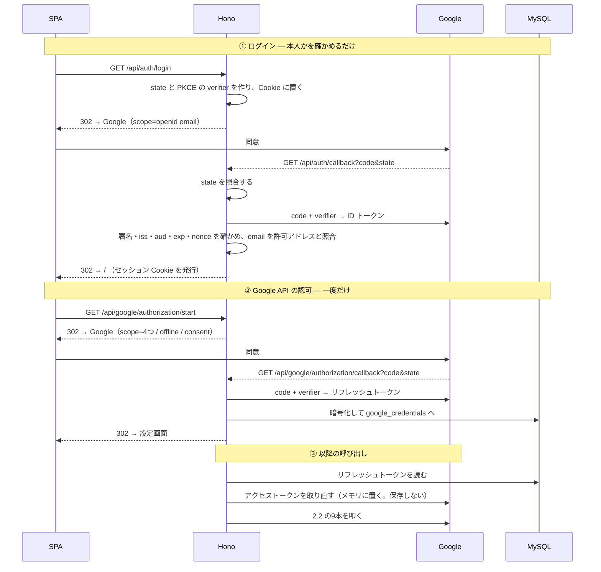

# 外部連携設計

## 1. この文書について

この文書は、**Gmail・Google ドライブ・Google スプレッドシートを、いつ・どう叩くか** を
決めたものである。設計フェーズの5本目で、[`api.md`](api.md) の次に置く。

- **扱うこと** — OAuth フロー、叩く呼び出しとその根拠、失敗の分け方、環境依存値
- **扱わないこと** — 異常系の実現方法（[`error-handling.md`](error-handling.md)）、
  エンドポイント（[`api.md`](api.md)）、テーブル定義（[`database.md`](database.md)）
- **出どころ** — **要求分析 5章・6章の API 実測**、[`tools/sheet-probe/`](../../tools/sheet-probe/)・
  [`tools/gmail-probe/`](../../tools/gmail-probe/)、要件定義 7章、
  `architecture.md` 5.3 / 6.3 / 7章、`api.md` 2.5 / 7章

> **このリポジトリは public である。**
> スプレッドシートID・シート名・フォルダID・会場コードの実値・氏名・メールアドレスは
> **この文書に書かない**（N-08 / N-18）。例示はすべて架空の値で、要件定義 5.6 と揃えてある。

### この文書が閉じる3つの宿題

| 宿題 | どこから来たか | どこで閉じるか |
| --- | --- | --- |
| **`NF-09` 提出シートの行数・保護範囲を決め打ちにしない** | `architecture.md` 9章 | **7.2** |
| **`multipart` の受け方**（Hono → `googleapis`） | `api.md` 10章 | **6.2** |
| **一括更新の原子性** | 要件定義 13章 / `architecture.md` 10章 | **8.2。確かめる必要が無くなった** |

### この文書には、他の設計文書に無い足場がある

**相手の挙動を、実物で確かめてある。**

| 相手 | いつ | どこに |
| --- | --- | --- |
| 提出シート | 2026-08-29 | 要求分析 5.2 / 5.3 / 5.5 / 5.6、`tools/sheet-probe/` |
| 依頼メール | 2026-08-31 | 要求分析 6章、`tools/gmail-probe/` |

**だから、この文書の「こうする」の多くは「こうだった」に支えられている。**
それでも**推測は推測と書く**（11章）。実測に基づく記述には、**出どころを添える。**

### 更新の仕方

実装の途中で判断がひっくり返ったら、**なぜひっくり返ったかを添えて**ここへ書き戻す。
前の文書の結論が変わる場合は、そちらも直す。

## 2. 共通の約束

### 2.1 `integrations` の形 — Google の語彙を外へ出さない

**`architecture.md` 5.3 のとおり、インターフェースと実装を分ける。**

```
integrations/
├ gmail/
│  ├ client.ts        インターフェース（services が見るのはこれだけ）
│  └ googleapis.ts    実装（googleapis パッケージを使う）
├ drive/
│  ├ client.ts
│  └ googleapis.ts
└ sheets/
   ├ client.ts
   └ googleapis.ts
```

**インターフェースに Google の語彙を持ち込まない。**
`services` が見るのは「依頼メールを集める」「領収書を保存する」「書ける行の範囲を読む」であって、
`messages.list` でも `spreadsheetId` でもない。

```ts
// integrations/sheets/client.ts
export interface SheetsClient {
  readTargetMonth(): Promise<TargetMonth>;         // 7.1
  readStructure(): Promise<SheetStructure>;        // 7.2  書ける行の範囲
  readHeader(): Promise<string[]>;                 // 7.3
  readVenueMaster(): Promise<VenueMasterRow[]>;    // 7.4
  insertRows(count: number): Promise<void>;        // 8.3
  writeBody(rows: SubmissionRow[], receiptCell: string): Promise<void>; // 8.2
}
```

**`spreadsheetId` が引数に無い。** 環境変数から取り、実装の中に閉じる。
**「書き込み先を実行時に決めない」（`NF-08`）を、インターフェースの形でも守る**（8.4 / `api.md` 7章）。

**ここを漏らすと、目的②で `fetch` へ差し替えるとき業務ロジックまで触ることになる**
（`architecture.md` 6.3）。

### 2.2 叩く呼び出しは9本だけ

| 相手 | 呼び出し | 何のために | 要件 | どこ |
| --- | --- | --- | --- | --- |
| Gmail | `users.messages.list` | 依頼メールを集める | F-04 | 4.1 |
| | `users.messages.get` | 本文を読む | F-06 | 4.2 |
| | `users.messages.send` | **提出アラートを送る** | F-35 | 5章 |
| ドライブ | `files.create` | 領収書を保存する | F-24 | 6章 |
| | `permissions.create` | 共有を付ける | F-25 | 6章 |
| スプレッドシート | `spreadsheets.get` | 構造・保護範囲・入力規則を読む | F-31 / `NF-09` | 7.2 / 7.4 |
| | `values.get` | `A1`・ヘッダー・会場マスタを読む | F-31 / F-13 | 7.1 / 7.3 / 7.4 |
| | `values.update` | **本文行を書く** | F-28 | 8.2 |
| | `spreadsheets.batchUpdate` | **行を挿入する** | N-10 | 8.3 |

**`architecture.md` 6.3 は10本としていたが、`values.clear` が要らなくなった**（8.2）。
**クリアという操作そのものを設計から外したためである。**

### 2.3 認可情報の持ち方

| 何を | どこに | 誰が触るか |
| --- | --- | --- |
| リフレッシュトークン | **DB に暗号化**（`google_credentials`） | **`integrations` だけ** |
| アクセストークン | **保存しない。** プロセスのメモリ | 同上 |

`OAuth2Client` にリフレッシュトークンを渡し、期限が来たらライブラリが取り直す。
**`tokens` イベントで新しいリフレッシュトークンが降ってきたら DB を更新する。**

**これは [`tools/sheet-probe/auth.cjs`](../../tools/sheet-probe/auth.cjs) が既にやっていることで、
そのまま持ってくる。** 保存先がファイルから DB（暗号化）に変わるだけである。

**`services` はトークンの存在を知らない**（`NF-05` / `architecture.md` 5.2）。

**`scheduler` も同じ行を読む。** `backend` と同じイメージを別コマンドで起動する
（`architecture.md` 3.8）ので、**DB を共有し、認可も共有される。認可の経路を2つ持たない。**

### 2.4 失敗をどう分けるか

**`api.md` 2.5 の応答へ写す。**

| 相手が返すもの | 何が起きたか | API の応答 | 要確認事項 |
| --- | --- | --- | --- |
| `invalid_grant` / 401 | **アプリの認可が切れた** | **503 `GOOGLE_UNAUTHORIZED`** | — （**再認可へ導く**・F-02） |
| 403 / 404（提出シート） | **共有が締められた** | 502 `SHEET_UNREACHABLE` | `sheet_unreachable` |
| 403 / 404（ドライブ） | 保管先フォルダが消えた・権限が無い | 502 `DRIVE_UPLOAD_FAILED` | `drive_upload_failed` |
| ヘッダーが想定と違う | **様式が変わった** | 502 `SHEET_FORMAT_CHANGED` | — （中止する・`NF-10`） |
| `400 Range exceeds grid limits` | 行が足りない | **起こさない。** 先に挿入する（8.3） | — |
| 400 保護範囲への書き込み | **起こってはいけない** | 502 | — |
| 429 | 割り当て超過 | 502 | — |

**401 と 403/404 を取り違えない。** 前者は再認可で直り、後者は**アプリ側では直せない**（N-13）。
**導く先が違うので、区別が要る**（要件定義 7.1）。

**`400 Range exceeds grid limits` は、起こさないほうで対処する。**
グリッドの外へは書けない（要求分析 5.3・実測）ので、**書く前に行数を照らして挿入する**（8.3）。
**エラーを見てから直すのでは、一度書き込みに失敗している。**

### 2.5 自動再試行を持たない

| なぜ | |
| --- | --- |
| **割り当てに遠く及ばない** | 上限は300回/分（要求分析 12章）。案件は月6〜10件（要件定義 9.1） |
| **提出はやり直せる** | F-29「何度でも実行できて、結果が同じ」。**人が押し直せば済む** |
| **記録の失敗はその場で見せたい** | F-26。**帰り道なら、やり直せる** |

**採らなかった案** — 指数バックオフによる自動再試行。**失敗を隠すことになる。**
このアプリの異常系の関心は「静かに壊れないこと」であり（要件定義 10章）、
**静かに再試行して静かに失敗する経路を作らない。**

## 3. OAuth フロー

### 3.1 2本に分ける

**`architecture.md` 3.7 が決めている。** ログインは「本人か」を確かめるだけで、
Gmail・ドライブ・スプレッドシートのスコープは要らない。

| | **ログイン** | **Google API の認可** |
| --- | --- | --- |
| いつ | セッションが切れたとき | **一度だけ**（と、失効したとき） |
| スコープ | `openid` `email` | **4つ**（3.3） |
| 受け取るもの | **ID トークン** | **リフレッシュトークン** |
| 保存するもの | **何も保存しない。** Cookie を発行するだけ | `google_credentials`（暗号化） |
| `access_type` | 既定 | **`offline`** |
| `prompt` | 既定 | **`consent`** |
| 入口 | `GET /api/auth/login` | `GET /api/google/authorization/start` |

**混ぜると、ログインのたびに広いスコープへの同意を求めることになる**（`architecture.md` 3.7）。

**`prompt=consent` を付けるのは、2回目以降も確実にリフレッシュトークンを得るためである。**
付けないと、既に同意済みのときリフレッシュトークンが降ってこない
（`tools/sheet-probe/auth.cjs` の実装と同じ理由）。

### 3.2 流れ



### 3.3 スコープ

| スコープ | 何のために | 要件 |
| --- | --- | --- |
| `openid` `email` | **ログイン。** 本人かを確かめる | F-01 / N-03 |
| `.../auth/gmail.readonly` | 依頼メールを読む | F-04〜F-06 |
| `.../auth/gmail.send` | **提出アラートを送る** | F-35 |
| `.../auth/drive` | 領収書を保存し、共有を付ける | F-24 / F-25 |
| `.../auth/spreadsheets` | 提出シートを読み書きする | F-13 / F-28 / F-31 |

**`gmail.send` は送信だけができる。** 読み取りも変更も含まない
（`google-cloud-basics.md` 8章）。**依頼メールには触れない。返信も転送もしない**（要件定義 7.1）。

#### `drive` が広いことについて

**`drive.file`（アプリが作ったファイルだけ）で済めば、そのほうがよい**
（`google-cloud-basics.md` 8章「スコープは狭いほどよい」）。

**検証時に `drive` を選んだ理由の半分は、もう無い。**
`tools/sheet-probe/` は委託元のシートを自分のドライブへ複製していたが、
**アプリ本体は複製しない。** 残っているのは「**既存の保管先フォルダの下にファイルを作れるか**」だけである。

> **これは未検証である。** 文献上は「**できない**」側の材料が出ている
> （`drive.file` はアプリが作っていない親フォルダを触れない・`google-cloud-basics.md` 15章）。
> **要件定義13章のとおり、実装時に `tools/` へプローブを足して確かめる。**
>
> **狭められたら変わるのは `integrations/drive/googleapis.ts` だけである**（`architecture.md` 5.3）。
> 業務ロジックには一行も触らない。**だから、今この判断を先に確かめる必要は無い。**

### 3.4 `state` と PKCE

| 何を | どうする |
| --- | --- |
| **`state`** | **必須。** 乱数を Cookie に置き、コールバックで照合する |
| **PKCE** | **使う**（`code_challenge_method=S256`） |
| **`nonce`**（ログイン側） | ID トークンの `nonce` を、発行したものと照合する |

**PKCE をコンフィデンシャルクライアントにも使う。**
ウェブアプリ型はクライアントシークレットを本当に秘密にできる（`architecture.md` 7.1）ので、
**認可コード横取りの前提は成立しにくい。**

**それでも使うのは、現行の指針がシークレットを持つクライアントにも求めており、
実装が数行で済むからである。** `api.md` 7章と同じ発想で、**塞げるものは塞ぐ。**

**`SameSite=Lax` の Cookie はトップレベルの `GET` には付く**ので、
**コールバックだけは `state` の素の照合が要る**（`api.md` 2.2）。

### 3.5 ID トークンの確かめ方（ログイン）

| # | すること |
| --- | --- |
| 1 | **署名と `iss` / `aud` / `exp`** を確かめる（`google-auth-library` の `verifyIdToken`） |
| 2 | **`nonce`** が発行したものと一致するか |
| 3 | **`email_verified` が真**であるか |
| 4 | **`email` が許可アドレス（環境変数）と一致する**か |

**どれか1つでも欠けたら 403**（F-01 / N-03 / `api.md` 2.5）。

**`hd`（ホストドメイン）だけで判定しない。** 組織の誰でも入れることになる。
**利用者は本人1人である**（N-03）。

### 3.6 リダイレクト URL

**事前に登録した固定 URL**（`architecture.md` 7.1）。**2本を登録する。**

```
https://<ホスト>/api/auth/callback
https://<ホスト>/api/google/authorization/callback
```

**目的②へ移るときは、移行先のドメインを追加で登録する**（差し替えではなく追加すれば、
移行中も両方が動く・`architecture.md` 7.1）。

## 4. Gmail — 依頼メールの取り込み

**要件定義 7.2 の手順を、呼び出しへ落とす。** `POST /api/sync` の中で走る（`api.md` 4.3）。

### 4.1 集める — `users.messages.list`

| パラメータ | 値 | 根拠 |
| --- | --- | --- |
| `userId` | `me` | |
| **`q`** | **`from:<差出人アドレス> after:<前回の取り込み日の1日前>`** | F-04 / N-15 |
| `maxResults` | 100。`nextPageToken` があれば辿る | |

**ラベルを条件にしない**（F-04 / N-15）。
ラベルを付けているのは委託元ではなく**本人の Gmail フィルタ**で、
**フィルタが無い状態で依頼メールが届いた実例がある**（要求分析 6.1）。
**ラベルだけに頼ると、取り込みは例外を出さずに静かに止まる。**

> **実測では、ラベルIDで引いた集合と `from:` で引いた集合が一致した**（要求分析 6.1）。
> **`from:` だけで足りることは確かめてある。**
> 差出人アドレスは案件詳細メールと依頼無しメールで同一である（表示名だけ違う）。

**`after:` を1日前から取るのは、境界が日付粒度だからである。**
しかも配信元のタイムゾーンは `-0500` のことがある（要求分析 6.6・実測）。
**広めに取り、返ってきた `id` を `imported_mails` で弾く**（4.4）。**二重の網にする。**

**初回は `after:` を付けない。**

**宛先（`To`）で判別しない**（N-17）。
**依頼無しメールでは自分が `To` に居ない**（Bcc で届く・要求分析 6.1・実測）。

### 4.2 読む — `users.messages.get`（`format: 'full'`）

| 使うもの | どこから |
| --- | --- |
| `id` / `threadId` / `internalDate` | メッセージの直下。**`imported_mails` に入る**（`database.md` 5.3） |
| 件名 | `payload.headers` の `Subject` |
| **平文の本文** | `text/plain` パートの `body.data`（base64url） |
| **HTML 由来のテキスト** | `text/html` パートを、タグを落としてテキストにする |

**両方を使う。片方では足りない**（要求分析 6.2・実測）。

| | 残るもの | 落ちるもの |
| --- | --- | --- |
| `text/plain` | 各リンクの URL が本文に並ぶ | **表のセル境界。スタッフ2名が空白区切りの4語に潰れる** |
| `text/html` | `td` の境界（タブとして取り出せる） | **`href`（本文テキストに現れない）** |

> **最上位は `multipart/alternative`、文字コードはどちらも UTF-8、添付は無い**（要求分析 6.2・実測）。
> **HTML には目印が無い。** `class` も `id` も、Gmail が挿入したもの以外に存在しない。
> **どちらのパートを読むにせよ、見出しと位置で読むことになる。**

**`integrations/gmail/client.ts` が返すのはここまでである。**

```ts
type FetchedMail = {
  id: string; threadId: string | null; internalDate: Date;
  subject: string; plainBody: string; htmlText: string;
};
```

**Google の語彙はここで終わる**（2.1）。**この先は文字列の話になる。**

### 4.3 取り出す — `domain/mail-parse.ts`

**[`tools/gmail-probe/extract.cjs`](../../tools/gmail-probe/extract.cjs) を移植する。**
**実測で何度も直して辿り着いたものなので、書き直さない**（`architecture.md` 3.2）。

**置き場は `domain/` である。**

| なぜ | |
| --- | --- |
| **I/O を持たない** | 入力は文字列、出力は案件か失敗。`architecture.md` 5.2「`domain` はどの層にも依存しない」に素直に収まる |
| **実データ無しでテストできる** | 依頼メールにはご両家名・他スタッフの氏名とメールアドレス・緊急連絡先が入っている（N-18）。**架空の文字列でテストできる形にしておく** |
| **Gmail の都合ではない** | 相手が Gmail をやめても、**この規則は委託元のメール書式の話**である |

**採らなかった案**

- **`integrations/gmail/` に置く** — 委託元の書式は外部システムの都合なので一緒に閉じたくなるが、
  **`integrations` を差し替えるとき（`architecture.md` 6.3）に、書き直さなくてよいものまで巻き込む**
- **`services/` に置く** — F-07 の「裏取りに失敗したら値を採らない」は業務ルールだが、
  **`services` は DB と `integrations` を触る層である。** 純粋な変換を混ぜると、テストに要る足場が増える

#### 件名で判別する（F-05 / R-19）

| | 件名 | 扱い |
| --- | --- | --- |
| **案件詳細メール** | `<YYYY/MM/DD>案件詳細です。` | **案件にする** |
| **依頼無しメール** | `【<M>月<D>日(曜) 依頼無しのご連絡】` | **取り込まない** |
| どちらでもない | — | **取り込まない。** `parse_failed` として記録する |

> **件名は文書に書かれた書式と厳密に一致した**（要求分析 6章・実測）。どちらも正規表現で判別できる。
> **依頼無しメールの件名には年が入らない**が、**取り込まない種別なので支障はない。**

#### 先頭4行の裏取りを落とさない（F-07 / N-16）

**先頭の4行には見出しが無く、位置で読むしかない**（要求分析 6.3）。そこで、

1. **1行目の日付が「施行日」行の日付と一致すること**
2. **4行目が `〇〇様 △△様` の形であること**

**両方を確かめてから**、2行目を会場名・3行目を会場コードとして採る。
**`extract.cjs` の `headTrusted` がこれである。どちらかが崩れたら、値を採らない。**

**書式が変われば裏取りが失敗する。それでよい**（要件定義 7.2）。
**黙って別の値を拾って提出してしまうより、取り込めていないと分かるほうが良い。**

#### 移植で落とすもの

| 落とすもの | なぜ |
| --- | --- |
| **リンク**（`extractLinks`） | **叩かない**（要件定義 7.2）。委託元の配信サービスの計測用 URL で、**叩けば計測される**。案件承諾は対象外（要件定義 11章） |
| **スタッフの割当**（`extractAssignments`） | 提出に要らない。**他人の氏名を持たない**（N-18） |
| 挙式・披露宴の時刻／緊急連絡先 | 提出に要らない |

**取り出すのは5項目だけである** — 施行日・会場名・会場コード・ご両家名・案件番号（F-06）。
**目的（C列）は常に `婚礼案件` なので、メールから取らない**（要件定義 5.3 / `database.md` 5.2）。

### 4.4 記録する

| 結果 | `imported_mails.result` | 案件 |
| --- | --- | --- |
| 案件詳細で、裏取りが通った | `project` | **作る** |
| 依頼無し | `no_request` | 作らない |
| 件名が合わない／**裏取りが失敗** | `parse_failed` | 作らない。**要確認事項に残す**（F-07） |

**どの結果でも行を残す**（要件定義 6.3 / `database.md` 5.3）。
残さないと、**次に開いたときに同じメールをまた読む。**
**解析に失敗したメールを毎回読み直しても、同じ失敗を繰り返して要確認事項が増えるだけになる。**

**取り込みは月度で絞らない。** 絞るのは提出のときだけ（8.1）。
**1回の実行で複数の月度にまたがる案件ができる**（要件定義 9.2）。

## 5. Gmail — 提出アラートの送信

`users.messages.send`

| | |
| --- | --- |
| **誰が呼ぶか** | **`scheduler` コンテナだけ**（`architecture.md` 3.8）。**API から送る経路を持たない**（`api.md` 7章） |
| **宛先** | **環境変数。実行時に組み立てない**（`NF-13` / N-23） |
| 渡し方 | RFC 2822 のメッセージを **base64url** にして `raw` へ入れる |
| 載せるもの | 対象月度・締切（その月の3日正午）・**記録済みと未記録の件数**・アプリの URL（要件定義 4.10） |

**要確認事項の件数は載せない**（要件定義 4.10）。
提出は要確認事項があっても実行できるので、
**載せると、出せるのに出さない理由があるように見えてしまう。**

**対象月度を読めなかったときは、対象月度を書かずに送る**（要件定義 7.5）。
**提出シートが読めないこと自体が、知らせるに値する**（N-13 / F-02）。
**読めないから黙る、という振る舞いにしない。**

**送信に失敗したら要確認事項に残す**（`alert_send_failed`）。
**ただし、届かなかったこと自体は検知しない**（要件定義 10章）。

## 6. ドライブ — 領収書

### 6.1 順番 — 途中で失敗したら乗車を残さない

**要件定義 7.3。この順で通す**（`api.md` 4.6 の `POST /api/projects/:id/taxi-rides` 1本の中）。

| # | すること | 要件 |
| --- | --- | --- |
| 1 | **受け取ったファイルの種別を確かめる**（画像 または PDF） | F-23 / R-13 |
| 2 | `files.create` — **保管先フォルダへ保存する** | F-24 |
| 3 | `permissions.create` — **ファイル単位で「リンクを知っている全員が閲覧可」** | F-25 / N-19 |
| 4 | **ここまで通って初めて** `taxi_rides` と `receipts` を書く | F-26 |

**フォルダに共有を付けて継承させる形は採らない**（N-19）。
実測では**フォルダは非共有のままで、各ファイルに個別の共有が付いていた**（要求分析）。
**現に回っているほうに合わせる。**

**F-25 を落とすと、静かに失敗する。**
ドライブの既定は非公開であり、共有を付け忘れると
**URL は提出シートに書けているのに担当者が開けない**という形で壊れる。
**しかも提出した側からは分からない。**

**保管先は1つのフォルダで、月ごとに分けない**（要求分析 3 / 要件定義 7.3）。

### 6.2 `multipart` の受け方 — `api.md` 10章の宿題

```
ブラウザ                Hono                            googleapis
─────────────           ────────────────────            ─────────────────────────────
multipart/form-data  →  c.req.formData()             →  drive.files.create({
  amount                  → amount / rodeOn               requestBody: { name, parents: [<フォルダID>] },
  rodeOn                  → receipt: File                 media: { mimeType, body: <Readable> },
  receipt (File)          → File.type を先に確かめる      fields: 'id,webViewLink',
                          → File.stream() を渡す        })
```

| 決めたこと | なぜ |
| --- | --- |
| **`File.type` で先に弾く** | R-13。**本文を読む前に分かる。** 通らないものをドライブへ送らない |
| **本文はストリームで渡す** | 1件あたり数百KB〜数MB（要件定義 9.1）。**載せてもよい大きさだが、載せる理由も無い** |
| **ファイル名はアプリが付ける** | `<YYYYMMDD>_<会場コード>_<連番>`（`database.md` 5.2）。**クライアントから受け取らない**（`api.md` 7章） |
| **`fields` に `id,webViewLink` を指定する** | **既定では返らない。** `webViewLink` が `receipts.drive_url` になる |
| **URL を保存する。組み立て直さない** | `database.md` 5.2。**ドライブの URL 書式が変わったとき、過去に提出した URL と食い違う** |

### 6.3 消さない

**ドライブ上のファイル実体は、アプリから消さない**（要件定義 6.4 / 11章）。
`receipts` の行が消えても、**ファイルは残る。**

**`files.delete` を呼ぶ経路を持たない**（`api.md` 7章）。
**提出後の正本はドライブにある**（N-05）。**アプリが消してよいものではない。**

## 7. スプレッドシート — 読む

### 7.1 対象月度（`A1`）— `values.get`

| パラメータ | 値 |
| --- | --- |
| `range` | `<自分のシート名>!A1` |
| **`valueRenderOption`** | **`UNFORMATTED_VALUE`** |

**`A1` は他シートを参照する数式で、表示は `2026年8月` である。**
`UNFORMATTED_VALUE` で読むと **日付のシリアル値**が返る（`2026年8月` なら `46235` = 2026-08-01）。
**要求分析 5.6 の API 実測。**

**シリアル値を暦日へ直すのは `integrations` の中で行う。**
`services` が受け取るのは**対象月度の型**である（`architecture.md` 5.4）。

**日付として解釈できなければ、提出を中止する**（要件定義 5.5 / `api.md` 5.4）。
**対象月度が決まらないまま書けば、他人ではなく自分の申請を壊す。**

**この値が月度切替の検知にも使われる**（F-32 / `database.md` 5.3 の `last_seen_target_month`）。

### 7.2 構造 — `NF-09` の宿題を閉じる

`spreadsheets.get`。**`fields` を絞る。**

```
properties(timeZone),
sheets(properties(sheetId,title,gridProperties(rowCount,columnCount)),
       protectedRanges(range,requestingUserCanEdit))
```

**書ける行の範囲は、次の3つで決まる。**

| # | すること | 根拠 |
| --- | --- | --- |
| 1 | 自分のシートの `protectedRanges` を読む | 要求分析 5.2・実測 |
| 2 | **`requestingUserCanEdit` が真の範囲**を、書ける範囲とする | 同上 |
| 3 | **`gridProperties.rowCount` を超えないこと**を確かめる | 要求分析 5.3・実測 |

**これは [`tools/sheet-probe/probe.cjs`](../../tools/sheet-probe/probe.cjs) の段階A-2 が
実際に読んでいる手順そのままである。**

**25行を決め打ちにしない**（`NF-09` / N-11）。

> **根拠は一次資料である。** 委託元の「ルール」シートの手順書は、保護範囲を **8〜37行**で
> 設定せよと指示している。**だが実物は 8〜32行だった**（要求分析 5.3・実測）。
> **シートの追加は担当者の手作業であり、指示どおりに設定されているとは限らない。**

**範囲を特定できなければ、提出を中止する**（要件定義 5.5）。
**保護範囲が読めなければ、どこへ書いてよいか分からない。**

### 7.3 様式（7行目のヘッダー）— `values.get`

`<自分のシート名>!A7:M7` を読み、**想定の並びと照合する**（要件定義 5.2 手順3）。

**違えば中止する**（`NF-10` / 502 `SHEET_FORMAT_CHANGED`）。
**列の意味が変わったことに気づかずに書けば、別の欄へ値を書き込むことになる。**
**金額の欄にご両家名が入るような壊れ方は、書いた側からは見えない。**

**7.2 と同じ呼び出しにまとめない。**
`spreadsheets.get` に `includeGridData` を足すと本文まで付いてくる。
**構造だけ見たい場面が別にある**（`POST /api/sync` の月度検知）ので、**軽いほうを保つ。**

**想定するヘッダーの並びは、環境変数に持たない。実装に定数として置く。**
**変わったら止まって知らせるのが要件であって**（`NF-10` / 要件定義 11章）、
**設定で追従させるものではない。** 追従できる作りにすると、
**「変わったこと」が設定を書き換えるだけの作業になり、気づきの機会が消える。**

### 7.4 会場マスタ — 在り処を決め打ちにしない

**2段階で読む。**

| # | すること |
| --- | --- |
| 1 | `spreadsheets.get` で、**自分のシートの B列に付いている入力規則**を読む |
| 2 | 種別が `ONE_OF_RANGE` なら、**参照している範囲そのもの**を `values.get` で読む |

```
ranges: <自分のシート名>!B8
includeGridData: true
fields:  sheets(data(rowData(values(dataValidation(condition(type,values(userEnteredValue)))))))
```

> **実測では `'会場'!$A:$A` を指しており、会場マスタは43件だった**（要求分析 6.5）。
> **シート名や行数が変わっても追随する。**

**[`tools/gmail-probe/`](../../tools/gmail-probe/) の `venue-check` が、この手順で実際に照合している。**
README が「**これは N-14 でアプリがやるべき手順と同じ**」と書いており、**そのまま持ってくる。**

**照合して知らせるが、書き込みは止めない**（N-14 / 要件定義 5.5）。
**マスタに無いコードは実際に来ており**（要求分析 6.5・実測）、
**本人はそのコードをそのまま書いて提出している。**
**止めれば、人にできることがアプリにできなくなる。**

## 8. スプレッドシート — 書く

### 8.1 何を書くか

**対象月度の案件だけ**（決定12 / 決定13 / 要件定義 5.3）。
アプリの中には別の月度の案件も同時にいる（要件定義 9.2）ので、**月度で絞ってから並べる。**

**行の作り方と列の規則は要件定義 5.3、値の出どころは `database.md` 7.2 にある。**

**`integrations` は組み立てない。** 受け取った行をそのまま書く（2.1）。
**「加工は記録時に済ませ、提出時には何もしない」**（`database.md` 5.2）が、ここまで効いている。

### 8.2 1回の `values.update` に畳む — 一括更新の原子性の宿題

**要件定義 5.2 手順8 は、「本文行をクリアし、組み立てた行を書く」を
1回の一括更新にまとめよとしていた。** 別々に実行すると、
**クリアが通って書き込みが失敗したときにシートが空のまま残る**からである。

**そこで、クリアという操作そのものをやめる。**

**本文行の全矩形を、1回の `values.update` で送る。**

| | |
| --- | --- |
| `range` | `<自分のシート名>!A8:M32`（**行の範囲は 7.2 で読んだ値**） |
| **`valueInputOption`** | **`USER_ENTERED`** |
| 値 | **書く行 → 値／残りの行 → 全列 `""`** |

```
      A          B     C        D           E        F        G     H    I    J  K  L   M
 8  2026/8/22  CCC  婚礼案件  ▲▲様▼▼様  X鉄甲駅  X鉄丙駅  往復  620  ""  ""  ""  ""  (8/23)⏎https://…
 9  ""         ""   ""        ""          Y鉄丙駅  Y鉄丁駅  往復  420  ""  ""  ""  ""  ""
10  ""         ""   ""        ""          ""       ""       ""    ""   ""  ""  ""  ""  ""
        … 書く行が尽きたら、残りは全部 "" …
32  ""         ""   ""        ""          ""       ""       ""    ""   ""  ""  ""  ""  ""
```

| なぜこうするか | |
| --- | --- |
| **2操作の原子性に寄りかからない** | **矩形1つなら、「クリアだけ通った」状態が作れない。** 要件定義13章の未確定事項は、**確かめるまでもなく消える** |
| **決定11 がそのまま出る** | 「本文行はすべてアプリが持つ」。**J〜L列（常に空）も、前回の残骸も、同じ書き込みで消える** |
| **F-29 がそのまま出る** | 「何度でも実行できて、結果が同じ」。**矩形を書くたびに、シートはアプリの内容と一致する** |
| **`USER_ENTERED` を使える** | `2026/8/29` と書けば**文字列ではなく日付として入る**（要求分析 5.5・実測） |

**`M9` 以降にも `""` が入るが、無害である。**
`M8:M32` は丸ごと1つの結合セルで、**`M9` 以降に書いても表示されない**（要求分析 5.5・実測）。
**既知の挙動であり、確かめてある。** 領収書は `M8` にだけ載る（要件定義 5.4）。

**保護範囲（1〜7行目）には触れない**（N-07 / 要件定義 5.1 原則2）。
矩形は8行目から始まる。**合計欄（4行目の数式）も範囲の外にある。**

**採らなかった案**

- **`values.clear` してから `values.update`** — 要件定義 5.2 の字面には近いが、**2操作になる。**
  **一括更新の原子性という、確かめていない前提に寄りかかることになる**
- **`values.batchUpdate` に `A8:L32` と `M8` の2つを渡す** — `M9` 以降に触らずに済むが、
  **やはり2つのデータになる。** しかも `M9` へ書くことは既に無害と分かっている
- **`spreadsheets.batchUpdate` の `UpdateCellsRequest` で値も書く** — 行の挿入と1回にまとめられるが、
  **`USER_ENTERED` の解釈が効かない。** 日付をシリアル値と表示形式で組み立てることになり、
  **実測済みの「`2026/8/29` と書けば日付として入る」を捨てることになる**

### 8.3 行が足りないときだけ、別の呼び出しを1本挟む

`spreadsheets.batchUpdate` の `InsertDimensionRequest`

| # | すること | 根拠 |
| --- | --- | --- |
| 1 | 組み立てた行数が、7.2 で読んだ書ける行数を超えるか見る | N-10 |
| 2 | 超えるなら、**書き込める範囲の内側に**足りないぶんを挿入する | 要件定義 5.2 手順5 |
| 3 | **構造を読み直す**（7.2） | 挿入すると**グリッドも保護範囲も伸びる**（要求分析 5.3・実測） |
| 4 | 8.2 の矩形を書く | F-28 |
| 5 | **挿入したことを要確認事項に残す**（`rows_inserted`） | F-33 |

**挿入を値の書き込みと1回にまとめない。**

| なぜ | |
| --- | --- |
| **目的が違う** | 挿入は**委託元の資産の構造を変える操作**である。だから要確認事項に残る（要件定義 5.2 手順5）。**件数ではなく、本人が読んで消す対象**である |
| **失敗しても壊れない** | **挿入だけ成功して書き込みが失敗しても、空行が増えるだけ**でシートは壊れていない。**次の実行でその行に書かれる** |
| **読み直しが要る** | 挿入後の保護範囲とグリッドは伸びている。**古い値のまま書くと、範囲を間違える** |

**行の挿入は用心ではなく、実際に要る**（要件定義 5.3）。
10件 × 3区間なら30行になり、**25行に収まらない。**

### 8.4 他人のシートへ書かない

| 歯止め | どこで |
| --- | --- |
| **書き込み先は環境変数。実行時に決めない** | 9章 / `NF-08` / N-12 |
| **インターフェースが宛先を受け取らない** | 2.1。`writeBody(rows, receiptCell)` に引数が無い |
| **API も受け取らない** | `api.md` 7章 |
| **書ける範囲を読んでから書く** | 7.2 |

> **他人のシートを2枚だけ編集できてしまう状態にある**（要求分析 5.2・実測）。
> 委託元側の保護設定の不備と見られる。
> **アプリはいかなる場合も他人のシートへ書かない**（要件定義 5.1 原則1）。

## 9. 環境依存値

**すべて環境変数**（`NF-07` / N-08 / N-18 / `architecture.md` 6.1 の縛り3）。

| 変数 | 何を | 使う場所 |
| --- | --- | --- |
| `GOOGLE_CLIENT_ID` / `GOOGLE_CLIENT_SECRET` | OAuth クライアント | 3章 |
| `GOOGLE_REDIRECT_URI_LOGIN` / `GOOGLE_REDIRECT_URI_AUTHORIZATION` | リダイレクト先（2本） | 3.6 |
| **`ALLOWED_EMAIL`** | **許可するメールアドレス** | 3.5 |
| `SESSION_SECRET` | セッション Cookie の署名鍵 | `api.md` 4.1 |
| `TOKEN_ENCRYPTION_KEY` | リフレッシュトークンの暗号鍵 | 2.3 |
| **`GMAIL_SENDER`** | **依頼メールの差出人アドレス** | 4.1 |
| **`ALERT_TO`** | **提出アラートの宛先（本人固定）** | 5章 |
| `DRIVE_FOLDER_ID` | 領収書の保管先フォルダ | 6章 |
| `SPREADSHEET_ID` / `MY_SHEET_NAME` | 提出シート | 7章・8章 |

**`GMAIL_LABEL_NAME` は要らない。**
`tools/gmail-probe/` は使っているが、**アプリはラベルを条件にしない**（F-04 / 4.1）。

**`.env.example` への追加は実装時に行う**（`architecture.md` 7.3）。**この章はその一覧である。**

**画面にも API の応答にも出さない**（N-08 / `screens.md` 3.10 / `api.md` 7章）。

## 10. 要件とのトレーサビリティ

| 要件 | どこで満たすか |
| --- | --- |
| F-01 | 3.1 / 3.3 / **3.5**（許可アドレスの照合） |
| F-02 | **2.4**（401 と 403/404 を分ける）／ 3.1 |
| F-03 | 4章（`POST /api/sync` の中で走る） |
| F-04 | **4.1**（`from:` で絞る。ラベルを条件にしない） |
| F-05 | **4.3**（件名で判別する） |
| F-06 | 4.2 / 4.3 |
| F-07 | **4.3**（先頭4行の裏取り）／ 4.4 |
| F-08 | 4.1（`after:` を広めに）／ **4.4**（`imported_mails` で弾く） |
| F-13 | **7.4**（入力規則の参照先から読む） |
| F-23 | **6.2**（`File.type` で先に弾く） |
| F-24 | 6.1 / 6.2 |
| F-25 | **6.1**（ファイル単位で共有を付ける） |
| F-26 | **6.1**（順番。通って初めて DB を書く） |
| F-27 | 7.4（会場コードの照合）／ 8.1 |
| F-28 | **8.1 / 8.2** |
| F-29 | **8.2**（矩形を書くたびに一致する） |
| F-31 | **7.1**（`UNFORMATTED_VALUE`） |
| F-32 | 7.1（同じ値を月度切替の検知に使う） |
| F-35 / F-36 | **5章**（`scheduler` だけが呼ぶ） |
| `NF-05` | **2.1 / 2.3**（トークンは `integrations` の外へ出ない） |
| `NF-07` | **9章** |
| `NF-08` | **8.4**（宛先を引数に持たない） |
| `NF-09` | **7.2**（`requestingUserCanEdit` から決める） |
| `NF-10` | **7.3**（ヘッダーが違えば中止） |
| `NF-11` | **外部連携が関わらない。** 設定データの控えは DB だけで完結する（`architecture.md` 8章） |
| `NF-13` | **5章 / 9章**（宛先は環境変数。API から送る経路が無い） |

## 11. 未確定事項

| 何が | 何が決まっていないか | いつ決めるか |
| --- | --- | --- |
| **`drive.file` で済むか** | 既存の保管先フォルダへ保存できるか。**文献上は「できない」側の材料が出ている**（3.3） | **実装時に `tools/` へプローブを足す**（要件定義13章） |
| **`googleapis` が Workers で動くか** | バンドルが 3 MiB に収まるか | **目的②のプロジェクト**（`architecture.md` 10章） |
| **`text/html` からテキストを起こす方法** | `tools/gmail-probe/` はタグを落とす自前の実装で足りた。**ライブラリを使うかは決めていない**（`architecture.md` 6.1 の縛り1・バンドルに効く） | 実装時 |
| 領収書のサイズ上限 | `api.md` 10章から引き継ぐ | 実装時 |
| **トランザクションの境界** | ドライブへの保存と DB 書き込みの順序（6.1）を、どこで区切るか | [`error-handling.md`](error-handling.md) |
| **要確認事項の `detail` の書式** | `database.md` 12章 / `api.md` 10章から引き継ぐ | [`error-handling.md`](error-handling.md) |
| **定期実行が落ちたことに気づく手立て** | `architecture.md` 11章から引き継ぐ | [`error-handling.md`](error-handling.md) |

> **「セル上の画像」を挿入するリクエストは Sheets API に無い**（要求分析 5.2）。
> 委託元の「入力例」シートは画像の直接添付を想定しているが、
> **アプリが採れるのは URL 方式だけである**（要件定義 11章）。
> **これは API の仕様から言えることで、実機では試していない。**
