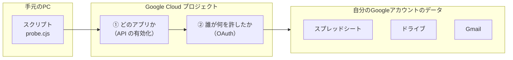
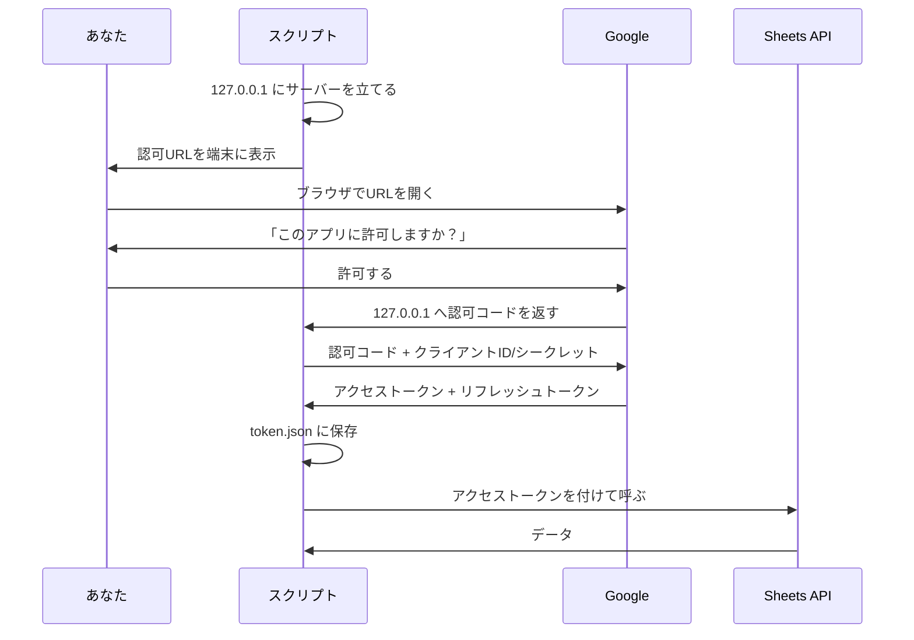
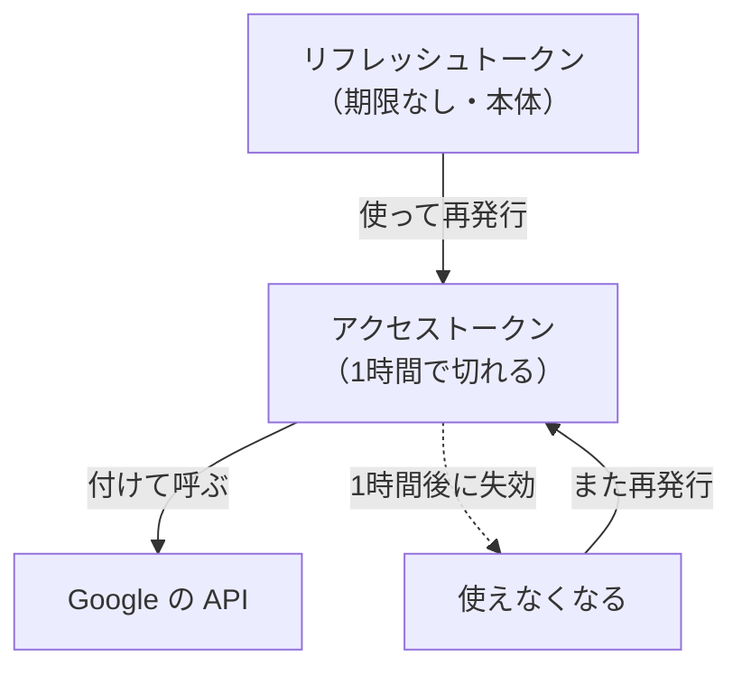

# Google Cloud 入門 — このアプリで使っている範囲だけ

## 1. この文書について

**目的は、Google Cloud まわりの提案を見て「これでいいのか」を自分で判断できるようになること。**
手順をなぞるための文書ではない。「なぜそれを選ぶのか」「何が危ないのか」に重心を置く。

- **扱うこと** — Issue #13 の検証で実際にやったこと（プロジェクト・API 有効化・OAuth・トークン）と、
  その先アプリを作るときに変わるところ
- **扱わないこと** — 上記に出てこない Google Cloud の機能。膨大にあるが、このアプリには要らない
- **読み方** — 第1部（2〜12節）を通して読めば仕組みが掴める。
  手を動かすときは第2部（13節）、**提案を受けたときは第3部（14節）を引く**

> **実測と文献を区別して書く。**
> 「**確認済み**」= このリポジトリで実際に動かして確かめた
> 「**文献**」= Google の公式ドキュメントにそう書いてある（自分では試していない）
>
> この区別にこだわるのは、一度やらかしているため。要求分析 5.3 に経緯が残っている。
> ファイルの見た目から断定した結論が、実物と違っていた。

---

# 第1部 仕組みを理解する

## 2. 全体像

やったことは、煎じ詰めると **「自分のスクリプトから、自分の Google アカウントのデータを触った」** だけ。
ただし Google は「誰でも勝手に触れる」ようにはしていないので、間に2つの関門がある。

**関門①「どのアプリか」** — Google Cloud のプロジェクトを作り、使う API を有効化する。
これは**アプリ側の申告**。「私はスプレッドシートの API を使うつもりです」と宣言している。

**関門②「誰が何を許したか」** — OAuth。**利用者側の許可**。
「独自ドメインのアカウントが、このアプリに、スプレッドシートの読み書きを許した」という記録。

**この2つは別物で、両方揃わないと動かない。**
API を有効化しただけではデータに触れないし、OAuth だけあっても API が無効なら弾かれる。

## 3. 用語

| 用語 | ひとことで言うと | 今回の実物 |
| --- | --- | --- |
| **組織** | 会社（Workspace ドメイン）の単位 | 独自ドメイン |
| **プロジェクト** | Google から見た「このアプリ」の単位 | 検証用に1つ作った |
| **API** | Google のデータを操作する窓口 | Sheets / Drive / Gmail の3つ |
| **API の有効化** | その窓口を使うというスイッチ | コンソールで「有効にする」を押した |
| **OAuth クライアント** | アプリの身分証。ID とシークレットの組 | デスクトップアプリ型を1つ |
| **同意画面** | 利用者に許可を求める画面 | 「内部」で構成した |
| **スコープ** | 何を許すかの品目 | `spreadsheets` / `drive` / `gmail.readonly` / `gmail.send` |
| **トークン** | 許可の証明書。実際に API を叩く鍵 | `credentials/token.json` |

## 4. プロジェクト — Google から見た「このアプリ」

プロジェクトは**箱**で、次のものがぶら下がる。

- どの API を有効にしたか
- OAuth クライアント（アプリの身分証）
- 割り当て（1分あたり何回叩けるか）
- 課金

**プロジェクトを分けると、これらが全部分かれる。** 検証用と本番用を分ける、といった使い方をする。
今回は検証用に1つ作った。

### 組織の配下に作ったことが効いている

プロジェクトは「組織なし」でも作れる。だが今回は **Workspace（独自ドメイン）の組織配下**に作った。
**これによって同意画面で「内部」が選べた**（9節）。ここが今回いちばん効いた判断。

> **確認済み**: コンソールの IAM 設定で、組織欄に独自ドメインが出ていることを確かめてから進めた。

## 5. API の有効化 — スイッチを入れただけ

コンソールで「有効にする」を押した。**これ自体では何も起きない。**

- ✅ 有効化する = 「このプロジェクトからこの API を呼べる状態にする」
- ❌ 有効化する = 「データにアクセスできるようになる」**ではない**

アクセスできるかどうかは OAuth（6節）とスコープ（8節）で決まる。

今回3つ有効化した。**Gmail も、依頼メールの送信先が独自ドメインへ切り替わったあとに使い始めた**
（2026-08-31・`tools/gmail-probe/`）。先に有効化しておいたので、そのときスコープの追加も
認可のやり直しも要らなかった。

> **判断のポイント**: 「API を有効化してください」と言われたら、
> **それ自体は危なくない**。危ないのはスコープのほう。

## 6. 認証と認可 — ここが一番の勘所

似た言葉だが、まったく別のことを指す。

| | 問い | 今回の答え |
| --- | --- | --- |
| **認証**（Authentication） | **誰か？** | 独自ドメインの Workspace アカウント |
| **認可**（Authorization） | **何をしてよいか？** | スプレッドシートの読み書き、ドライブ、Gmail の読み取り |

**OAuth はこの2つをまとめて処理する仕組み。** 実際の流れはこうだった。

### なぜブラウザが出てくるのか

**スクリプトにパスワードを渡さないため。** パスワードを渡してしまうと、スクリプトは
あなたのアカウントで何でもできてしまう。OAuth ではパスワードは Google にしか渡らず、
スクリプトが受け取るのは**限定された許可証（トークン）だけ**。

### なぜ 127.0.0.1 にサーバーを立てたのか

許可した結果（認可コード）を、**ブラウザからスクリプトへ渡す必要がある**。
その受け渡し場所として、手元に一時的な受け口を立てた。

> **文献**: デスクトップアプリでは `http://127.0.0.1:ポート` を受け口に使う。
> **ポートの事前登録は要らず、空いているポートを勝手に使ってよい。**
> かつてあった「コードを手でコピーする」方式（`urn:ietf:wg:oauth:2.0:oob`）は廃止済み。
> カスタム URI スキームも、なりすましのリスクを理由に廃止された。

## 7. OAuth クライアントの種類 — なぜ「デスクトップ アプリ」なのか

コンソールで作るとき種類を選ぶ。**選択を間違えると動かないか、危険になる。**

| 種類 | どういうとき | 受け口 | 今回 |
| --- | --- | --- | --- |
| **デスクトップ アプリ** | 手元のPCで動かす | `127.0.0.1` の任意ポート（登録不要） | ✅ **これを選んだ** |
| **ウェブ アプリケーション** | サーバーに置いて公開する | 事前登録した固定URL | 将来（15節） |
| **サービス アカウント** | 人ではなくプログラム自身のアカウント | — | ❌ **使えない** |

### サービスアカウントが使えない理由

「人の許可なしに動く」ので一見便利だが、**今回の用途では成立しない。**

1. **提出シートは委託元の所有物。** サービスアカウントは独自のメールアドレスを持つ別人格なので、
   **委託元にそのアドレスを共有先へ追加してもらう必要がある。** 頼める話ではない
2. **Gmail が読めない。** サービスアカウントが読めるのは自分自身のメールボックスで、
   本人のメールではない（組織全体の委任設定を入れれば可能だが、大掛かりで過剰）

> **判断のポイント**: **「サービスアカウントを使いましょう」と提案されたら、まず疑う。**
> このアプリは「本人のアカウントのデータを、本人の許可で触る」形が本筋。

## 8. スコープ — 何を許すか

**スコープは許可の品目リスト。** OAuth で同意するとき、実際に何を許したかはこれで決まる。

| 今回のスコープ | 何ができる | なぜこれにしたか |
| --- | --- | --- |
| `.../auth/spreadsheets` | **全**スプレッドシートの読み書き | 提出シートを読み書きするため |
| `.../auth/drive` | **ドライブ全体**の読み書き | 下記のとおり、狭いもので済まなかった |
| `.../auth/gmail.readonly` | メールの読み取り | 依頼メールを読むため |
| `.../auth/gmail.send` | **メールの送信だけ** | 月初の提出アラートを自分あてに送るため（要件定義 7.5 / F-35） |

### `drive` は広い。それでも選んだ理由

Drive には狭いスコープ `drive.file` がある。**アプリが作ったファイルしか触れない**もので、
本来はこちらが望ましい。だが今回は使えなかった。

**委託元のスプレッドシートを自分のドライブへ複製する必要があった**ためである。
複製元は自分が作ったファイルではないので、`drive.file` では触れない。

複製したのは、**委託元の本番シートにいきなり書き込まないため。**
安全側に倒した結果として、スコープは広い側に振れた。**トレードオフを承知で選んでいる。**

### `gmail.send` を後から足した

**当初は `gmail.readonly` だけだった。** 「メールの変更・送信はしない」と要件に書いてあった。
月初の提出アラート（要件定義 F-35）が要求として出たときに、**送る側に回ることになった。**

**`gmail.send` は送信だけができるスコープで、読み取りも変更も含まない。**
`gmail.modify` や `mail.google.com` のような広いものは要らない。
**足すのは最も狭い1つで済んだ。**

宛先は本人のアドレス固定で、実行時には決めない（`NF-13` / `N-23`）。
**スコープを広げるかわりに、使い道のほうを要件で狭めている。**

> **原則: スコープは狭いほどよい。** 広げるときは必ず理由が要る。
> **判断のポイント**: スコープを増やす提案が来たら、**「なぜ狭いほうで済まないのか」を聞く。**
> 答えられないなら、たぶん要らない。

## 9. 「内部」と「外部」— 7日で切れるかの分かれ道

同意画面を作るとき「対象ユーザー」を選ぶ。**今回いちばん効いた判断がここ。**

| | **内部**（選んだ） | 外部 |
| --- | --- | --- |
| 使える人 | **組織のメンバーだけ** | Google アカウントを持つ誰でも |
| Google の審査 | **不要** | 制限付きスコープを本番で使うなら必要 |
| テストユーザー登録 | 不要 | 必要 |
| リフレッシュトークン | **期限の話が出てこない** | **テスト状態では7日で失効** |

**「外部」を選んでいたら、7日ごとに認可をやり直すことになっていた。**

> **文献**: 7日失効は公開ステータスが「テスト」であることに紐づく。「内部」を選ぶと
> その組み合わせにならない。
> **ただし7日待って確かめたわけではない。** 実際に切れなかったと言えるのは、
> 最初の認可から7日以上経ってからトークンが使えたときである。

> **判断のポイント**: **「外部」に変える提案が来たら止めて理由を聞く。**
> 組織外の人に使わせる必要が本当にあるのか。このアプリは利用者が本人だけ（N-03）なので、
> 内部で足りるはず。

## 10. トークン — 2種類ある

OAuth で受け取るのは2種類。**役割も寿命もまったく違う。**

| | アクセストークン | リフレッシュトークン |
| --- | --- | --- |
| 用途 | **実際に API を叩く鍵** | アクセストークンを再発行してもらう鍵 |
| 寿命 | **約1時間** | **期限なし**（失効させない限り） |
| 漏れたら | 1時間だけ悪用される | **失効させるまでずっと悪用される** |

`credentials/token.json` に入っているのは**両方**だが、**価値があるのはリフレッシュトークンのほう。**
アクセストークンは1時間で無価値になる。

初回の認可でしかリフレッシュトークンは配られない（`access_type=offline` と `prompt=consent` を
付けて要求している）。**このファイルを消すと、認可をやり直すことになる。**

## 11. 秘密の重みは同じではない

**Git に入れてはいけないファイルが3つある。だが危険度は同じではない。**

| ファイル | 中身 | 漏れたらどうなるか |
| --- | --- | --- |
| **`credentials/token.json`** | リフレッシュトークン | 🔴 **最も危険。** 提出シートもドライブも Gmail も読まれる。期限が無いので、失効させるまで止まらない |
| `credentials/oauth-client.json` | クライアントID／シークレット | 🟡 **これ単体では何もできない。** ただし他人がこのアプリを名乗れる |
| `.env` | スプレッドシートID・シート名 | 🟡 実データの所在が分かる。このリポジトリは public なので委託元と他スタッフの情報を守る意味で入れない（N-08） |

### クライアントシークレットは、実はあまり秘密ではない

> **文献**: **デスクトップアプリのクライアントシークレットは、Google 自身が「秘密として
> 扱えない」としている。** インストール型のアプリは配布された時点で中身を読まれるので、
> 秘密を保持できないという前提に立っている（RFC 8252）。

**それでもコミットしない。** 理由は2つ。

- 他人がこのクライアントIDを名乗ってアプリを作れる。同意画面にこちらのアプリ名が出るため、
  利用者から見て見分けがつかない
- そのプロジェクトの割り当てを勝手に消費される

**ただし、万一漏らしたときの動き方は違う。**
`token.json` が漏れたら**即座にアクセスを取り消す**（Google アカウントの
「サードパーティ製アプリとの連携」から解除）。`oauth-client.json` なら、
クライアントを作り直せば足りる。

> **判断のポイント**: 認証情報をリポジトリに入れる提案が来たら、**例外なく止める。**
> 「サンプルだから」「テスト用だから」も通らない。

## 12. 料金と割り当て

> **文献**: **Sheets API の通常利用は無料。** Drive・Gmail も同様。

ただし**割り当て（1分あたりの上限）**がある。

| | 上限 |
| --- | --- |
| 読み取り | 300回/分（プロジェクト単位）、60回/分（ユーザー単位） |
| 書き込み | 300回/分（プロジェクト単位）、60回/分（ユーザー単位） |

**このアプリは案件が月6〜10件なので、上限には遠く及ばない。** 気にする必要はない。
超えると `429 Too many requests` が返る。

> **注意**: Google は**2026年後半から、割り当てを超えた分に課金する予定**と告知している。
> 通常利用が無料である点は変わらないが、動きは見ておく。

---

# 第2部 セットアップ手順

## 13. 今回やったセットアップ

**Workspace（独自ドメイン）のアカウントでログインした状態**で進める。`gcloud` CLI は要らない。

各手順に、第1部のどこで説明したかを添えてある。**「なぜこうするのか」が分からないまま
押していくと、あとで判断できなくなる。**

### ① プロジェクトが組織の配下にあるか確かめる

https://console.cloud.google.com/iam-admin/settings

**「組織」欄に独自ドメインが出ていること。**
出ていない（「組織なし」）と ③ で「内部」を選べず、7日失効の構成になってしまう（9節）。

### ② API を3つ有効化する

各ページで「有効にする」を押すだけ。**これ自体では何も起きない**（5節）。

| API | URL |
| --- | --- |
| Google Sheets API | https://console.cloud.google.com/apis/library/sheets.googleapis.com |
| Google Drive API | https://console.cloud.google.com/apis/library/drive.googleapis.com |
| Gmail API | https://console.cloud.google.com/apis/library/gmail.googleapis.com |

Gmail は最初は使わないが、依頼メールの送信先が切り替わったあとに使う。先に済ませておく。

### ③ 同意画面を構成する

https://console.cloud.google.com/auth/overview

旧「OAuth 同意画面」は **「Google Auth Platform」** に名前が変わっている。「開始」から:

- アプリ名（自分にしか見えない）
- ユーザーサポートメール
- **対象ユーザー: 「内部」** ← **ここが肝**（9節）
- 連絡先メール

### ④ スコープを登録する

https://console.cloud.google.com/auth/scopes

`.../auth/spreadsheets` / `.../auth/drive` / `.../auth/gmail.readonly` /
`.../auth/gmail.send` の4つ（8節）。

### ⑤ OAuth クライアントを作る

https://console.cloud.google.com/auth/clients

「クライアントを作成」→ **種類は「デスクトップ アプリ」**（7節）→ **JSON をダウンロード**。

落とした JSON を `credentials/oauth-client.json` へ置く。**Git 管理外**（11節）。

### ⑥ 初回の認可

`node tools/sheet-probe/probe.cjs read` を実行すると認可 URL が端末に出る。
ブラウザで開いて許可すると `credentials/token.json` が作られ、以降は再利用される（10節）。

**4つのスコープをまとめて要求しているので、認可は1回で済む。**
`tools/gmail-probe/` も同じトークンを使う。**確認済み**: Gmail を初めて使ったとき、
認可のやり直しは要らなかった。

### 詰まったときに見るところ

| 症状 | 原因と対処 |
| --- | --- |
| 「このアプリは Google で確認されていません」 | 対象ユーザーが「外部」になっている。③ を見直す |
| 「アクセスをブロックしました: このアプリは組織のポリシーに準拠していません」 | Workspace 側でサードパーティアプリが制限されている。admin.google.com → セキュリティ → アクセスとデータ管理 → API の制御 で、このクライアントIDを信頼済みに追加する |
| ブラウザが「接続できません」 | 手元の受け口へ届いていない。そのときのアドレスバーの URL を丸ごと端末へ貼れば処理できる（6節） |

---

# 第3部 判断する

## 14. 提案を受けたときに確かめること

**Google Cloud まわりの提案が来たら、これを上から見ていく。**
1つでも引っかかったら、理由を聞いてから承認する。

### 🔴 止めて理由を聞くもの

- [ ] **スコープが増えていないか。** 増やすなら「なぜ狭いほうで済まないのか」を聞く（8節）
- [ ] **サービスアカウントを勧められていないか。** このアプリでは成立しないはず（7節）
- [ ] **対象ユーザーを「外部」に変えようとしていないか。** 利用者は本人だけ（N-03）（9節）
- [ ] **認証情報をリポジトリに入れようとしていないか。** 例外なく止める（11節）
- [ ] **委託元の本番シートにいきなり書こうとしていないか。**
      検証用サンドボックスがある。壊してよい場所で先に試す（N-04）
- [ ] **他人のシートに触ろうとしていないか。** 保護設定の不備で書けてしまう箇所がある（N-12）

### 🟡 確認しておくもの

- [ ] **新しい API の有効化を求められたら、何のためかを聞く。**
      有効化自体は危なくないが、そのあとスコープが増えるのが普通
- [ ] **`token.json` を作り直す提案なら、なぜ今のものが使えないのかを聞く。**
      認可のやり直しには理由があるはず
- [ ] **プロジェクトを新しく作る提案なら、既存のもので足りない理由を聞く**

### ✅ そのまま進めてよいもの

- API の有効化だけ（スコープが変わらない）
- サンドボックス側での読み書き
- 本番シートの**読み取りだけ**

## 15. この先で変わるところ

**アプリ本体を作り始めると、今回の構成のままではいかない。** 変わると分かっている点を挙げる。
**まだ決めていないことは、決めていないと書く。**

> **この節の一部は、設計で決まった。**
> どこで動かすか・リフレッシュトークンをどう保管するかは
> [`docs/design/architecture.md`](design/architecture.md) が決めている。
> **決まったものは「決まったこと」へ移した。**

### スマホから使うので、ウェブアプリになる

主な利用環境はスマートフォンで、移動中・屋外から入力する（N-01）。
つまり**手元のPCでスクリプトを叩く形ではなくなる。**

すると **OAuth クライアントを作り直す**ことになる。今回のデスクトップアプリ型は
`127.0.0.1` で受け取る前提なので、スマホのブラウザからは使えない。

### ウェブアプリ型で変わること

| | 検証時（デスクトップ） | アプリ本体（ウェブ） |
| --- | --- | --- |
| クライアントの種類 | デスクトップ アプリ | **ウェブ アプリケーション**（新しく作る） |
| 受け口 | `127.0.0.1` の任意ポート。**登録不要** | **事前に登録した固定URL**。追加・変更のたびにコンソールを触る |
| クライアントシークレット | 秘密として扱えない（11節） | **本当に秘密になる。** サーバー側に置き、ブラウザへ出さない |
| リフレッシュトークンの置き場 | 手元の `token.json` | **データベースに暗号化して保存する。**鍵は環境変数（設計 7.2） |

**「内部」は変えなくてよい。** 対象ユーザーは誰が同意できるかの話で、クライアントの種類とは別。
利用者が本人だけである以上、内部のままでよいはず。

### 決まったこと

**設計（[`docs/design/architecture.md`](design/architecture.md)）で決まった。**
理由と却下した案はそちらにある。

| 何が | 決定 | 設計のどこ |
| --- | --- | --- |
| **どこで動かすか** | **AWS の EC2 1台 + RDS 1台。** Docker Compose で動かす | 3.8 / 4章 |
| **リフレッシュトークンをどう保管するか** | **データベースに暗号化して保存する。** 鍵は環境変数 | 7.2 |

**Google のサービスは使い続けるが、アプリが動くのは AWS である。**
Gmail・ドライブ・スプレッドシートを叩くのに、動かす場所は問われない。
**この文書の内容は、動かす場所が変わっても効き続ける。**

**リダイレクトURLは EC2 のドメインになる**（設計 7.1）。
`127.0.0.1` と違って**事前登録が要る**ので、ここは今回のセットアップと手順が変わる。

**AWS Secrets Manager は使わない。** クラウド固有のサービスに依存すると、
別の場所へ移すときに外す作業が増えるためである（設計 6.1）。
**それでも平文で置かないのは、11節がリフレッシュトークンを 🔴 最も危険としているからである。**

### まだ決めていないこと

**残りは1件。**

- **スコープを狭められるか。** ウェブアプリなら Google Picker を使って `drive.file` で
  済ませられる可能性があるが、**検証していない**

  **文献上は「できない」側の材料が出た。** `drive.file` は
  **アプリが開いた、または作ったファイルとフォルダしか触れない**ため、
  **アプリが作っていない既存の保管先フォルダの下にファイルを作れない**とされる。
  Picker でフォルダを選ばせる道も、**フォルダは `drive.file` の意味での「ファイル」として
  一覧できない**ため難しい。

  **ただしこれは文献からの推測であって、実機では確かめていない**（設計 10章）。
  要件定義13章のとおり、**実装時に `tools/` へプローブを足して確かめる。**
  結果が出たら、8節「`drive` は広い。それでも選んだ理由」も書き直す。

**決定の詳細は [`docs/design/architecture.md`](design/architecture.md) にある。**
この節は「**Google Cloud の側から見て何が変わるか**」だけを書く。

---

## 出どころ

- Google Sheets API の使用制限 — https://developers.google.com/workspace/sheets/api/limits
- OAuth 2.0 for iOS & Desktop Apps — https://developers.google.com/identity/protocols/oauth2/native-app
- アプリの対象ユーザーを管理する — https://support.google.com/cloud/answer/15549945
- 認証情報を作成する — https://developers.google.com/workspace/guides/create-credentials
- Drive API のスコープを選ぶ — https://developers.google.com/workspace/drive/api/guides/api-specific-auth
- Google Picker の概要 — https://developers.google.com/workspace/drive/picker/guides/overview

実際にやったことの記録は要求分析 5.5（提出シート）と 6章（依頼メール）、
動かせるコードは `tools/sheet-probe/` と `tools/gmail-probe/` にある。
